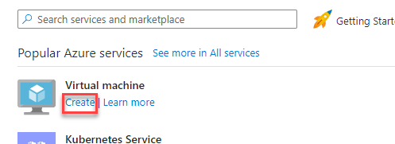
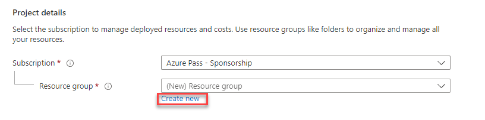
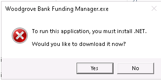
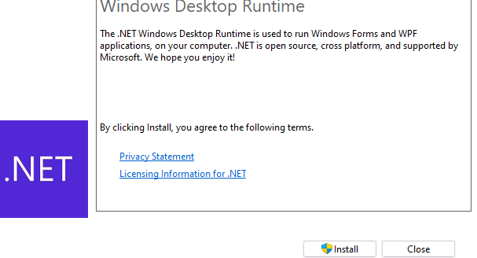
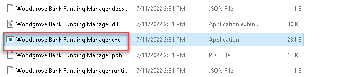

---
lab:
    title: 'Lab 0 - Setup and environment preparation'
    module: 'Module 0 - Setup'
---

# Setup the lab environment

**⏱️ The estimated time to complete this lab is 30 minutes.**

Attention to MCTs: Please make sure you are familiar with
the TrainerPrepGuide for this course, especially the teaching tips and
recommendations.

## Introduction

Let's get started. In this first lab, you will acquire a Power Platform 
trial tenant and access the Power Platform admin center. In the admin 
center, you will create the environments for use during the course.

You will also see the Power Automate Desktop application and install .NET 
and Browser extension pre-requisities which are required for the remainder 
of the course.

## Exercise 1 - Acquire your Power Platform trial tenant

1.  Copy your **Microsoft 365 credentials** from the Authorized Lab
    Hoster.

2.  Navigate to <https://powerapps.microsoft.com> and click **Start free**.

3.  Enter the email address from your Microsoft 365 credentials.

4.  You see a prompt that you have an existing account with Microsoft.
    Select **Sign in**.

5.  Enter the password provided by the Authorized Lab Hoster.

6.  Select **Yes** to stay signed in. Enter 0123456789 as Business phone number and complete the sign up process by clicking **Get Started**.

7.  To confirm the details, click **Get started** again.

8.  PowerApps will load in a new tab. On the **Contact information** panel, enter 0123456789 as Phone number and click **Submit**.

9.  Following the Welcome prompts, click **Next**, **Next** and **Let's go**.

## Exercise 2 - Create your environments

In this exercise, you will create your Development and Test environments
that you will do the majority of your lab work in.

### Task 1 – Create Development environment

1.  Open a new tab and access <https://powerapps.microsoft.com/en-us/developerplan> and
    select **Existing user? Add a dev environment**, log in with your Microsoft
    365 credentials if prompted again.
    
2.  Click **Accept**.

3.  Your **Dev** environment should now show in the list of
    Environments. This typically is named **MOD Administrator’s
    Environment**. For the rest of this course when it says Dev
    environment it will be this environment.
    
    > Note: It might take a couple of minutes for the new environment to be provisioned and become available in the list of the environments. You can see the progress of the environment creation in the [Power Platform admin center](https://admin.powerplatform.microsoft.com). You can proceed with the rest of this lab while the environment is provisioned, it must be finished before you start the next lab.

### Task 2 – Create Test environment

1.  Open a new tab and access [https://admin.powerplatform.microsoft.com](https://admin.powerplatform.microsoft.com/) and
    log in with your Microsoft 365 credentials if prompted again.

2.  Select **Environments** and click **+ New**.

3.  For **Name**, enter **\[my initials\] Test** (Example: AJ Test)

4.  For **Type**, select **Trial**.

5.  Change the toggle on **Create a database for this
    environment?** to **Yes**.

6.  Leave all other selections as default and click **Next**.

7.  On the next tab, leave all selections to default and click **Save**.

8.  Your **Test** environment should now show in the list of
    Environments.

    > Note: Your environment may take a few minutes to provision. Refresh the
    Environments list if needed. When your environment shows as 'Ready', select
    your **Test** environment by clicking on the ellipses next to its
    name to expand the drop-down menu and select **Settings**. 

9.  Explore the different areas in **Settings** that you may be interested
    in but do not make any changes yet. 

## Exercise 3 - Power Automate Software 

In this excercise, you will be updating and installing Power Automate Desktop and accompanying applications.

### Task 1 - Updating Power Automate Desktop 

Power Automate Desktop is installed by default on Windows 11, but it may first need to be updated to the latest version before it can be used. 

1.  Open the **Microsoft Store** and select **Library** from the left-hand navigation. 

2.  Search for Power Automate and click **Update**. 

https://www.microsoft.com/store/productId/9NFTCH6J7FHV

3.  When the update is finished, click **Open**. 

    > Note: Further updates may be required. If needed, refresh the Power Automate page in the **Microsoft Store** and select **Update** again. 

4.  When Power Automate Desktop opens, sign in using your Office 365 Tenant credentials. Click **Next** and **Get started**. 

    > Optional: Click **Start tour** and go through the welcome prompts to get a feel for the application. 

5.  From the **Environments** list, select your **Dev** environment. 

### Task 2 - Installing the Power Automate Machine-Runtime App 

To run attended and unattended flows across cloud and desktop environments, the **machine-runtime app** needs to be installed. 

6.  In Power Automate Desktop, click **⚙️ Settings**, under Machine settings click **Open machine settings**. 

7.  Click **Install app**. 

8.  Check the box to accept Microsoft's terms of use. Click **Install**. System Administrator privileges are required for the install. Click **Yes** on the User Account Control dialogue box. 
  
Power Automate Desktop will restart during the installation of the machine-runtime app. 

9.  Follow the steps to enable the bundled browser extension. Click **Turn on extension**. 

10.  Click **Launch app**. 

11.  Under Machine settings, select your Dev environment. The machine-runtime app will register the machine in the Dev environment's Dataverse database. You should see a success notification "Your machine XXXXYYX has been registered". 

## Exercise 4 - Azure account setup

In this exercise, you will create your Azure account that you will be
using in the labs.

1.  Get a new Azure Pass (valid for 30-days) from the instructor or
    other source.

2.  Use a private browser session, go to Microsoftazurepass.com to
    redeem your Azure Pass using the Microsoft 365 credentials provided
    to you). [Redeem a Microsoft Azure
    Pass](https://www.microsoftazurepass.com/Home/HowTo?Length=5) Follow
    the instructions for redemption.

After the account setup completes, setup the following Virtual Machine.

3.  Navigate to <https://portal.azure.com>. Click + Create a resource.

4.  Click **Create** Virtual Machine.

5.  Click Create new resource group.

6.  Enter **Funding** for Name and click **OK**.

7.  Enter **Funding** for virtual machine name

8.  Select **Windows 11** Image.

9.  Enter **Funding** for Username

10. Enter **relecloud@word1** for Password

11. Confirm Password.

12. Place check in box for *I confirm I have an eligible Windows 10/11 license with multi-tenant hosting rights.* under *Licensing*.

13. Click **Review and create**.

14. Click **Create**

## Exercise 5 – Copy Lab Resources

1.  Create a folder **Labs** on the **C:** drive if you don't already have that folder.

2.  Copy the lab resources folder to **C:\Labs** if it doesn't already exist.

3.  Browse to **C:\Labs\Resources\Funding manager app** and double click
    on the **Woodgrove Bank Funding Manager.exe** file.

4. Click **Yes** on the download .NET popup.

5. Select open file on the downloaded .exe file in the browser downloaded file list.

6. Click **Install** and wait for the installation to complete.

7. Click **Close** after the installation completed.

8. Browse to **C:\Labs\Resources\Funding manager app** and double click
    on the **Woodgrove Bank Funding Manager.exe** file again.

9.  The app should launch. Close the application.
