---
lab:
    title: 'Lab 1 - Design Solution'
    module: 'Module 1 - Process Advisor & Importing Solution'
---

# Process Advisor & Importing Solution

**⏱️ The estimated time to complete this lab is 2 hours 30 minutes.**

## Scenario

In this lab, you will be working to design the automation of a
Construction Loan Funding process that is currently manually tracked by
Relecloud staff.

## High-level lab objectives

-   Discover the current process

-   Use Process Advisor to visualize and analyze the current process

-   Evaluate automation options

-   Design the automation of the process

-   Import and review the starter solution

# Exercise \# 1 – Discover Current Process

In this exercise you are going to get to know the current manual
process.

## Task 1: Review the process scenario

The following companies or people are involved in the process you will
be automating.

| **Company or people** | **Description**                                                                                                                             |
|-----------------------|---------------------------------------------------------------------------------------------------------------------------------------------|
| Borrower              | Borrows money from bank to build a house.                                                                                                   |
| Builder               | Has an agreement to build house for Borrower and gets paid as the house is built by Loan Draws from the borrower’s loan.                    |
| Woodgrove Bank        | Loans borrower money to build house, hires Relecloud to manage the construction loan draw funding as the house is built by the builder.     |
| Relecloud             | Escrow company that manages the process for the bank. They do all the manual work today and this is who you are automating the process for. |
| Fabrikam Inspections  | An inspection company that goes on site to verify and provide proof of work completed.                                                      |
| A Datum               | A risk management company that helps banks reduce losses from bad loans. They provide a risk score used in the process.                     |

The following describes the current manual process:

Woodgrove Bank does construction loans to builders to build homes.
Woodgrove does not give all the loan money to the builders on initial
approval they only give it as construction progresses. Each month,
builders can request loan funds (a draw) for the progress made and funds
spent during the last month.

Woodgrove is too busy to manage the process, so they hired Relecloud to
manage it. Each month builders email forms requesting funds to
Relecloud. After review, Relecloud requests Fabrikam Inspections via
their website to do an onsite inspection to verify the work stated was
actually done.

Once the inspection is completed, Relecloud does a risk check using a
website A Datum has that confirm that the builder hasn’t become high
risk. After these checks, Relecloud uses a Windows form app provided by
Woodgrove to request funding. Someone from Relecloud checks the app each
day for any completed requests and then they notify of funding
completed.

Today Relecloud does each process step manually. You have been asked if
you can improve the process by automating some of the process.

## Task 2: Review the draw request form

1.  Go to the lab resources folder and open the Draw1-MC3747.pdf file.

2.  Review the form.

3.  This form is completed for each draw by the builder and emailed to
    Relecloud.

## Task 3: Review the loan tracking Excel file

1.  Go to the lab resources folder and open the LoanTracking-MC3747.xlsx
    file.

2.  Review the loan tracking file.

3.  Relecloud staff creates one of these worksheet files for each loan
    and uses it to track the draws on the loan.

# Exercise \# 2 – Use Process Advisor with Data

In this exercise, you will create a process advisor from existing
process data and review the analytics. 

## Task 1: Create process advisor

1.  Navigate to <https://make.powerautomate.com> and make sure you are
    in the **Dev** environment you created.

2.  Select **Process advisor** from the left-hand navigation pane and click **+ Start here**.

> 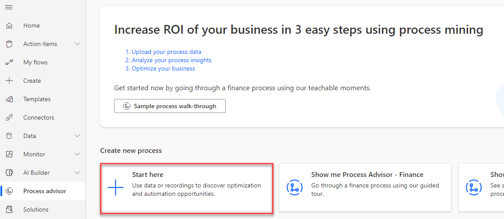 alt="Select process advisor" />

3.  Enter **Loan Funding - Data** for Process name, select **Data (preview)**, and
    click **Create**.

> 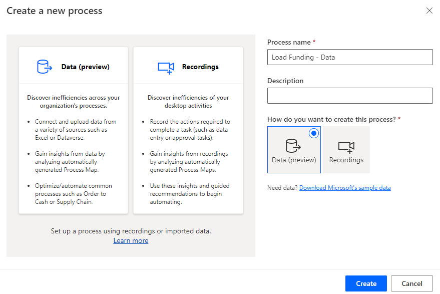 alt="Select data to create the process" />

4.  Select **Excel workbook**.

5.  Select **Upload file** and click **Browse**.

>  alt="Select Upload file and click Browse." />

6.  Select the **ExistingProcessData.xlsx** file located in the lab
    resources folder and click **Open**.

7.  Click **Sign in**.

>  alt="select the file location and then sign in" />

    > Note: You may need to configure your pop-up blocker to allow this site to create pop-up windows. 

8.  Provide your credentials and sign in.

9.  Click **Next**.

> 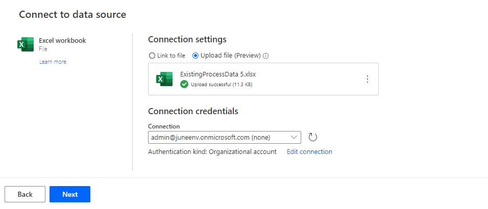 alt="confirm credentials and select next" />

10. Select **ConstructionFunding** for data and click **Next**.

>  alt="select the data and choose next" />

11. Click **Next**.

> 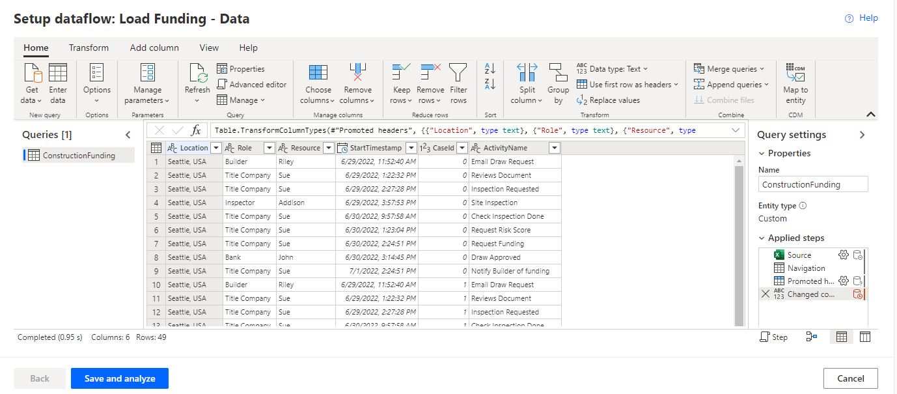 alt="Click Next" />

12. Map the mandatory fields. For each **Event Level Attribute** drop-down, select as follows: 

    - ActivityName: **Activity** 
    - CaseId: **Case ID** 
    - StartTimestamp: **Event Start** 

    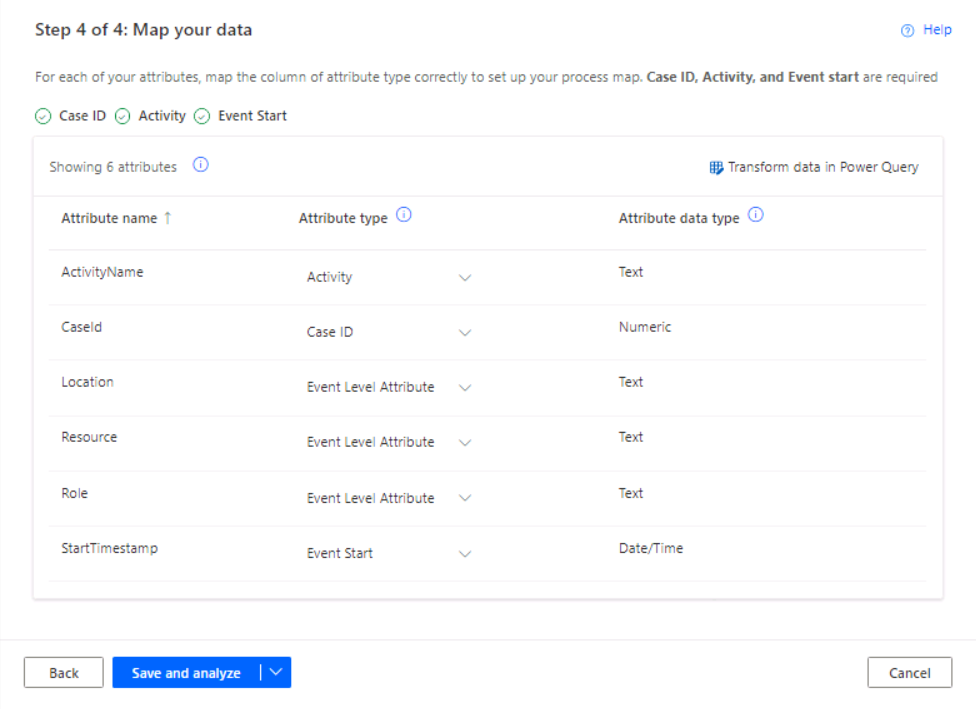

13. Click **Save and analyze**. 

14. Wait for the analyzing to complete. 

15. Do not navigate away from this page. 

## Task 2: Review analytics

1.  The produced process map should look like the image below.

> 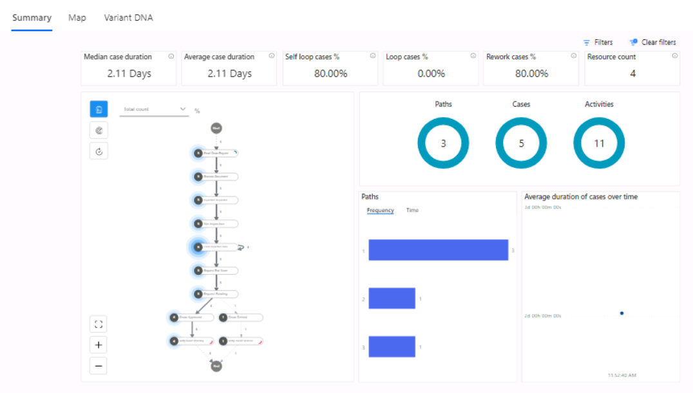 alt="process map for review" />

2.  Zoom in and go to the Request Funding activity. Notice there is a
    path or variant for approved draw and a different one for denied
    draw.

> 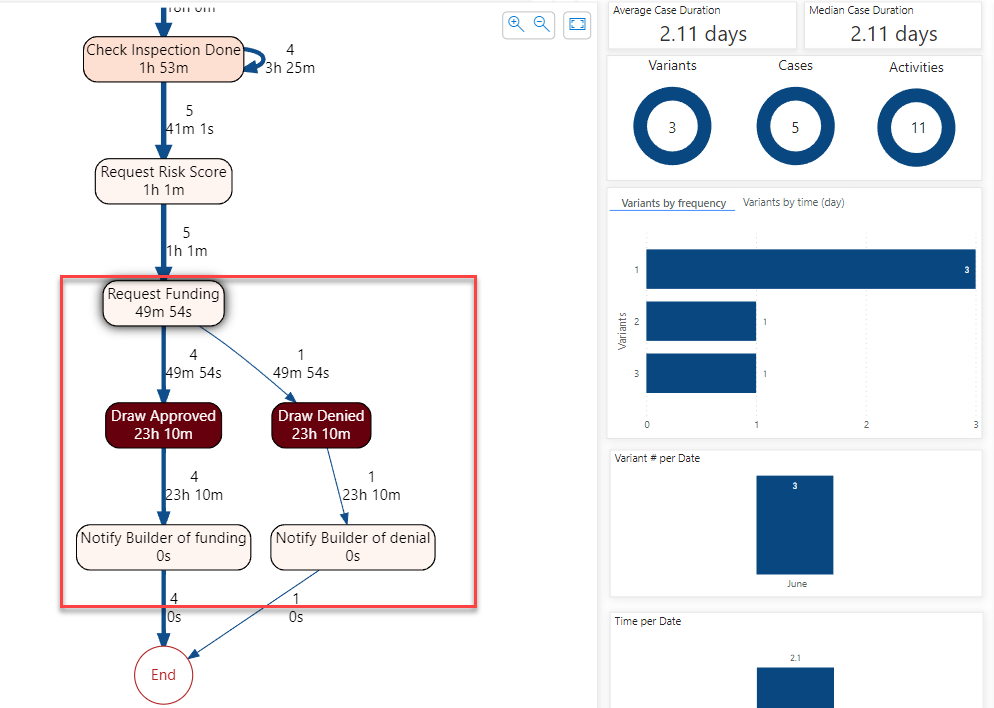 alt="drill into mapping for review" />

3.  Go to the **Paths > Frequency** chart and select the bar with the
    highest frequencies. This is the most common path the process takes;
    in our case this is the **Draw Approved** path.

> 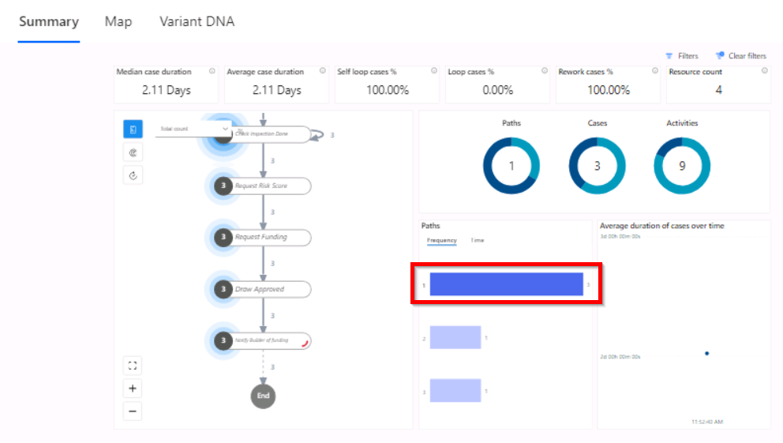 alt="process data to review" />

4.  Go to the **Paths > Frequency** chart and select the second bar.
    This is the frequency for the approved draw path.

> 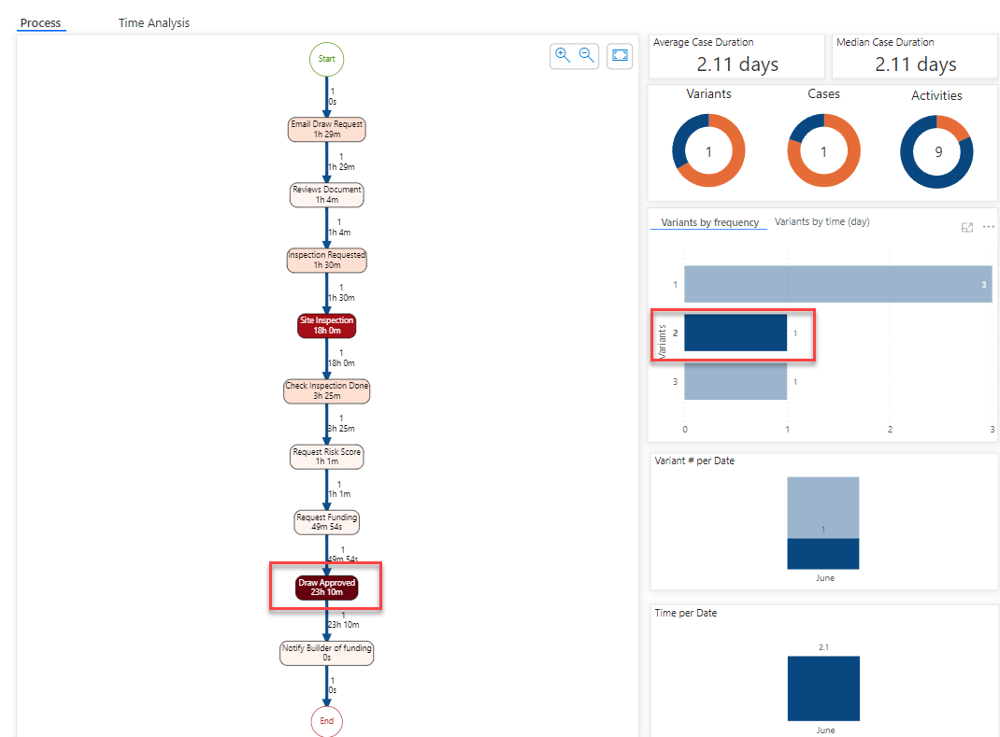 alt="review frequencies" />

5.  Select the last bar. This is the frequency for the denied draw.

> 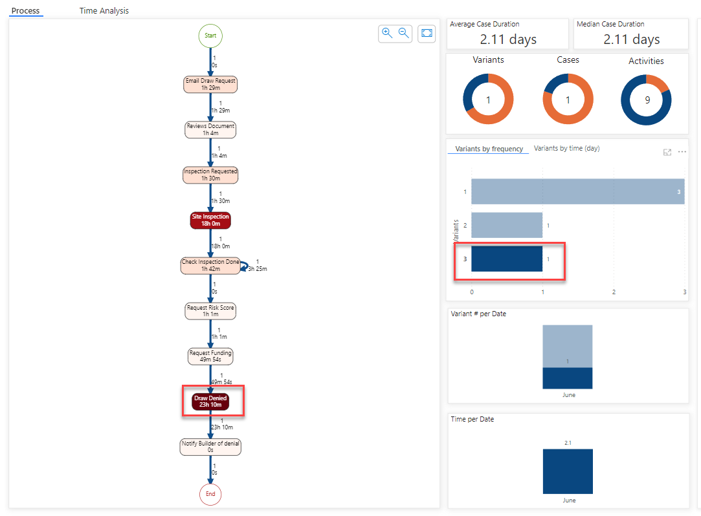 alt="additional data to review" />

6.  Switch the **Overview** drop-down to **Time Analysis**. This page shows information including
    how much time is spent on each activity, on each variant, and more.

> 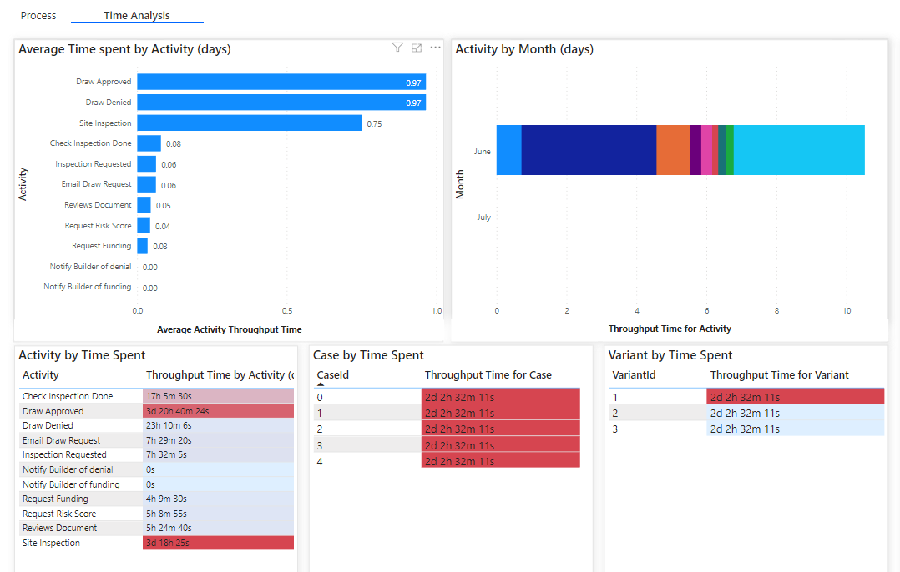 alt="review time analysis data" />

> Note: These Power BI charts allow drilling down on a specific data point and filtering. 

# Exercise \# 3 – Use Process Advisor with Recording

In this exercise, you will perform task analysis by recording using the
Woodgrove Bank Funding Manager application, add activities, and then
analyze it.

## Task 1: Create process advisor

1.  Navigate to <https://make.powerautomate.com> and make sure you are
    in the dev environment.

2.  Select **Process advisor** and click **+ Start here**.

>  alt="start process advisor" />

3.  Enter **Loan Funding - Recording** for Process name, select
    **Recordings**, and click **Create**.

>  alt="select recording option" />

4.  Click **Add a recording**.

> 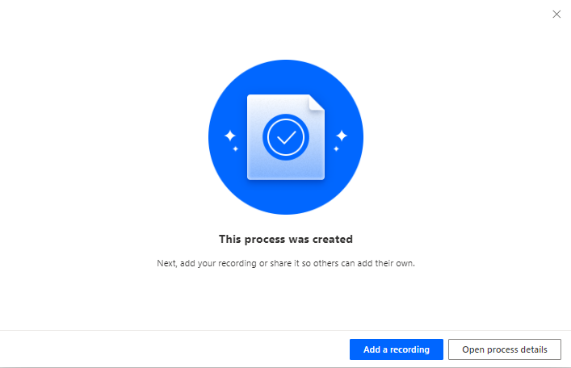 alt="choose add a recording" />

5.  Power Automate desktop should launch. The browser may prompt "This site is trying to open Power Automate Designer", **Click Open**.

6.  Do not start recording yet.

## Task 2: Record process

Before you start recording, you should familiarize yourself with the
application, so the recording goes smoothly.

1.  Minimize or close all but Power Automate desktop.

2.  Go to the Start menu and launch the Woodgrove Bank Funding Manager
    application. If not displayed, go to the lab resources folder (C:\Labs\Resources\Funding manager app) and launch from there.

>  alt="Find and open the app" />

1.  Enter your name for username, **pass@word1** for password and
    click **Login**.

> 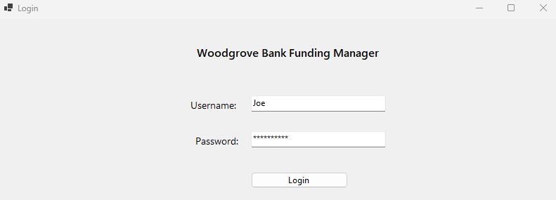 alt="Follow login prompts" />

4.  Enter **JG7165** for Loan number and click **Lookup**.

5.  Click **Draw Funds**.

>  alt="review and click draw funds" />

6.  Enter **100000** for Amount, **12345** for Inspection job number,
    **65** for Risk Score, check the Borrower Approved Draw checkbox,
    and click **Draw Funds**.

> 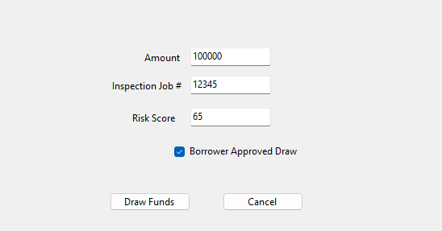 alt="Fill out listed details and select draw funds" />

7.  Click **OK**.

8.  Repeat steps **4 to 7** a few more times or until you feel comfortable
    with using the funding application.

9.  You are now ready to record. Go to the recorder and click
    **Record**.

>  alt="record the listed steps" />

10. Go to the funding application and repeat steps **4 to 7**.

11. Go to the recorder and click **Finish**.

12. Click **Got it** and return to Power Automate web portal to select View Recording.

> 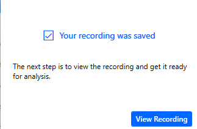 alt="select view recording" />

13. The recording should look like the image below. You can delete and
    record again if you are not happy with recoding.

> 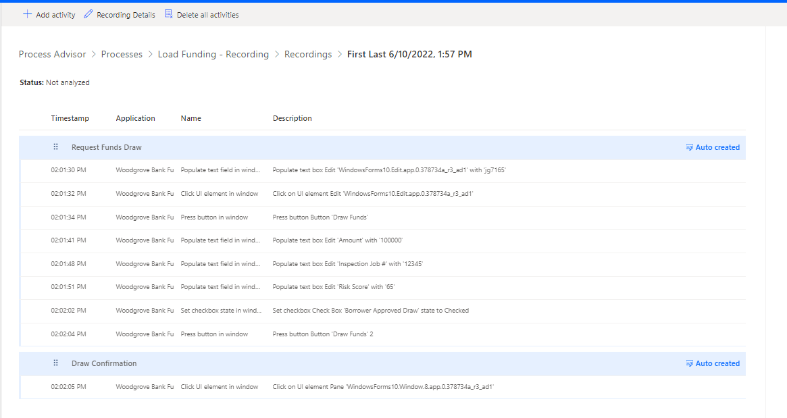 alt="image of recorded steps" />

14. Click on each action and examine the action details.

> 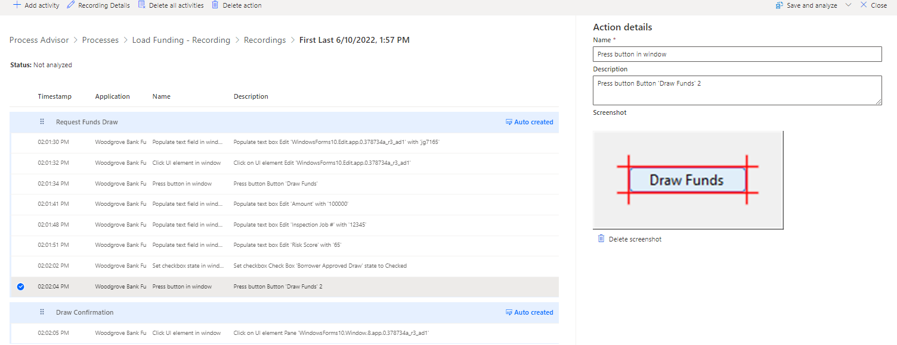 alt="review the resulting steps" />

15. Notice the auto created activities.

>  alt="review auto-created steps" />

16. We will delete these auto-created activities and create our own in
    the next task.

17. Do not navigate away from this page.

## Task 3: Create activities

In this task, you will group actions into activities.

1.  Navigate to the process by clicking on the name of the process.

>  alt="navigate to the process definition" />

2.  Click **Create activity names**.

> 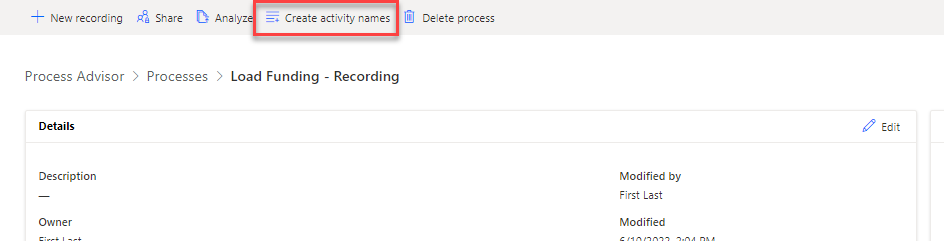 alt="select create activities" />

3.  Click **+ New name**.

4.  Enter **Lookup** and click **+ New name** again.

> 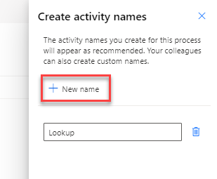 alt="create listed activities" />

5.  Enter **Draw Request** and click **+ New name** again.

6.  Enter **Approve** and click **+ New name** one more time.

7.  Enter **Fund** and click **Save**.

> 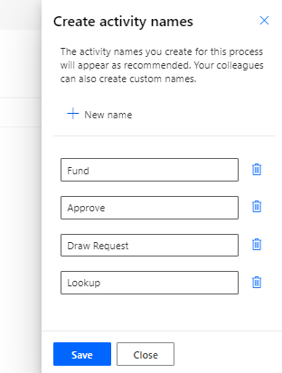 alt="create listed activities" />

8.  Close the create activity names pane.

9.  Go to the **Recordings** section and click to open the recording.

> 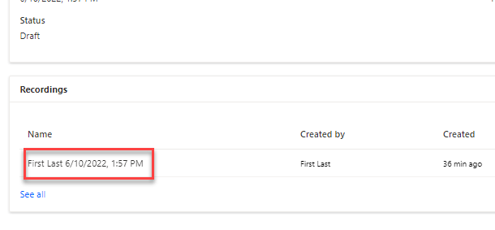 alt="open the recording" />

10. Click **Delete all activities**.

> 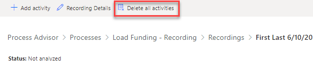 alt="delete activities that were auto created" />

11. Click **Delete**.

12. Click **+ Add activity**.

>  alt="add activities you created" />

13. Click on the Name dropdown and select **Lookup**.

> 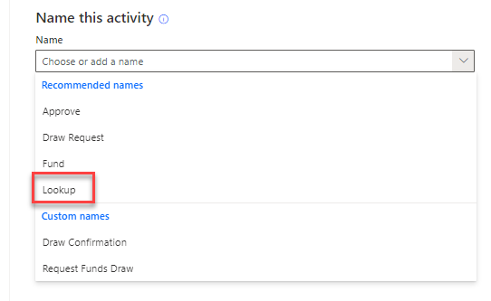 alt="select the lookup activity" />

14. The Lookup activity will be added.

15. Click **+ Add activity** again.

16. Click on the Name dropdown and select **Draw Request**.

17. The Draw Request activity will be added.

18. Click **+ Add activity** again and add **Approve**.

19. Click **+ Add activity** one more time and add **Fund**.

20. You should now have 4 activities added.

> 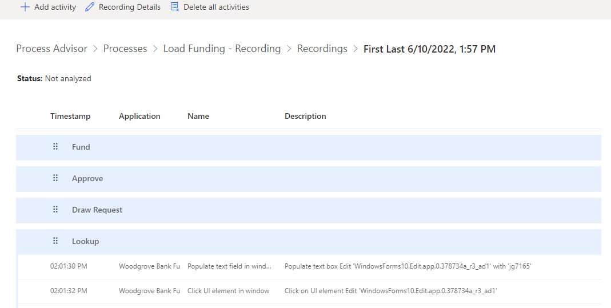 alt="review added activities" />

18. Drag the **Draw Request** activity and place it below the second
    action. You are combing the first two actions into one **Lookup**
    activity.

> 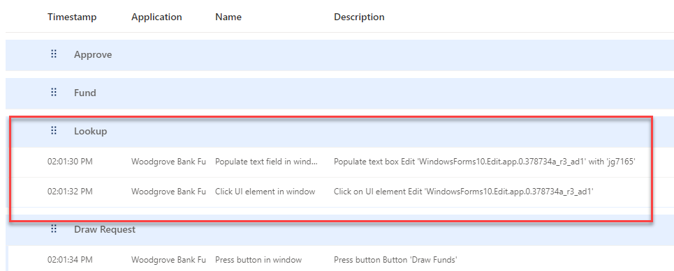 alt="order items into the activities" />

19. Drag the **Fund** activity and place it below the Draw Funds action.

20. Drag the **Approve** activity and place it below the Draw Funds 2
    action.

21. The activities should now look like the image below.

> 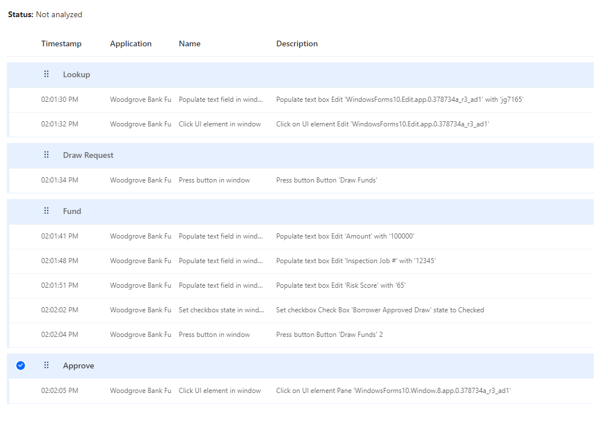 alt="all activities and actions should be organized" />

22. Click **Save and analyze**.

23. Wait for the process to be analyzed.

24. Do not navigate away from this page.

## Task 4: Review analytics

1.  Click **View analytics**.

> 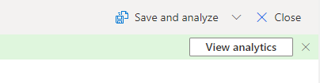 alt="select to view the analytics" />

2.  The process should look like the image below.

> 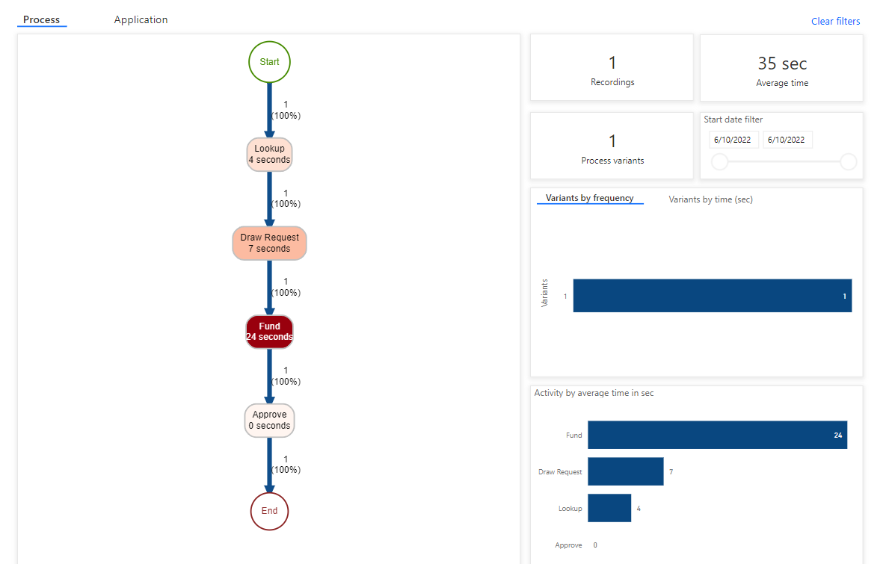 alt="review the process" />

3.  Select the Application tab and review it.

> 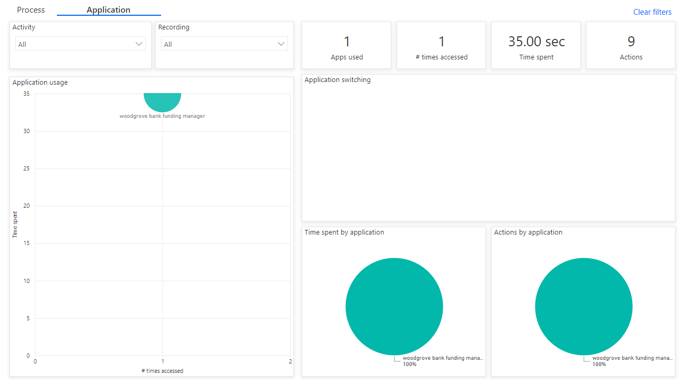 alt="review the charts" />

# Exercise \# 4 – Evaluate Automation Options

When you automate a process, you want to use the most efficient and
reliable means of automation possible. In this exercise you will
re-review what you know about the process and what should be automating
an app and what should use an API.

## Task 1: Review and make notes of what should use an app and what should be a connector

A discovery process has been completed by the project team. The following is the original scenario with our notes from the discovery added

Woodgrove Bank does construction loans to builders to build homes.
Woodgrove does not give all the loan money to the builders on initial
approval they only give it as construction progresses. Each month,
builders can request loan funds (a draw) for the progress made and funds
spent during the last month.

Woodgrove is too busy to manage the process, so they hired Relecloud to
manage it. Each month builders email forms requesting funds to
Relecloud. After review, Relecloud requests Fabrikam Inspections via
their website to do an onsite inspection to verify the work stated was
actually done. *During discovery we learned that Fabrikam has no plans to
offer an API*.

Once the inspection is completed, Relecloud does a risk check using a
website A Datum has that confirm that the builder hasn’t become high
risk. *During discovery we learned A Datum has a RESTful API for the risk
check*.

After these checks, Relecloud uses a Windows form app provided by
Woodgrove to request funding. Someone from Relecloud checks the app each
day for any completed requests and then they notify of funding
completed. *During discovery we learned that Woodgrove plans to modernize
the app in the future*.

Today Relecloud does each process step manually. You have been asked if
you can improve the process by automating some of the process.

# Exercise \# 5 – Design the automation

In this exercise, you will review the design the team came up with. In
the rest of this course, you will be building out this automation.

## Task 1 – Review the process diagram

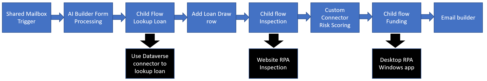

## Task 2 – Review design notes

-   A shared mailbox will be used to not be dependent on individual users

-   Dataverse tables will be used instead of Excel worksheets to track
    the process. There will be a Loan, Loan Draw and Inspection Photo
    tables.

-   Child flows will be used for Lookup, Inspection and Funding to keep
    the main cloud flow maintainable.

-   Inspection website will be automated with an unattended desktop flow
    which will include a JSON array of work site photos.

-   The inspection child flow will run the inspection desktop flow and
    then download and persist the work site photos to the Dataverse
    table.

-   A custom connector will be built for A Datum’s Risk API.

-   The Woodgrove Funding Manager Windows app will be automated with a
    desktop flow.

# Exercise \# 6 – Import starting solution

In this exercise, you will import a solution into your dev environment,
review the components in the solution, run a cloud flow that will add
test data to your environment, and run the loan manager app included in
the solution.

## Task 1: Import solution

1.  Navigate to <https://make.powerapps.com/> and make sure you are in
    the Dev environment.

2.  Select **Solutions** and click **Import solution**.

> 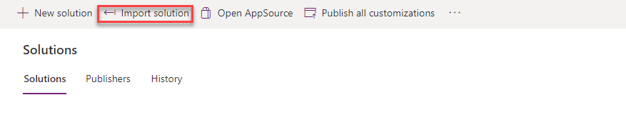 alt="Import the provided solution" />

3.  Click **Browse**.

4.  Select the **ConstructionFunding** solution file located in the lab
    resources folder and click **Open**.

>  alt="select the solution provided" />

5.  Click **Next**.

6.  Click **Next** again.

7.  Click on the Select a connection dropdown and select **+ New
    connection**.

> 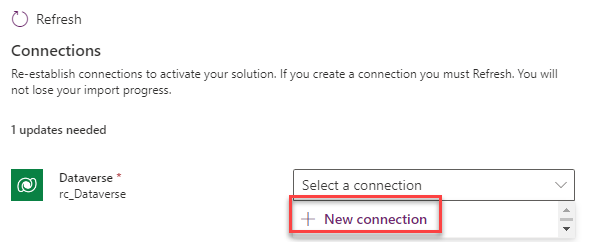 alt="map the connection" />

8.  Click **Create**.

9.  Provide your credentials.

10. Close the connections browser tab.

11. Click **Refresh**.

> 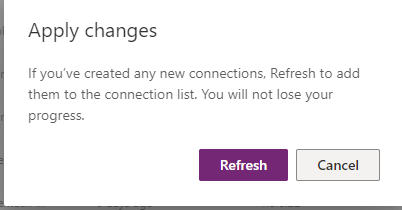 alt="refresh for importing" />

12. Click **Import** and wait for the import to complete.

13. You will get a message when the import completes.

> 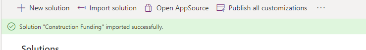 alt="success message" />

14. Click **Publish all customizations** and wait for the publishing to
    complete.

>  alt="publish customizations from imported solution" />

15. Do not navigate away from this page.

## Task 2: Review components

1.  Click to open the **Construction Funding** solution you imported.

> 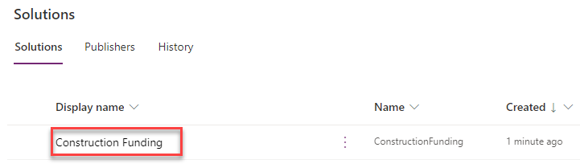 alt="review solution components" />

2.  The solution should have several components including 1 application,
    1 cloud flow, 1 connection reference, 1 sitemap, and 3 tables.

3.  Expand **Tables**, expand the **Loan** table and select **Columns**.

4.  Review the columns for this **Loan** table.

>  alt="solution contains tables" />

5.  Expand the **Loan Draw** table and select **Columns**.

6.  Review the columns for this **Loan Draw** table.

7.  Select **Cloud flows** and click to open the **Create Test Data**
    cloud flow.

>  alt="select cloud flow to run" />

8.  Click **Edit**.

>  alt="select edit" />

9.  Expand the **Parse JSON** step and review the data that will be
    added to your environment.

>  alt="expanded parse JSON step" />

10. Click on the back button.

11. Do not navigate away from this page.

## Task 3: Run flow

1.  Select **Cloud flows** and click Details to open the **Create Test Data**
    cloud flow.

>  alt="select the flow to run" />

1.  Click **Run**.

> 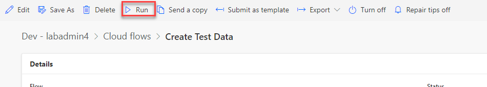 alt="run the flow" />

2.  Click **Run flow**.

3.  Click **Done**.

4.  Wait for the flow run to complete.

5.  Click on the refresh button until you see the success message.

> 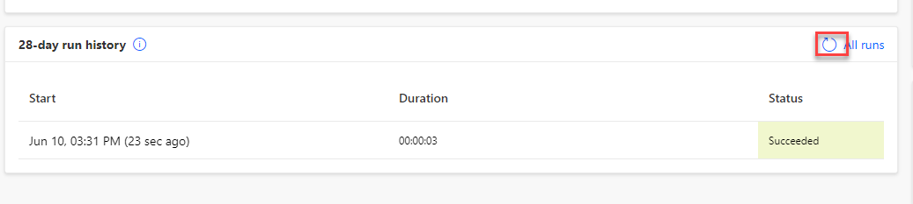 alt="flow successed" />

## Task 4: Run loan manager app

1.  Navigate to <https://make.powerapps.com/> and make sure you are in
    the Dev environment.

2.  Select **Apps** and click to launch the **Loan Manager**
    application.

>  alt="start the app" />

3.  You should see the data added by the cloud flow. Click to open one
    of the loans.

>  alt="review data" />

4.  Review the loan.

> 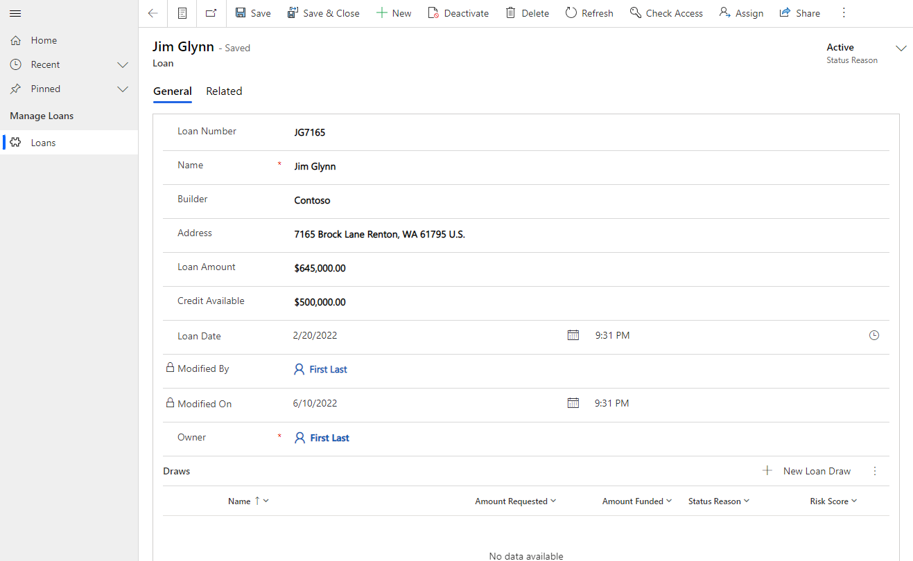 alt="review load record" />
