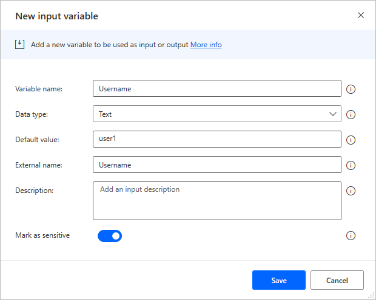

# Scenario

In this lab, you will be creating two desktop flows. One to automate the
inspection website and the other to automate the funding Windows app.

# High-level lab objectives

-   Use recording to capture steps to automate for both web and Windows
    desktop applications

-   Use input and output variables

-   Use flow control to handle conditional logic

-   Use loop condition and wait control

-   Use JavaScript to build JSON

# Exercise \#1: Automate Desktop Funding Application

## Task \#1: Practice using app

In preparation for recording practice using the app to help eliminate
accidental steps from being recorded.

1.  Browse to **C:\Labs\Resources\Funding manager app** and launch the **Woodgrove Bank Funding Manager.exe** app.


2.  Enter your username for Username, **pass@word1** as Password, and
    click **Login**.

3.  Enter **MC3747** for Loan number and click **Lookup**.

4.  Click **Draw Funds**.

5.  Enter **100000** for Amount, **123** for Inspection Job \#, **30**
    for Risk Score, check the Borrower Approved Draw checkbox, and click
    **Draw Funds**.

>  alt="enter details as described" />

6.  Click **OK**.

7.  Repeat steps **3** to **6** until you feel comfortable with
    application.

8.  Close the application.

## Task \#2: Record using the app 

Create a new desktop flow in the **Construction Funding** solution and
record the steps using the **Woodgrove Funding Manager** application.

1.  Navigate to <https://make.powerapps.com/> and make sure you have the
    Dev environment selected.

2.  Select **Solutions** and open the **Construction Funding** solution.

3.  Click **+ New** and select **Automation \| Desktop flow**.

>  alt="select new desktop flow" />

4.  Enter **Woodgrove Funding Manager Draw** for Flow name and click
    **Launch app**.

5.  Desktop flow should launch.

6.  Go to the **Actions** pane, expand the **System** group, and double
    click on the **Run application** action.

>  alt="select run from the actions available" />

7.  Click on the **Select file** button of the Application path.

>  alt="select file" />

8.  Select the **Woodgrove Bank Funding Manager.exe** file located in
    the lab resources folder and click **Open**.

>  alt="select the exe file" />

9.  Click **Save**.

10. Click **Run**.

>  alt="run the application" />

11. The application should start, and the flow should complete.

12. Do not close the application.

13. Click **Recorder**.

14. Do not start recording yet. Close or minimize all but the funding
    manager application. You will be recording steps and modifying
    steps. Make sure to follow the directions here, and only click
    Finish when we tell you to.

15. Remember, you will provide the values below once you start
    recording.

    Username: your username.

    Password: pass@word1

    Account number: MC3747

    Amount: 100000

    Inspection job \#: 123

    Risk score: 30

    **<u>DO NOT</u>** click the **OK** button on the Draw Confirmation
screen.

16. Click **Record**.

>  alt="click record" />

17. The recording should start.

18. Capture steps, same as you practiced.

19. **DO NOT** click on the OK button.

20. On the confirmation screen of the Windows app right click on the
    **Amount** value and select **Get text(“”).**

>  alt="right click on the item " />

21. Right click on the **Funds transfer number** value and select **Get
    text(“”).**

22. Right click on the **Funds sequence number** value and select **Get
    text(“”).**

23. Click **OK**.

24. Go to the recorder and click **Done**.

25. The steps you recorded should look like the image below.

>  alt="summary of steps" />

26. Close the **Woodgrove Funding Manager** application.

27. If Run Application is no longer your first step, Drag the **Run
    application** action from the bottom to the top of the steps.

>  alt="reorder to match the description if needed" />

28. Click **Run**. Do not interact with your computer until the run
    completes.

29. Your flow variable should now look like the image below but might
    have different values.

>  alt="review flow variables" />

30. Click **Save** and wait for the flow to be saved.

31. Do not close the desktop flow.

## Task \#3: Add Input and output variables

In this task, you will define the input and output variables that you'll
use to replace the hard coded values recorded. The input variables will
be used to pass data from the calling cloud flow. The output variables
will be used to return data to that flow.

1.  Go to the **Variables** pane and click **+** Add.

>  alt="select add " />

2.  Select **Input**.

3.  Enter **Username** for Variable name, **user1** for Default value,
    **Username** for External name, **Username** for Description, mark
    the variable as sensitive, and click **Save**.

>  alt="enter details as described" />

4.  Click **+** add and select **Input** again.

>  alt="add another input" />

5.  Enter **Password** for Variable name, **pass@word1** for Default
    value, **Password** for External name, **Password** for Description,
    mark the variable as sensitive, and click **Save**.

6.  Click **+** add argument and select **Input**.

7.  Enter **LoanNumber** for Variable name, **MC3747** for Default
    value, **LoanNumber** for External name, **Loan number** for
    Description, and click **Save**.

8.  Click **+** add argument and select **Input**.

9.  Enter **RequestedAmount** for Variable name, **100000** for Default
    value, **RequestedAmount** for External name, **Requested amount**
    for Description, and click **Save**.

10. Click **+** add argument and select **Input**.

11. Enter **InspectionJobNumber** for Variable name, **123** for Default
    value, **InspectionJobNumber** for External name, **Inspection job
    number** for Description, and click **Save**.

12. Click **+** add argument and select **Input**.

13. Enter **BorrowerApproved** for Variable name, **Yes** for Default
    value, **BorrowerApproved** for External name, **Borrower approved**
    for Description, and click **Save**.

14. Click **+** add argument and select **Input**.

15. Enter **RiskScore** for Variable name, **30** for Default value,
    **RiskScore** for External name, **Risk score** for Description, and
    click **Save**.

16. You should now have 7 input arguments.

>  alt="summary of input variables" />

17. Click **+** add and select **Output**.

>  alt="add output variable" />

18. Enter **FundedAmount** for Variable name, **FundedAmount** for
    External name, **Funded amount** for Description, and click
    **Save**.

>  alt="enter details as described" />

19. Click **+** add argument and select **Output**.

20. Enter **FundTransferNumber** for Variable name,
    **FundTransferNumber** for External name, **Fund transfer number**
    for Description, and click **Save**.

21. Click **+** add argument and select **Output**.

22. Enter **FundSequenceNumber** for Variable name,
    **FundSequenceNumber** for External name, **Fund sequence number**
    for Description, and click **Save**.

23. Click **+** add argument and select **Output**.

24. Enter **FundingStatus** for Variable name, **FundingStatus** for
    External name, **Funding status** for Description, and click
    **Save**.

25. You should now have **11** total arguments 7 inputs and 4 outputs.

26. Click **Save** and wait for the flow to be saved.

## Task \#4: Change flow to use input variables 

In this task, you will modify hard coded values in the steps to use the
input variables you just defined.

1.  Go to the populate username action and double click on it.

>  alt="select the item described" />

2.  Remove the current value and click on the **{x}** select variable
    button.

>  alt="click on the variable button as shown" />

3.  Select **Username** for variable and click **Select**.

>  alt="select user name variable" />

4.  Click **Save**.

5.  Go to the populate password action and double click on it.

>  alt="select the item shown" />

6.  Click on then encryption button and select **Input as text,**
    **variable or expression**.

>  alt="enter details as described" />

7.  Click on the **{x}** select variable button.

8.  Select **Password** for variable and click **Select**.

9.  Click **Save**.

10. Go to the populate loan number action and double click on it.

11. Remove the current value and click on the **{x}** select variable
    button.

12. Select **LoanNumber** for variable and click **Select**.

13. Click **Save**.

14. Go to the populate amount action and double click on it.

15. Remove the current value and click on the **{x}** select variable
    button.

16. Select **RequestedAmount** for variable and click **Select**.

17. Click **Save**.

18. Go to the populate inspection job \# action and double click on it.

19. Remove the current value and click on the **{x}** select variable
    button.

20. Select **InspectionJobNumber** for variable and click **Select**.

21. Click **Save**.

22. Go to the populate risk score \# action and double click on it.

23. Remove the current value and click on the **{x}** select variable
    button.

24. Select **RiskScore** for variable and click **Select**.

25. Click **Save**.

26. The actions you changed should now look like the image below.

>  alt="summary view of work just completed" />

1.  Click **Save** and wait for the flow to be saved.

## Task \#5: Change to populate output variables

In this task, you will modify hard coded values in the steps to use the
output variables you just defined.

1.  In your steps, locate the **Get details of a UI element in window**
    action for the amount and double click on it.

>  alt="select item described" />

2.  Expand the **Variables produced section** and click on the **{x}**
    select variable button.

>  alt="select variable button" />

3.  Select **FundedAmount**.

>  alt="select funded amount" />

4.  Click **Save**.

5.  Locate the **Get details of a UI element in window** action for the
    transfer number and double click on it.

>  alt="locate the item described" />

6.  Expand the **Variables produced section** and click on the **{x}**
    select variable button.

7.  Select **FundTransferNumber**.

8.  Click **Save**.

9.  Locate the **Get details of a UI element in window** action for the
    sequence number and double click on it.

>  alt="select the item described" />

10. Expand the **Variables produced section** and click on the **{x}**
    select variable button.

11. Select **FundSequenceNumber**.

12. Click **Save**.

13. You should now have three output variables populated.

>  alt="summary of work recently completed" />

14. Click Save and wait for the flow to be saved.

## Task \#6: Handle denied draws

In this task, you will handle if the funding is denied by adding
conditional logic to the flow. This will ensure the flow does not have
an error when certain controls are not available, and you will return an
output variable indicating that the funding was denied.

1.  Go to the **Actions** pane and expand the **UI automation** group.

2.  Go back to the app and go through the steps with the following to
    get the denied message.

Username: your username.

Password: pass@word1

Account number: MC3747

Amount: 100000

Inspection job \#: 123

Risk score: 90

3.  Leave the denied message and don’t click OK

4.  Drag **If window contains** action and drop it above the Get details
    of the UI element in window of the amount.

>  alt="drag the action as described" />

1.  Click the UI element dropdown and then click Add UI element.

2.  Hold the ctrl key and Click on the text **Draw denied contact bank**.

3.  Click **Save**.

>  alt="save the item" />

8.  Click on the **…** More actions button of the Get details of a UI
    element in window action for the amount.

>  alt="select more actions" />

9.  Select **Copy**.

10. Right click on the Get details of a UI element in window action for
    the amount and select **Paste**.

>  alt="complete the copy paste" />

11. You should now have two the Get details of a UI element in window
    action for amount.

>  alt="summary of work just completed" />

12. Drag the first Get details of a UI element in window action for
    amount and drop it inside the **If window** contains.

>  alt="drag the item as described" />

13. Double click on the Get details of a UI element in window action for
    amount inside the If.

>  alt="open the item as described" />

14. Click on the **UI element** dropdown and select **Draw denied
    contact back** and click **Select**.

>  alt="from the dropdown select the item as described" />

15. Expand the **Variables produced** and click on the **{x}** select
    variable button.

16. Select **FundingStatus**.

17. Click **Save**.

18. Drag another If window contains action and drop it below the **End**
    if.

>  alt="drag item as described" />

19. Click on the **Check if window** dropdown and select **Doesn’t
    contain UI element**.

20. Click on the **UI element** dropdown select **Draw denied contact
    bank** and click **Select**.

21. Click **Save**.

22. Move all three Get details of a UI element in window actions outside
    of the If and drag them to the inside of the second if condition.

>  alt="move the items as described" />

23. Expand the **Variables** action group and drag **Set variable**
    action to the second If window contains.

>  alt="drag the item as described" />

24. Click **{x}** select variable select **FundingStatus**.

>  alt="select the variable as described" />

25. Type **Approved** for Value and click **Save**.

## Task \#7: Add Close of app and Test Run

1.  Drag **Terminate Process** and drop it after the last action.

2.  Specify by Process ID.

3.  Set Process ID to AppProcessId

4.  Click **Save**.

5.  Click Save to save the flow.

6.  Close the app if it is running still.

7.  Click **Run**. Do not interact with the VM until the run
    completes.

>  alt="run the flow" />

8.  The flow should run successfully. Review the output variables and
    make sure the **FundingStatus** is set to **Approved**.

>  alt="review the output" />

9.  Locate the **RiskScore** variable and double click on it.

>  alt="locate risk score" />

10. Change the **Default value** to **85** and click **Save**.

>  alt="update the default value" />

11. Click **Run** again. Do not interact with the VM until the
    run completes.

12. The flow should run successfully. Review the output variables and
    make sure the **FundingStatus** is set to **Draw denied contact
    bank**.

>  alt="review the output" />

13. Locate the **RiskScore** variable and double click on it.

14. Change the **Default value** to **65** and click **Save**.

15. Click **Save** and wait for the flow to be saved.

16. You may close the desktop flow.

# Exercise \#2: Automate Inspection web site

## Task \#1: Practice using site

In preparation for recording practice using the app to help eliminate
accidental steps from being recorded.

1.  Navigate to <https://fabrikaminspectionstest.azurewebsites.net/>

2.  Navigate to the **Request Inspection** page.

3.  Enter your name for Inspection Account#, enter **123 Main Street**
    for Property Address, enter **Test work item** for Work to Inspect,
    and then click **Request Inspection**.

>  alt="enter details as described" />

4.  Copy the **Job Number** and keep it in your clipboard.

>  alt="review the output and save it" />

5.  Go to the **Inspection Results** page.

6.  Enter your name for Inspection Account \#, paste the Job number you
    copied, and click **Check Inspection**.

>  alt="enter details as described" />

7.  The Job Status should show **In progress**.

>  alt="review the output" />

8.  Go to the **Request** **Inspection** page and repeat the steps until
    you are comfortable with the inspection request process.

## Task \#2: Record using app

Create a new desktop flow in the **Construction Funding** solution and
record the steps using the **Inspection** web app.

1.  Navigate to <https://make.powerapps.com/> and make sure you have the
    Dev environment selected.

2.  Select **Solutions** and open the **Construction Funding** solution.

3.  Click + New and select Automation - Desktop flow.

>  alt="new desktop flow" />

4.  Enter **Perform Site Inspection** for Flow name and click **Launch
    app**.

5.  Desktop flow should launch.

6.  Expand the **Browser automation** group and double click on the
    **Launch new Microsoft Edge** action.

7.  Provide
    <https://fabrikaminspectionstest.azurewebsites.net>
    for Initial URL and click **Save**.

>  alt="enter details as described" />

8.  DO NOT start recording yet.

9.  Minimize or close all but desktop flow application.

10. Click **Run**.

>  alt="run the flow" />

11. Microsoft Edge should load and navigate to the URL you provided.

12. DO NOT close this Browser session.

13. Go back to the desktop flow and click **Record**.

14. The recorder pane should come to view.

15. DO NOT start recording. Once you’ve reviewed the steps below, start
    recording. When you start recording you will repeat the steps you
    went through during the practice as outlined below.

<!-- -->

1)  Go to the **Request Inspection** page.

2)  Enter your name for Inspection Account \#

3)  Enter **123 Main Street** for Property Address.

4)  Enter **Test work item** for Work to Inspect.

5)  Click on the **Request Inspection** button.

6)  Right click on the **Job Number** and select **Extract element value
    \| Text: (“*your job number here*”)**. Remember the Job number.

7)  Navigate to the Inspection Results page.

8)  Provide your name again.

9)  Enter the **Job number**.

10) Click on the **Check Inspection** button.

11) Right click on the **Job status** and select **Extract element value
    \| Text: (Inprogress”)**

>  alt="enter details as described" />

12) Go back to the recorder and click **Done**.

<!-- -->

16. Click **Record** and perform the steps.

17. After you finish recording, your recorder actions should look like
    the image below.
    
18. Click **Save** and wait for the flow to be saved.

>  alt="summary of completed work" />

## Task \#3: Add Input and output variables

In this task, you will define the input and output variables that you'll
use to replace the hard coded values recorded. The input variables will
be used to pass data from the calling cloud flow. The output variables
will be used to return data to that flow.

1.  Go to the **Variable** pane, click **+** add argument and select
    **Input**.

2.  Enter **InspectionAccountNumber** for Variable name, **Jane Doe**
    for Default value, **InspectionAccountNumber** for External name,
    **Inspection account number** for Description, and click **Save**.

3.  Click **+** add argument and select **Input** again.

4.  Enter **PropertyAddress** for Variable name, **123 Main Street** for
    Default value, **PropertyAddress** for External name, **Property
    address** for Description, and click **Save**.

5.  Click **+** add argument and select **Input** one more time.

6.  Enter **WorkToInspect** for Variable name, **Test work item** for
    Default value, **WorkToInspect** for External name, **Work to
    inspect** for Description, and click **Save**.

7.  Click **+** add argument and select **Output**.

8.  Enter **InspectionStatus** for Variable name, **InspectionStatus**
    for External name, **Inspection status** for Description, and click
    **Save**.

9.  Click **+** add argument and select **Output** again.

10. Enter **SitePhotos** for Variable name, **SitePhotos** for External
    name, **Site photos** for Description, and click **Save**.

11. Click **+** add argument and select **Output** again.

12. Enter **JobNumber** for Variable name, **JobNumber** for External
    name, **Job Number** for Description, and click **Save**.

13. You should now have three input and three output variables.

## Task \#4: Change to use variables

In this task, you will modify hard coded values in the steps to use the
variables you just defined.

1.  Go to the Populate text field on web page for the account number and
    double click on it.

>  alt="select the item as noted" />

2.  Clear the Text value and click on the **{x}** select variable
    button.

>  alt="clear the value and select variable button" />

3.  Select **InspectionAccountNumber** and click **Select**.

4.  Click **Save**.

5.  Go to the Populate text field on web page for the property address
    and double click on it.

>  alt="select item as noted" />

6.  Clear the Text value and click on the **{x}** select variable
    button.

7.  Select **PropertyAddress** and click **Select**.

8.  Click **Save**.

9.  Go to the Populate text field on web page for the work to inspect
    and double click on it.

>  alt="select item as noted" />

10. Clear the Text value and click on the **{x}** select variable
    button.

11. Select **WorkToInspect** and click **Select**.

12. Click **Save**.

13. Go to the first Get details of element on web page and double click
    on it.

>  alt="select item as noted" />

14. Click on the variable name, change it to **%JobNumber%**, and click
    **Save**. You are typing in this field.

>  alt="enter details as described" />

15. Go to the Populate text field on web page for the second account
    number and double click on it.

>  alt="select the item as described" />

16. Clear the Text value and click on the **{x}** select variable
    button.

17. Select **InspectionAccountNumber** and click **Select**.

18. Click **Save**.

19. Go to the last Populate text field on web page and double click on
    it.

>  alt="select the item as described" />

20. Clear the Text value and click on the **{x}** select variable
    button.

21. Select **JobNumber** and click **Select**.

22. Click **Save**.

23. Go to the last Get details of element on web page and double click
    on it.

>  alt="select the item as described" />

24. Click on variable and then click on the **{x}** select variable button.

25. Select **InspectionStatus**.

26. Click **Save** and close the Fabrikam Inspection website.

27. If your Launch new Microsoft Edge is not the first action in the
    flow, then drag the Launch new Microsoft Edge action and drop it
    before all the recorded actions.

>  alt="order items as described" />

28. Click **Run** and wait for the run to complete.

29. After the run completes, the variables should like the image below.

>  alt="review the results" />

30.  Click **Save** and wait for the flow to be saved.

## Task \#5: Add loop condition and wait control

In this task, you will be adding a loop to recheck if the inspection is
done. You will add a delay to give the inspection time to be completed
before checking again.

1.  Expand the **Loops** group, drag **Loop condition** and drop it
    before Populate text field on a web page for the second
    InspectionAccountNumber action.

>  alt="drag the item as described" />

2.  Click on the **{x}** select variable button of the First operand.

>  alt="select variable as noted" />

3.  Select **InspectionStatus** and click **Select**.

4.  Select **Not equal to (<\>)** for Operation, enter **Completed**
    for the Second operand, and click **Save**.

>  alt="enter details as described" />

5.  Select the four actions after the loop and move them inside the loop
    by drag and drop.

>  alt="move the items as described" />

6.  Expand the **Flow control** group, drag **Wait** action and drop it
    before the **End** loop.

>  alt="drag the item as described" />

7.  Enter **10** seconds and click **Save**.

8.  Click **Run** and wait for the flow to complete. The flow should go
    through the loop until the inspection status changes to Completed.

>  alt="review the results" />

9.  Do not close the browser.

10. Click **Save** and wait for the flow to be saved.

## Task \#6: Use JavaScript to build JSON

In this task, you will use JavaScript to extract the work site
inspection photos and format the data into a JSON array that can be used
to populate the output variable.

1.  Go to the **Actions** pane and expand the **Browser automation**
    group.

2.  Expand the **Web data extraction** subgroup and double click on the
    **Extract data from web page** action.

>  alt="select the item described" />

3.  Go back to the web page, right click on the image, and select
    **Extract entire HTML table**.

>  alt="follow the steps" />

4.  Notice you only get Value \#1, currently, extract is not able to
    extract both columns of the table because column 2 is an img tag.

>  alt="review the results" />

5.  Click **Cancel**.

6.  Click **Cancel** again.

>  alt="select cancel" />

7.  Go to the web page and open the DevTools via the **F12** key. We are
    going to use Dev Tools to test our JavaScript.

8.  Select the **Console** tab and click **Clear console**.

>  alt="enter details as described" />

9.  Paste the script below and enter.

```js
var table = document.getElementById("sitephotostable");

var sitephotolist = { images:[] }

for (var i = 0; i < table.rows.length; i++) {

row = table.rows[i];

namecol = row.cells[0];

imgcol = row.cells[1];

var imgtags = imgcol.getElementsByTagName('img');

var imgsource = imgtags[0]['src'];

console.log(imgsource)

sitephotolist.images.push({"name":namecol.innerText, "url":imgsource})

}

console.log(JSON.stringify(sitephotolist))
```

10. Review the information you are trying to extract.

>  alt="review results" />

11. Close the DevTools.

12. Go back to the desktop flow.

13. Expand the **Browser automation** group, drag **Run JavaScript
    function on a web page and get the returned result** action and drop
    it after the **End** loop.

>  alt="drag item as described" />

14. Select **Browser** for Web browser instance, paste the script below
    in the JavaScript function field, expand the **Variables produced**
    section, click on the **{x}** select variable button.

function ExecuteScript()

{

var table = document.getElementById("sitephotostable");

var sitephotolist = { images:[] }

for (var i = 0; i < table.rows.length; i++) {

row = table.rows[i];

namecol = row.cells[0];

imgcol = row.cells[1];

var imgtags = imgcol.getElementsByTagName('img');

var imgsource = imgtags[0]['src'];

console.log(imgsource)

sitephotolist.images.push({"name":namecol.innerText, "url":imgsource})

}

console.log(JSON.stringify(sitephotolist))

return JSON.stringify(sitephotolist);

}

>  alt="review the results of the script you added" />

15. Select **SitePhotos**.

16. Click **Save**.

17. Expand the **Browser automation** group, drag **Close web browser**
    action, and drop it to the bottom of the recorded actions.

>  alt="drag the item as described" />

18. Select **Browser** for web browser instance and click **Save**.

19. Click **Save** and wait for the flow to be saved

## Task \#7: Close browser and test

1.  Close the Fabrikam Inspection website.

2.  Click **Run** and wait for the run to complete. The flow will loop
    through the loop condition multiple times, until the status changes
    to completed.

3.  Go to the Variables pane and make sure the **SitePhotos** variable
    has the expected value.

>  alt="review results" />


4. Save the flow.

