# Scenario

In this lab, you will build the cloud flows and integrate with the
desktop flows.

# High-level lab objectives

-   Use child flows to create a more maintainable cloud flow

-   Use desktop flows from cloud flow

# Exercise \#1: Lookup Loan Child flow

## Task \#1: Create child flow

1.  Navigate to <https://make.powerapps.com/> and make sure you are in
    the Dev environment.

2.  Select **Solutions** and open the **Construction Funding** solution.

3.  Click **+ New** and select **Automation \| Cloud flow \| Instant**.

> 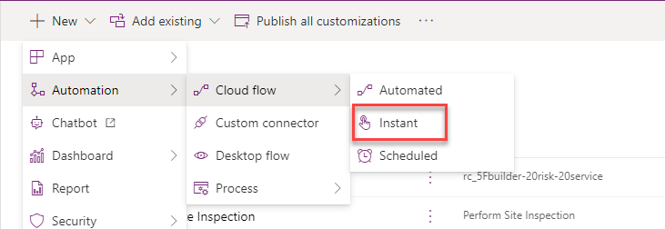 alt="Select new instant flow" />

4.  Enter **CF Lookup Loan** for Flow name, select **Manually trigger a
    flow**, and click **Create**.

> 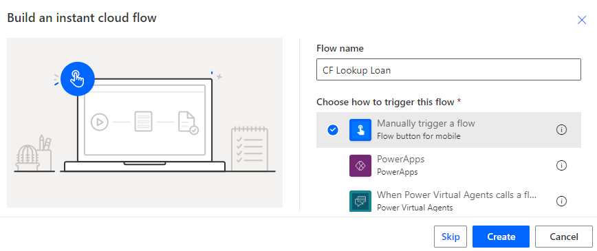 alt="Name the flow and select manual trigger" />

5.  Expand the trigger by clicking on Manually trigger a flow.

6.  Select **+ Add an input**.

> 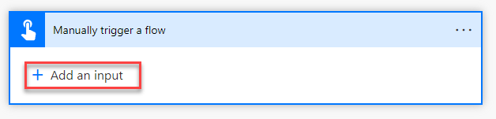 alt="select add an input" />

7.  Select **Text**.

8.  Enter **LoanNumber** and click **+ New step**.

>  alt="add LoanNumber and select new step" />

9.  Search for list rows and select **List rows Microsoft Dataverse**.

> 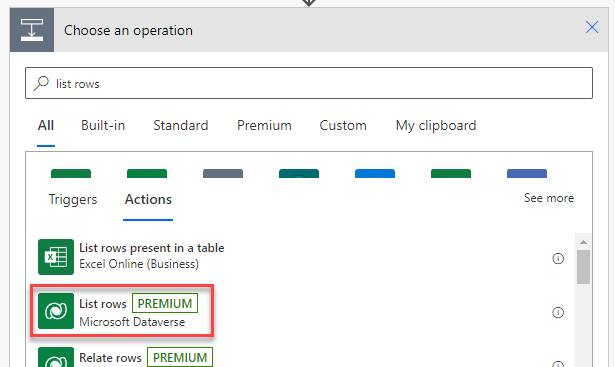 alt="search for and select List rows for Microsoft Dataverse" />

10. Select **Loans** for Table name and click **Show advanced options**.

>  alt="Show advanced options" />

11. Enter **rc_loannumber eq** for Filter rows and select **LoanNumber**
    from the dynamic content pane.

> 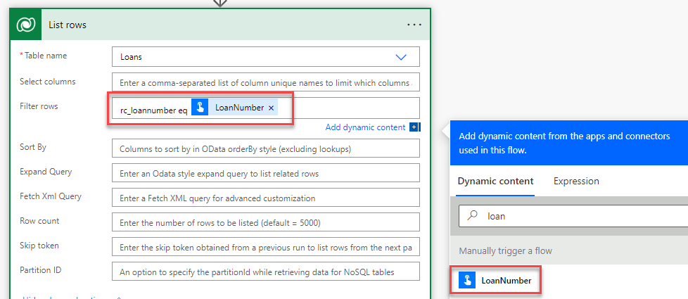 alt="enter details listed" />

12. Add single quotes ‘ before and after LoanNumber

13. Click **+ New step**.

14. Select **Condition**.

>  alt="add the condition" />

15. Click to select the first operand field, go to the dynamic content
    pane, and select the expression tab.

16. Paste the expression below and click **OK**. This checks if any rows
    were returned.

empty(outputs('List_rows')?\['body/value'\])

> 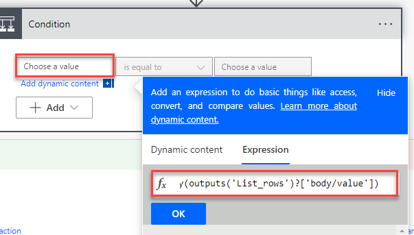 alt="paste the expression listed" />

17. Select **is equal to** for condition.

18. Click to select the second operand field, go to the dynamic content
    pane, and select the expression tab.

19. Type **true** and click **OK**.

> 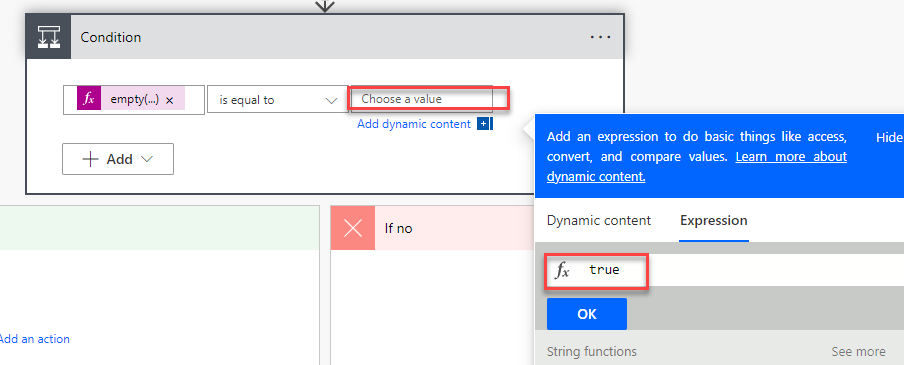 alt="add the true item" />

20. Go to the **If yes** branch and click **Add an action**.

>  alt="add an action in the yes branch" />

21. Select **Respond to a PowerApp or flow**.

> 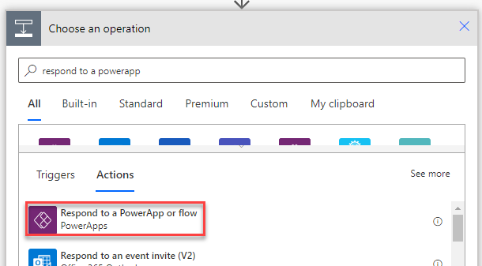 alt="search for and select the Respond to a PowerApp or flow action" />

22. Click **+ Add an output**.

>  alt="select add an output" />

23. Select **Yes/No**.

24. Enter **LoanFound** for title and click to select the value field.

25. Go to the Dynamic content pane and select the **Expression tab**.

26. Type **false** and click **OK**.

> 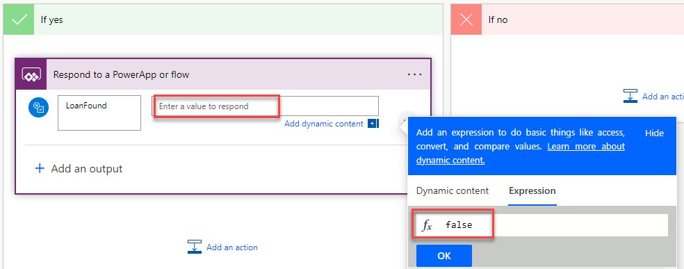 alt="type false for the function and select ok" />

27. Click **+ Add an output** again.

28. Select **Text**.

29. Enter **LoanID** for title.

30. Click on the value field, and empty space.

> 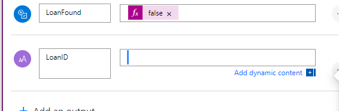 alt="place your curser in the empty space as described" />

31. Click on the **…** more actions button and select **Rename**.

> 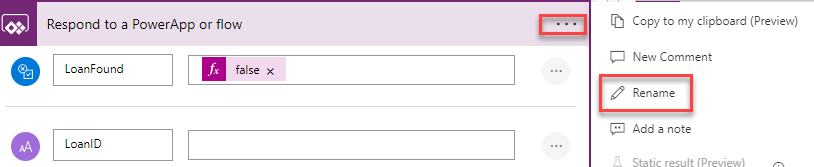 alt="in more actions, select rename" />

32. Rename the step **Not found response**.

33. Go to the **If no** branch and click **Add an action**.

> 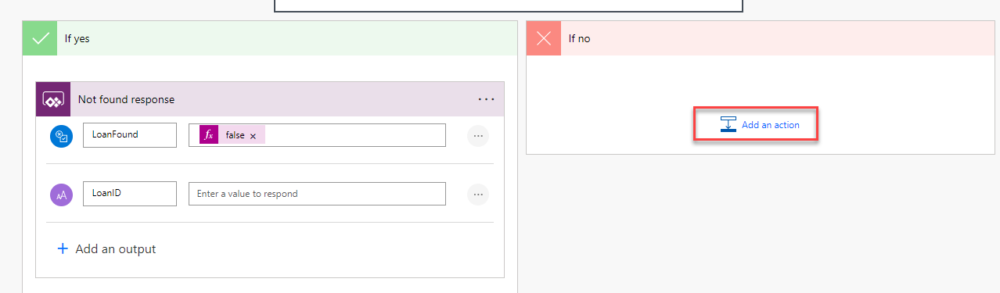 alt="add an action in the no branch" />

34. Select **Respond to a PowerApp or flow**.

>  alt="search for and select respond to a PowerApp of flow action" />

35. Click **+ Add an output**.

36. Select **Yes/No**.

37. Enter **LoanFound** for title and click to select the value field.

38. Go to the dynamic content pane and select the **Expression tab**.

39. Type **true** and click **OK**.

>  alt="enter the value true for the function" />

40. Click **+ Add an output** again.

41. Select **Text**.

42. Enter **LoanID** for title.

43. Click to select the value field, go to the dynamic content pane, and
    select the **Expression** tab.

44. Paste the expression below and click *OK*. This gets the ID from the
    first row.

outputs('List_rows')?\['body/value'\]\[0\]\['rc_loanid'\]

> 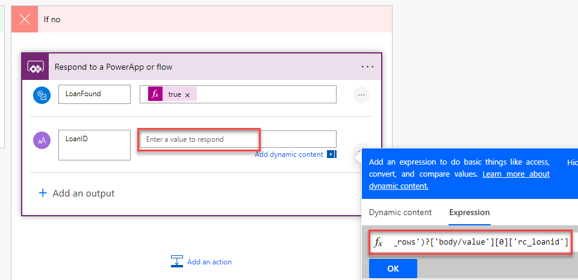 alt="paste the expression as directed" />

45. Click on the … more actions button and select **Rename**.

46. Rename the step **Found response**.

47. Click **Save** to save the flow.

> 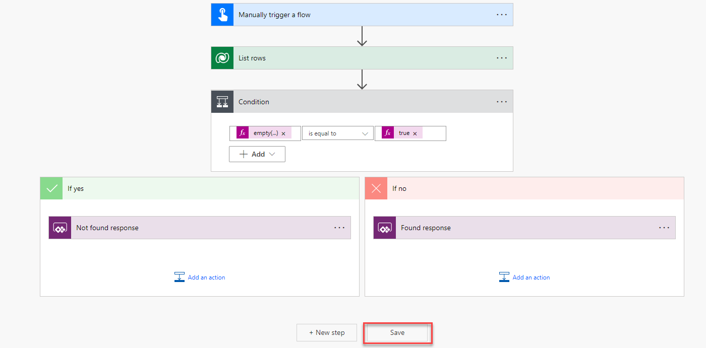 alt="save the flow" />

48. Click **Test**.

> 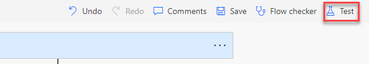 alt="test the flow" />

49. Select **Manually** and click **Test**.

50. Enter **MC3747** for LoanNumber and click **Run flow**.

> 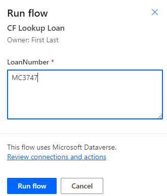 alt="give the load number MC3747" />

51. Click **Done**.

52. Click to expand the response step.

53. Make sure the output body matches your expectation.

>  alt="verify the output" />

54. You may close the flow

# Exercise \#2: Inspection Child flow

## Task \#1: Setup Machine connection

1.  Navigate to <https://make.powerapps.com/> and make sure you are in
    the Dev environment.

2.  Select **Solutions** and open the **Construction Funding** solution.

3.  Click **+ New** and select **More \| Connection Reference**.

>  alt="in the solution select new connection reference" />

4.  Enter Desktop Flows for Display name, select Desktop flows for
    Connector, click on the Connection dropdown and select **+ New
    connection**.

>  alt="select new connection" />

5.  Select Direct to machine for Connect and select your desktop. If you
    don’t see your desktop here, go to desktop flow machine settings and
    make sure you have the Dev environment selected.

> 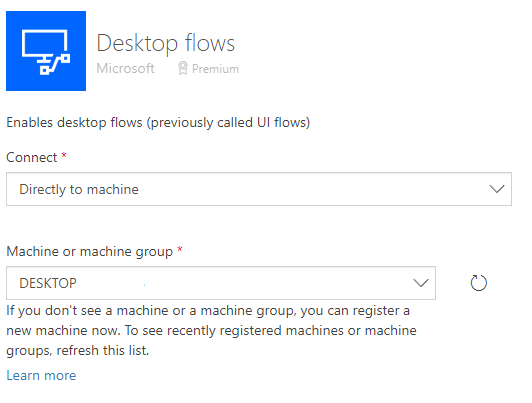 alt="set the connections for the desktop flow" />

6.  Provide your username, password, and click **Create**. If your
    username doesn’t work try admin as the username.

>  alt="provide user information" />

7.  Close the connection browser tab or window.

8.  Click on the **Refresh** connection button.

>  alt="refresh the connection" />

9.  Select the connection you created and click **Create**.

>  alt="select create" />

## Task \#2: Create child flow

1.  Navigate to <https://make.powerapps.com/> and make sure you are in
    the Dev environment.

2.  Select **Solutions** and open the **Construction Funding** solution.

3.  Click **+ New** and select **Automation \| Cloud flow \| Instant**.

>  alt="add a new instant flow automation to the solution" />

4.  Enter **CF Manage Inspection Process** for Flow name, select
    **Manually trigger a flow**, and click **Create**.

5.  Expand the trigger and click **+ Add an input**.

6.  Select **Text**.

7.  Enter **PropertyAddress** and click **+ Add an input** again.

> 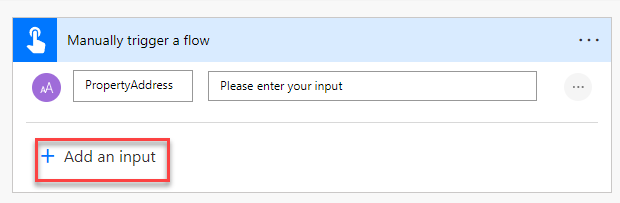 alt="enter details as listed" />

8.  Select **Text**.

9.  Enter **LoanDrawID** and click **+ Add an input** one more time.

10. Select **Text**.

11. Enter **Work**. You should now have three input parameters. Click + New
    step.

> 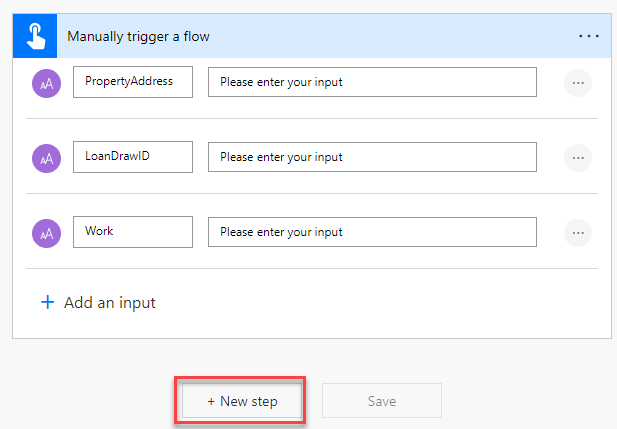 alt="enter details as listed" />

12. Select **Run a flow built with Power Automate for desktop**.

> 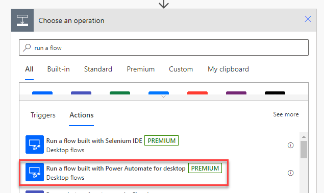 alt="search for and select Run a flow built with Power Automate for desktop" />

13. Select **Perform Site Inspection** for Desktop flow and select
    **Attended** for Run Mode.

14. Click on the **WorkToInspect** field and select **Work** from the
    dynamic content pane.

> 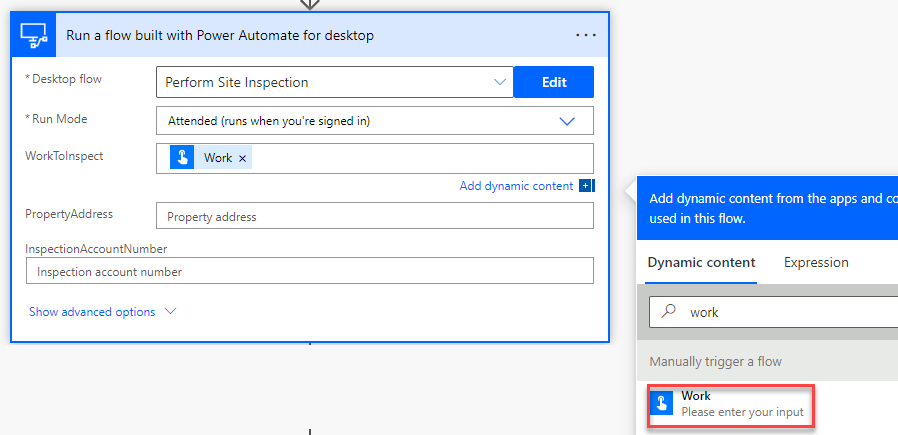 alt="select work from the dynamic content pane" />

15. Click on the **PropertyAddress** and select **PropertyAddress** from
    the dynamic content pane.

16. Enter your name for Inspection account number.

> 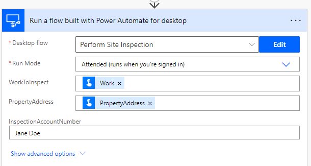 alt="enter text as described" />

17. Click **+ New step**.

18. Select **Parse JSON**.

> 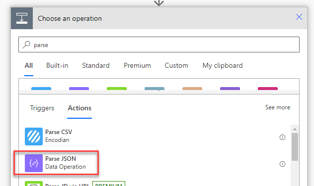 alt="select parse JSON" />

19. Click on the **Content** field and select **SitePhotos** from
    dynamic content pane.

>  alt="select SitePhotos from dynamic content pane" />

20. Paste the JSON schema below in the **Schema** field and click **+
    New step**. Typically, you would generate this from a sample of the
    data expected.

{

"type": "object",

"properties": {

"images": {

"type": "array",

"items": {

"type": "object",

"properties": {

"name": {

"type": "string"

},

"url": {

"type": "string"

}

},

"required": \[

"name",

"url"

\]

}

}

}

}

>  alt="select new step" />

21. Select HTTP.

>  alt="select HTTP action" />

22. Select **GET** for Method, click on the **URI** field, and select
    **url** from the dynamic content pane.

> 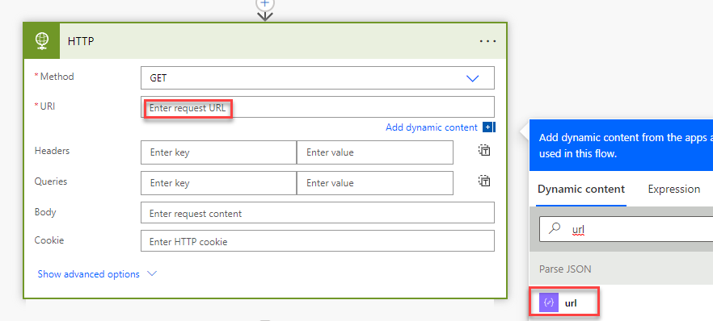 alt="select Get method" />

23. Apply to each will be added automatically for you. Rename the Apply
    to each step **Apply to each image**.

24. Click **Add an action**.

> 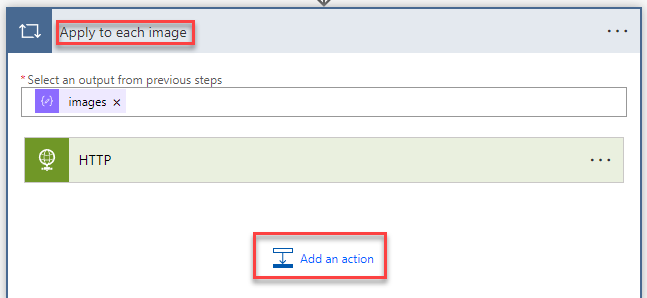 alt="select add an action from the apply to each image step" />

25. Select **Add a new row** Microsoft Dataverse.

> 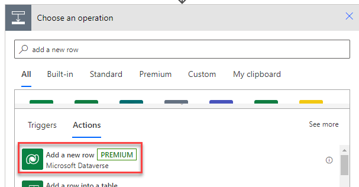 alt="search for and select Add a new row action" />

26. Select **Inspection Photos** for Table name, click on the **Name**
    field, and select **name** from the dynamic content pane.

> 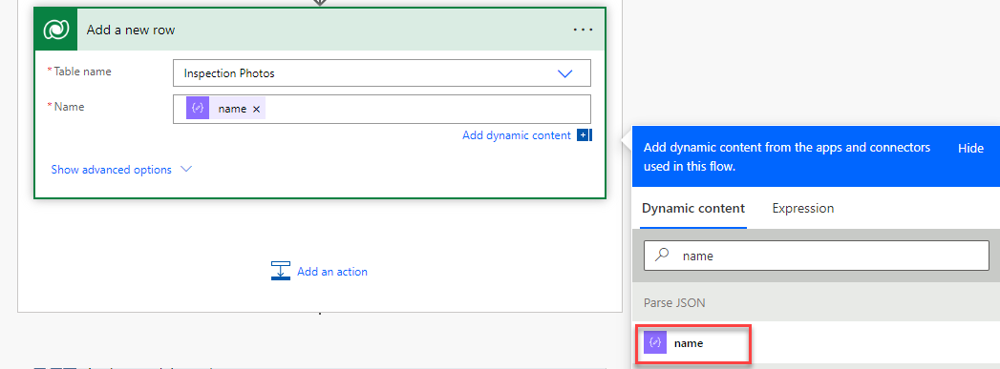 alt="choose Inspection Photo and enter the details" />

27. Rename the Add a new row step **Add inspection photo** and click
    Show advanced options.

>  alt="rename the step" />

28. Enter **rc_loandraws()** for Loan Draw, place your cursor inside the
    single parentheses, and select **LoanDrawID** from the dynamic
    content pane.

> 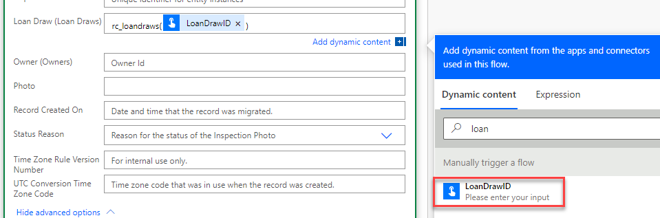 alt="enter details shown" />

29. Click on the **Photo** field, go to the dynamic content pane, and
    select the **Expression** tab.

30. Paste the expression below and click OK.

base64(body('HTTP'))

> 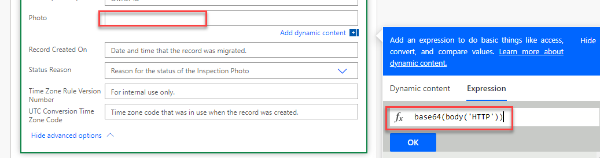 alt="enter details shown" />

31. Click **+ New step**.

>  alt="select add new step" />

32. Select **Update a row** Microsoft Dataverse.

>  alt="search for an select Update a row Microsoft Dataverse" />

33. Select **Loan Draws** for Table name, click on the **Row ID** field
    and select **LoanDrawID** from the dynamic content pane.

34. Click **Show advanced options**.

>  alt="show advanced options" />

35. Click on the **Inspected On** field, go to the dynamic content pane,
    select the **Expression** tab, type **utcNow()** and click **OK**.

>  alt="add time to the field" />

36. Click on the **Inspection Job** field and select **JobNumber** from
    the dynamic content pane.

>  alt="add job number field" />

37. Select Inspection Completed for **Status Reason** and click **Hide
    advanced options**.

> 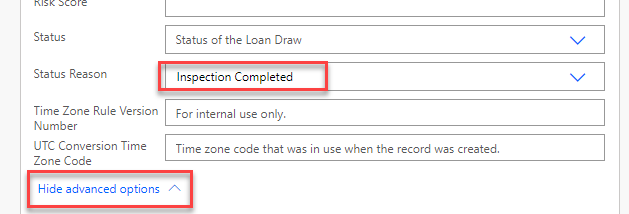 alt="input status reason and hide advanced options" />

38. Rename the step **Update loan draw** and click **+ New step**.

39. Select **Respond to PowerApp or flow**.

> 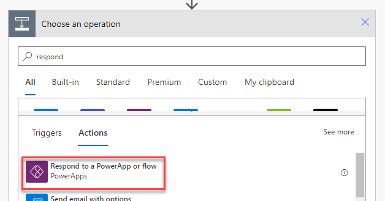 alt="search for and select Respond to PowerApp or flow" />

40. Click **+ Add an output**.

41. Select **Text**.

42. Enter **InspectionStatus**, click on the value field and select
    **InspectionStatus** from the dynamic content pane.

>  alt="enter details as described" />

43. Click **+ Add an output** again.

44. Select **Text**.

45. Enter **JobNumber**, click on the value field and select
    **JobNumber** from the dynamic content pane.

>  alt="enter details as described" />

46. Click **Save** to save the flow.

47. Click on the back button.

>  alt="select back button" />

48. Open the flow details.

>  alt="open flow details" />

49. Click **Run**.

50. Select **Manually** and click **Test** again.

51. Click **Continue**.

>  alt="run the flo" />

52. **DO NOT** navigate away from this page.

53. Start a new browser instance and navigate to
    <https://make.powerapps.com/> and make sure you are in the Dev
    environment.

54. Select **Apps** and launch the **Loan Manager** application.

>  alt="launch the loan manager app" />

55. Click to open the first loan.

56. Click **Related** and select Loan Draws.

>  alt="drill into record details as described" />

57. Click **+ New Loan Draw**.

>  alt="add a new loan draw" />

58. Enter **Test Draw** for Name and click **Save**.

59. Click on the Test Draw row to open

60. Go to the URL and copy the **id**. Keep this id in a notepad, you
    will need it in future steps.

>  alt="get the url id as described" />

61. Go back to the cloud flow and enter **123 main street** for
    PropertyAddress, paste the id you copied in the LoanDrawID field,
    type **Test work item** for Work, and click **Run flow**.

> 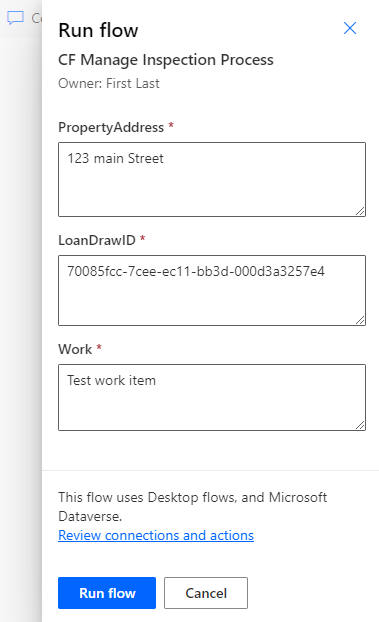 alt="follow the steps to run the flow" />

62. Wait for the flow run to complete.

63. Close the run flow pane.

64. Go to the flow run history and click refresh until the flow run
    succeeds.

>  alt="wait for the succeeded message" />

65. Go back to the **Loan Manager** application, click **Related** and
    select **Inspection Photos**.

>  alt="select the related photos" />

66. You should see the inspection photos created by the flow.

> 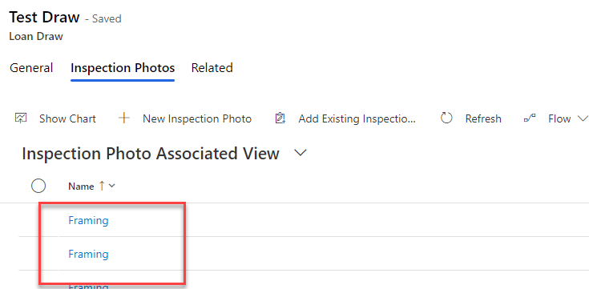 alt="review what was created" />

# Exercise \#3: Funding Child flow

## Task \#1: Create child flow

1.  Navigate to <https://make.powerapps.com/> and make sure you are in
    the Dev environment.

2.  Select **Solutions** and open the **Construction Funding** solution.

3.  Click **+ New** and select **Automation \| Cloud flow \| Instant**.

4.  Enter **CF Manage Woodgrove Funding Process** for Flow name, select
    **Manually trigger a flow**, and click **Create**.

>  alt="name your new flow" />

5.  Click **+ Add an input**.

>  alt="select add input" />

6.  Select **Text**.

7.  Enter **LoanNumber** and click **+ Add an input** again.

8.  Select **Text**.

9.  Enter **LoanDrawID** and click **+ Add an input** again.

10. Select **Text**.

11. Enter **RequestedAmount** and click **+ Add an input** again.

12. Select **Text**.

13. Enter **InspectionJobID** and click **+ Add an input** again.

14. Select **Number**.

15. Enter **RiskScore**.

16. You should now have five inputs. Click **+ New step**.

> 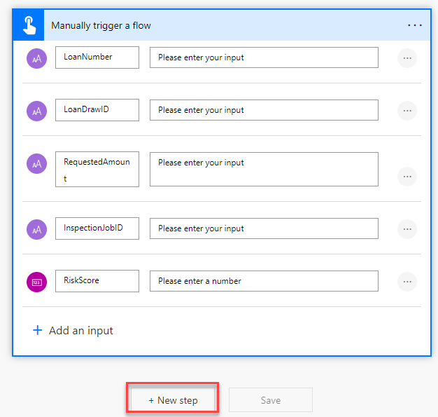 alt="review the steps and select new step" />

17. Select **Run a flow built with Power Automate for desktop**.

>  alt="search for and use Run a flow built with Power Automate for desktop" />

18. Select **Woodgrove Funding Manager Draw** for Desktop flow and
    select **Attended** for Run Mode.

19. Click on the **LoanNumber** field and select **LoanNumber** from the
    dynamic content pane.

> 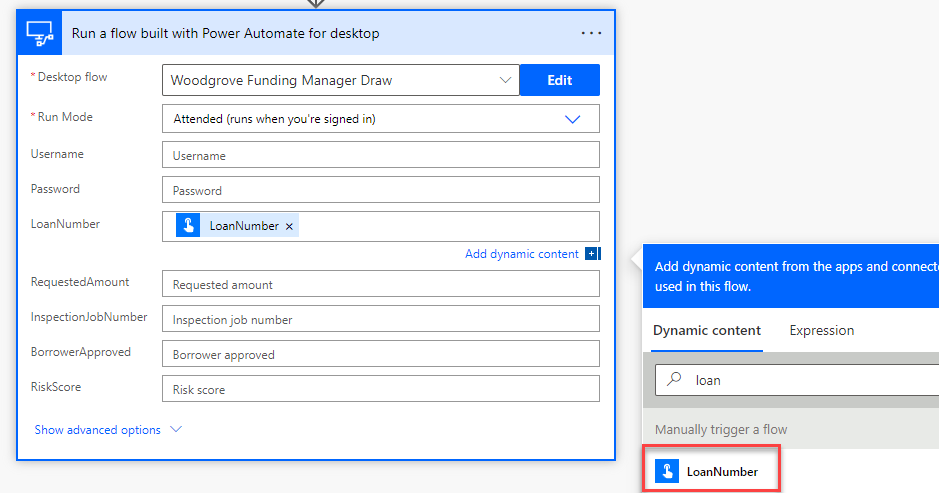 alt="follow the steps for using the dynamic content pane" />

20. Click on the **RequestedAmount** field and select
    **RequestedAmount** from the dynamic content pane.

21. Click on the **InspectionJobNumber** field and select
    **InspectionJobIS** from the dynamic content pane.

22. Type **Yes** for BorrowerApproved.

23. Click on the **RiskScore** field and select **RiskScore** from the
    dynamic content pane.

24. Enter your name for Username, **pass@word1** for Password.

25. The run desktop flow should now look like the image below. Click **+
    New step**.

> 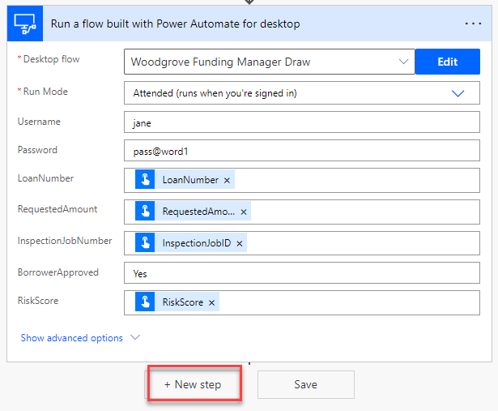 alt="review the steps" />

26. Select **Condition**.

27. Click on the first operand and select **FundingStatus** from the
    dynamic content pane.

> 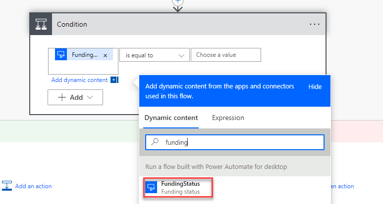 alt="add details to the funding step" />

28. Select **is equal to** for operator and enter **Approved** for the
    second operand.

29. Go to the **If yes** branch and click **Add an action**.

> 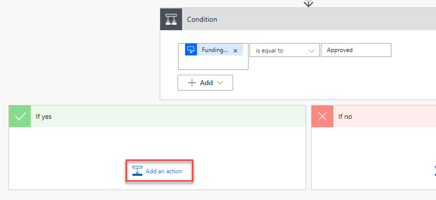 alt="add an action to the yes side" />

30. Select **Update a row** Microsoft Dataverse.

> 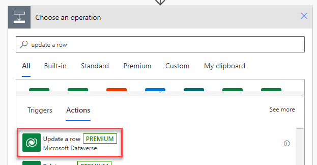 alt="select update a row for Dataverse" />

31. Select **Loan Draws** for Table name, click on the Row ID field and
    select **LoanDrawID** from the dynamic content pane.

> 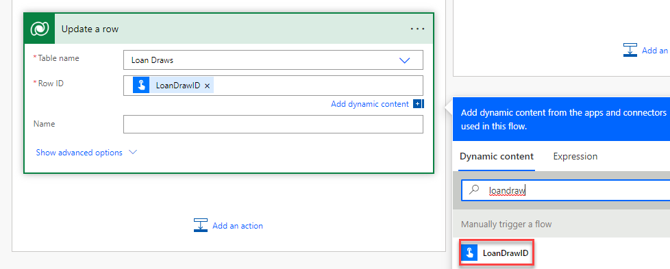 alt="select loan draw for table" />

32. Click **Show advanced options**.

33. Click on the **Amount Funded** field and go to the dynamic content
    pane and select the Expression tab.

34. Paste the expression below and click OK.

replace(outputs('Run_a\_flow_built_with_Power_Automate_for_desktop')?\['body/FundedAmount'\], '$','')

> 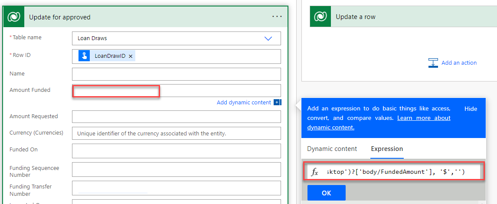 alt="paste the expression" />

35. Click on the **Funded On** field, go to the dynamic content pane,
    and select the **Expression** tab.

36. Type **utcNow()** and click **OK**.

> 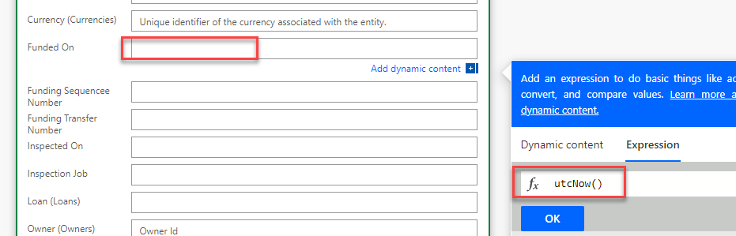 alt="add time field" />

37. Click on the **Funding Sequence Number** field and select
    **FundSequenceNumber** from the dynamic content pane.

38. Click on the **Funding Transfer Number** field and select
    **FundTransferNumber** form the dynamic content pane.

39. Click on the **RiskScore** field and select **RiskScore** form the
    dynamic content pane.

40. Select **Funding Approved** for Status Reason and click **Hide
    advanced options**.

> 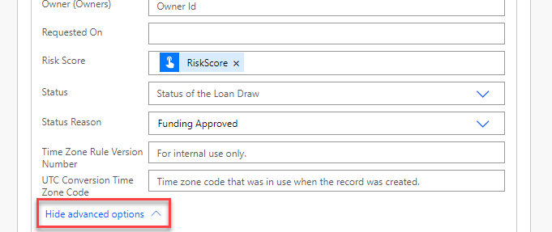 alt="set status reason" />

41. Rename the step Update for approved.

42. Go to the **If no** branch and click **Add an action**.

>  alt="add an action on the no branch" />

43. Select **Update a row** Microsoft Dataverse.

>  alt="select update a row" />

44. Select **Loan Draws** for Table name, click on the Row ID field and
    select **LoanDrawID** from the dynamic content pane.

>  alt="select loan draws" />

45. Click **Show advanced options**.

46. Select **Funding Denied** for Status Reason and click **+ New
    step**.

>  alt="set status reason" />

47. Select Respond to PowerApps or flow.

> 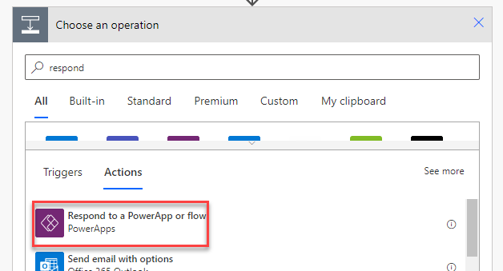 alt="select respond to PowerApp or flow action" />

48. Click **+ Add an output**.

49. Select **Text**.

50. Enter **FundingStatus**, click on the value field and select
    **FundingStatus** from the dynamic content pane.

>  alt="enter details as described" />

51. Click **Save** and wait for the flow to be saved.

52. Click **Test**.

53. Select **Manually** and click **Test** again.

54. Click **Continue**.

55. Enter **JG7165** for LoanNumber, paste the id you copied in the
    previous exercise for LoanDrawID, enter **80000** for
    RequestedAmount, enter **123** for InspectionJobID, enter **50** for
    RiskScrore, and click **Run flow**.

>  alt="run the flow with the provided details" />

56. Wait for the flow run to complete.

57. The flow run should succeed.

# Exercise \#4: Build Overall Process Flow

## Task \#1: Create a shared mailbox

1.  Navigate to <https://admin.microsoft.com/> and click **Show all**.

> 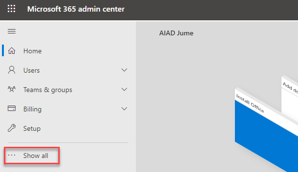 alt="in the admin portal, select show all" />

2.  Go to the **Admin centers** area and select **Exchange**.

> 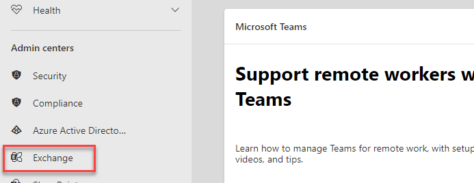 alt="select exchange" />

3.  Click **+ Add a shared mailbox**.

>  alt="add a shared mailbox" />

4.  Enter **Funding** for Display name, **Funding** for Email address,
    select your domain, and click **Create**.

>  alt="enter details as described" />

5.  Click **Add users to this mailbox**.

> 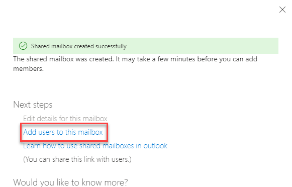 alt="add users to mailbox" />

6.  Click **+ Add members**.

7.  Select your user and click **Save**. You may add other users to the
    shared mailbox.

> 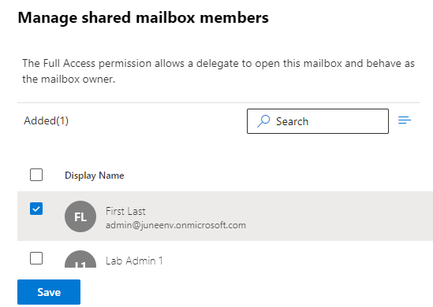 alt="manage mailbox members" />

8.  Click **Confirm**.

9.  Close the shared mailbox pane.

## Task \#2: Create flow

1.  Navigate to <https://make.powerapps.com/> and make sure you are in
    the Dev environment.

2.  Select **Solutions** and open the **Construction Funding** solution.

3.  Locate and open the **CF Manage Inspection Process** child flow.

> 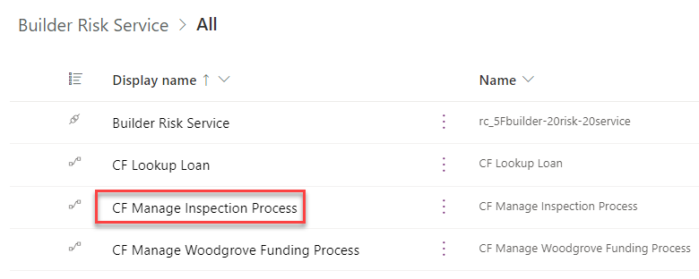 alt="locate the child flow" />

4.  Go to the **Run only users** section and click **Edit**.

> 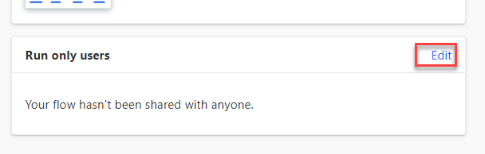 alt="edit users" />

5.  Select the desktop connection you created and click **OK** on the
    popup.

6.  Click **Save**.

>  alt="select desktop flows" />

7.  Click on the browser back button.

8.  Locate and open the **CF Manage Woodgrove Funding Process** child
    flow.

> 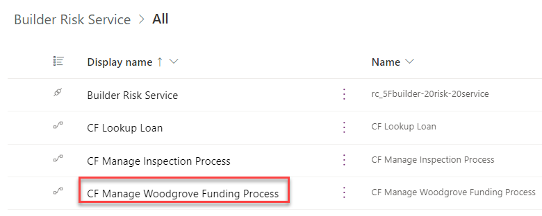 alt="open the next child flow" />

9.  Go to the **Run only users** section and click **Edit**.

10. Select the desktop connection you created and click **OK** on the
    popup.

11. Click **Save**.

12. Click on the browser back button.

13. Click **+ New** and select **Automation \| Cloud flow \|
    Automated**.

>  alt="select automated" />

14. Enter **Process Construction Funding Request** for Flow name, select
    **When a new email arrives in a shared mailbox (V2)**, and click
    **Create**.

>  alt="name and create the flow" />

15. Select the **Funding** shared email you created for **Original
    Mailbox Address**, select **Inbox** for Folder, and click **Show
    advanced options**.

16. Select **Yes** for Include attachments and click on the **…** button
    of the trigger.

>  alt="select the ellipses " />

17. Select **Rename**.

18. Rename the trigger **When a new funding request email arrives**.

19. Click **+ New step**.

20. Select **Run a child flow**.

> 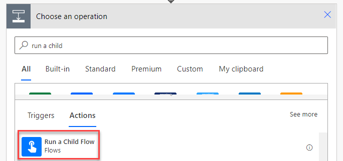 alt="select run a child flow action" />

21. Select **CF Lookup** for Child flow.

22. Click on the **LoanNumber** field, go to the dynamic content pane,
    and select **Subject**.

>  alt="enter details as described" />

23. Rename the step **Lookup loan number**.

24. Click **+ New step**.

25. Select **Condition**.

26. Click to select the first operand field, go to the dynamic content
    pane, and select **LoanFound**.

>  alt="enter details as described" />

27. Select **is equal to** for the operator, click to select the second
    operand field, and input True.

28. Rename the condition **Check if loan number found**.

29. Go to the **If no** branch and click **Add an action**.

> 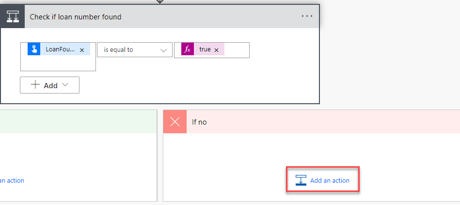 alt="add an action on the no branch" />

30. Select **Send an email from a shared mailbox (V2).**

>  alt="select send email from shared mailbox v2" />

31. Click on the **Original mailbox Address** and select **To** from the
    dynamic content pane.

>  alt="enter details as described" />

32. Click on the **To** and select **From** from the dynamic content
    pane.

33. Type **Loan number not found** for Subject.

34. Type **Loan \#** Body and select **Subject** from the dynamic content
    pane.

>  alt="enter details as described" />

35. Add **not found, contact your bank.** to the body.

36. Rename the reply **Send loan not found email** and click **Add an
    action**.

>  alt="enter details as described" />

37. Select **Terminate**.

> 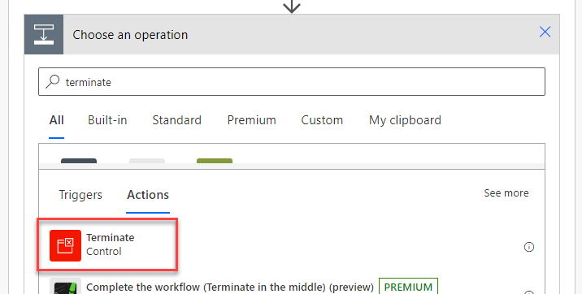 alt="select terminate action" />

38. Select **Succeeded** for Status.

39. Click **+ New step**.

>  alt="select new step" />

40. Select **Add a new row** Microsoft Dataverse.

> 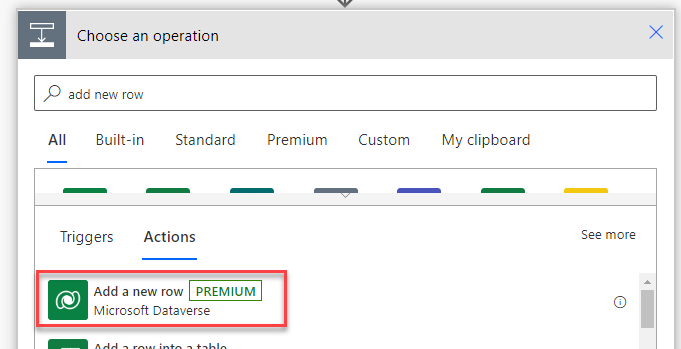 alt="select add a new row" />

41. Select **Loan Draws** for Table name.

42. Enter **Loan draw** for Name and click **Show advanced options**.

> 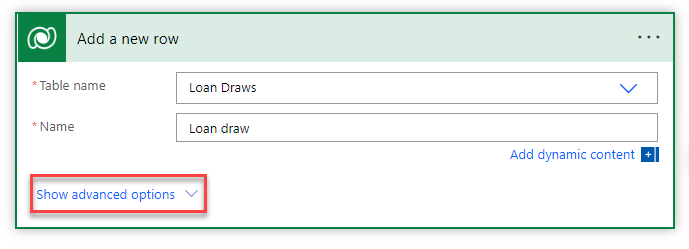 alt="enter details as described" />

43. Enter **80000** for Amount Requested.

44. Type **rc_loans()** for Loan (Loans), place your cursor inside the
    single parentheses, and select **LoanID** from the dynamic content
    pane.

> 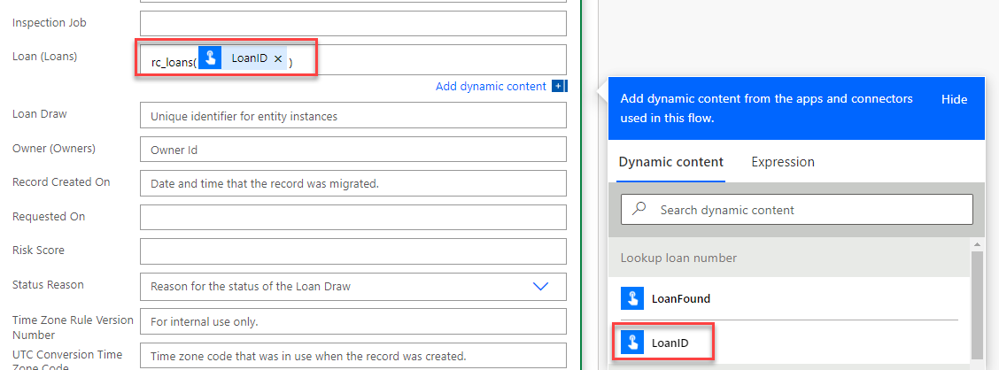 alt="enter details as described" />

45. Rename the step **Create new loan draw row**.

46. Click **+ New step.**

47. Select **Run child flow**.

48. Select **CF Manage Inspection Process** for Child flow.

49. Enter **123 Main Street** for PropertyAddress.

50. Click on the **LoanDrawID** field and select **Loan Draw** from the
    dynamic content pane.

> 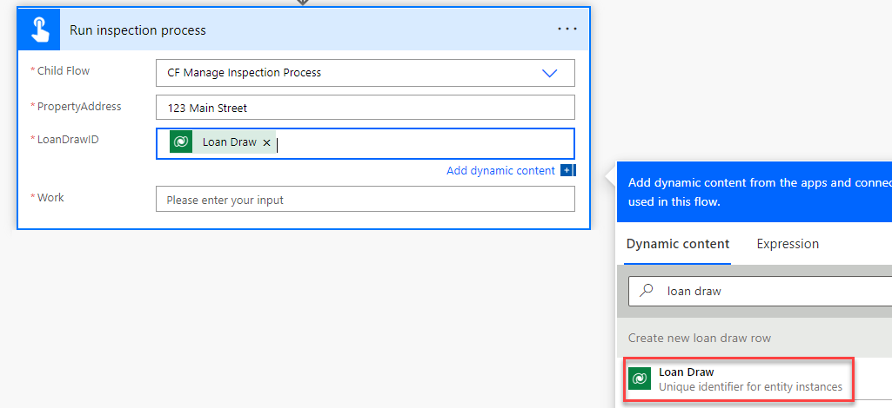 alt="enter details as described" />

51. Enter **Test work item** for Work.

52. Rename the child flow **Run inspection process** and click **+ New
    step**.

>  alt="rename the flow and select add new step" />

53. Select **Run a child flow**.

54. Select **CF Manage Woodgrove Funding Process** for Child flow.

55. Click on the **LoanNumber** field and select **Subject** from the
    dynamic content pane.

56. Click on the **LoanDrawID** field and select **Loan Draw** from the
    dynamic content pane.

57. Ener **80000** for RequestedAmount.

58. Click on the **InspectionJobID** field and select **JobNumber** from
    the dynamic content pane.

59. Enter **55** for **RiskScore**.

60. Rename the child flow **Run funding process**.

61. Click **+ New step**.

>  alt="click new step" />

62. Select **Condition**.

63. Click on the first operand and select **FundingStatus** from the
    dynamic content pane.

>  alt="enter details as described" />

64. Select **is equals to** for operator and enter **Approved** for the
    second operand.

65. Rename the condition **Check approval status**.

66. Go to the **If yes** branch and click **Add an action**.

>  alt="add an action on the yes branch" />

67. Select **Send an email from a shared mailbox (V2).**

68. Click on the **Original Mailbox Address** field and select **To**
    from the dynamic content pane.

69. Click on the **To** field and select **From** from the dynamic
    content pane.

70. Enter **Draw Approved** for Subject.

71. Type **Your draw for** in the Body and select **Amount Funded** from
    the dynamic content pane.

> 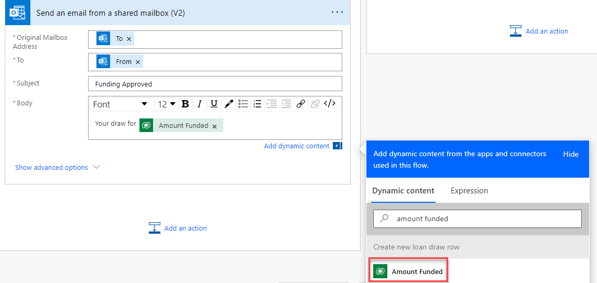 alt="enter details as described" />

72. Add **was approved** to the body.

73. Rename the step **Send approved draw email**.

74. Go to the **If no** branch and click **Add an action**.

>  alt="add an action to the no branch" />

75. Select **Send an email from a shared mailbox (V2).**

76. Click on the **Original Mailbox Address** field and select **To**
    from the dynamic content pane.

77. Click on the **To** field and select **From** from the dynamic
    content pane.

78. Enter **Draw was not approved** for Subject.

79. Type **Your draw for** in the Body and select **Amount Funded** from
    the dynamic content pane.

80. Add **was not approved, please contact bank.** to the body.

81. Rename the step **Send draw not approved email**.

82. Click **Save** and wait for the flow to be saved.

>  alt="save the flow" />

## Task \#3: Test flow

1.  Click **Test**.

2.  Select **Manually** and click **Test** again.

3.  Send an email with the subject **MC3747** from your email to the
    Funding shared email you created
    (Funding@yourdomain.onmicrosoft.com).

4.  Wait for the flow to get triggered. Do not interact your computer
    while the flow is running.

5.  The flow should run successfully.

>  alt="review the tested flow" />

6.  You should receive the approved email.
