---
lab:
    title: 'Lab 4 - Custom Connectors'
    module: 'Module 4 - Custom Connectors'
---

# Custom Connectors

## Scenario

In this lab, you will build a custom connector for A Datum’s Risk Score
API.

## High-level lab objectives

-   Build a custom connector

-   Modify the cloud flow to use the connector

# Exercise \#1: Create a custom connector

## Task \#1: Create a new solution

1.  Navigate to <https://make.powerapps.com/> and make sure you are in
    the Dev environment.

2.  Select **Solutions** and click **+ New solution**. We are creating a
    new solution to keep the custom connector separate from the flow
    that uses it which is the current requirement of using a custom
    connector.

3.  Enter **Builder Risk Service** for Display name, select
    **Relecloud** for Publisher, and click **Create**.

> 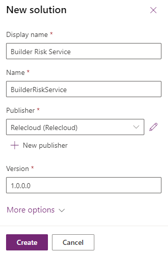 alt="create your new solution as described" />

## Task \#2: Create custom connector

1.  Click **+ New** and select **Automation \| Custom connector**.

>  alt="add a new custom connector" />

2.  Enter **Builder Risk Service** for Connector Name.

> 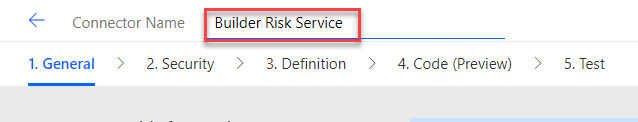 alt="name the connector" />

3.  Enter **Service for evaluating builder risk** for Description, enter
    **adatumbuilderrisktest.azurewebsites.net** for Host, and click
    **Create connector**.

>  alt="create the connector" />

## Task \#3: Import Open API 

1.  Navigate to <https://adatumbuilderrisktest.azurewebsites.net/>

2.  Click **Download Logo** and save the logo on your machine.

3.  Click on the **API Key** link.

> 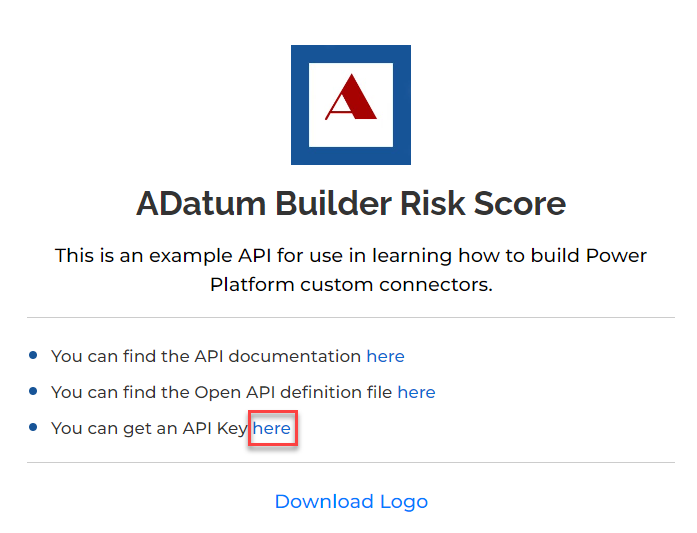 alt="download API key" />

4.  Copy the **API Key** and save it on a notepad.

5.  Click **Return to home**.

6.  Click on the **API documentation** link.

7.  Review the documentation.

8.  Close the documentation browser tab or window, after you finish
    reviewing.

9.  Click on the **Open API definition file** link.

>  alt="click to review definition" />

10. On your keyboard press **CTRL + S** and select **Save**. Now the file is saved on your machine.

11. Navigate to <https://make.powerautomate.com/> and make sure you are in
    the Dev environment.

12. Click **More** and select **Discover all**.

> 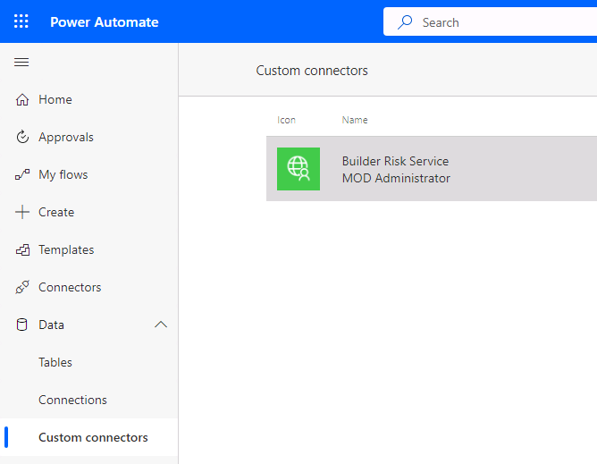 alt="Expand more option in navifation" />

13. Scroll down and select **Custom connectors** under data.

> 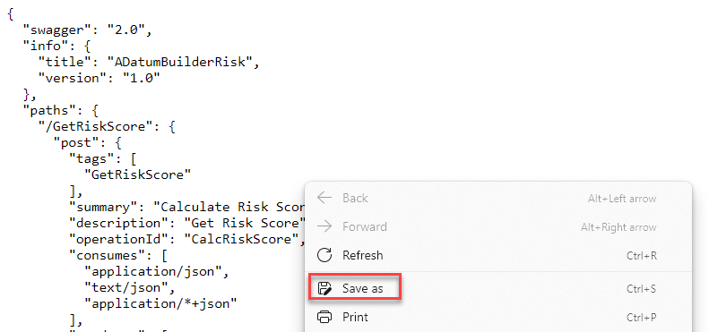 alt="Find custom connectors" />

14. Click on the **…** more actions button of the **Builder Risk
    Service** custom connector and select **Update from OpenAPI file**.

>  alt="locate and update the OpenAPI file" />

15. Click **Import**.

16. Select the **swagger.json** file you saved to your machine and click
    **Open**.

17. Click **Continue**.

> 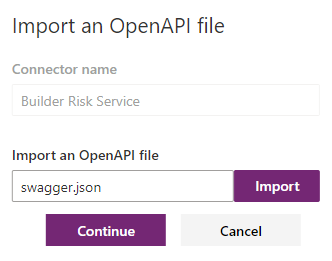 alt="Import the file" />

18. Click **Upload** logo.

19. Select the logo you downloaded and click **Open**.

20. Enter **Builder risk service** for Description, enter

    **adatumbuilderrisktest.azurewebsites.net** for Host, and select **Security** from the breadcrumb navigation bar at the top of the screen.

> 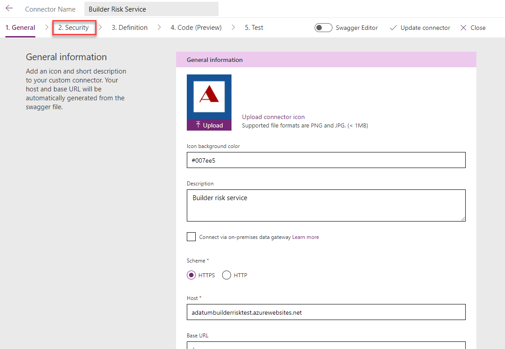 alt="enter details as described" />

21. Select **Definition** from the breadcrumb navigation bar at the top of the screen and see the operation imported.

22. Turn on **Swagger Editor**.

> 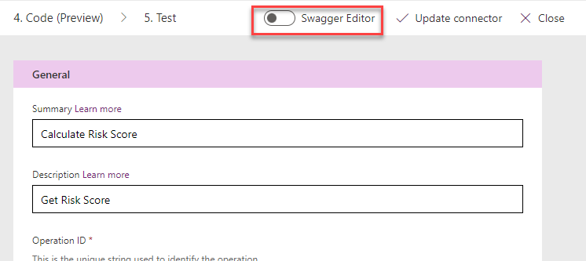 alt="toggle swagger editor" />

23. Have a look at the Swagger Editor and then turn off the **Swagger Editor**.

24. Select **Update connector** and wait for the connector to be updated.

25. Do not navigate away from this page.

## Task \#4: Test connector

1.  Select **Test** from the breadcrumb navigation bar at the top of the screen and click **+ New connection**.

> 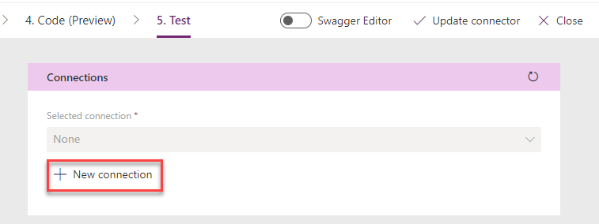 alt="select new connection" />

2.  Paste your **API Key** and click **Create connection**.

5.  Click the **Refresh connections** button, on the right. The connection you just created should be the **Selected connection**.

6.  Under CalcRiskScore, enter **Contoso** for builderName, **7165 Brock Lane Renton, WA
    61795 U.S.** for propertyAddress, **JG7165** for loanNumber,
    **645000** for loanAmount, **500000** for creditAvailable,
    **100000** for drawAmount, and click **Test operation**.

> 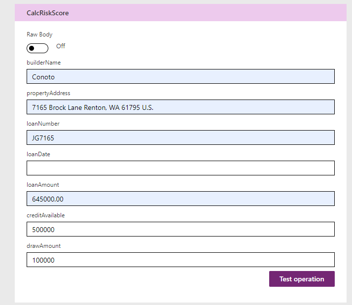 alt="Enter details as described" />

7.  The test should run successfully, and you should receive a score and
    a reason.

>  alt="review results" />

8.  Click **Close** to return to the list of Custom connectors.

# Exercise \#2: Modify cloud flow to use connector

## Task \#1: Use custom connector in flow

1.  Navigate to <https://make.powerapps.com/> and make sure you are in
    the Dev environment.

2.  Select **Solutions** and open the **Construction Funding** solution.

3.  Select **Cloud flows**, select **Process Construction Funding
    Request** flow and click **Edit**.

>  alt="locate and edit the flow" />

4.  Click **+** insert new step after the **Check if loan number found**
    condition and select **Add an action.**

> 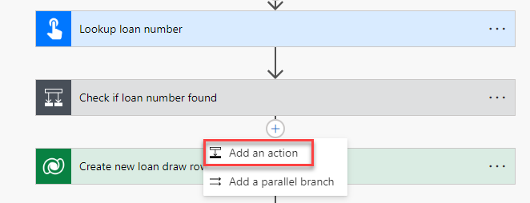 alt="add a new step" />

5.  Select **Get a row by ID** Microsoft Dataverse.

>  alt="select get a row by ID action" />

6.  Select **Loans** for Table name, click on the **Row ID** field and
    select **LoanID** from the dynamic content pane.

> 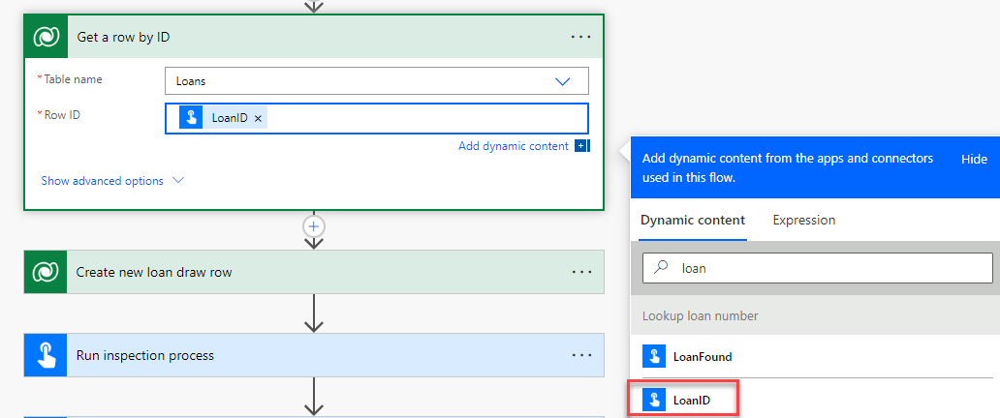 alt="enter details as described" />

7.  Rename the step **Get loan**.

8.  Go to the **+** Insert a new step button after the **Run inspection
    process** and select **Add an action**.

>  alt="add an action" />

9.  Go to the **Custom** tab and select **Builder Risk Service**.

>  alt="add the custom action you provided" />

10. Select the **Calculate Risk Score** action.

11. Enter **Risk Service** for Connection name, paste the API Key you
    copied earlier, and click **Create**.

> 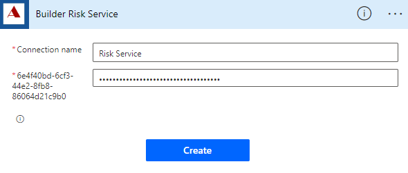 alt="enter details as described" />

12. Click on the **builderName** field and select **Builder** from the
    dynamic content pane.

> 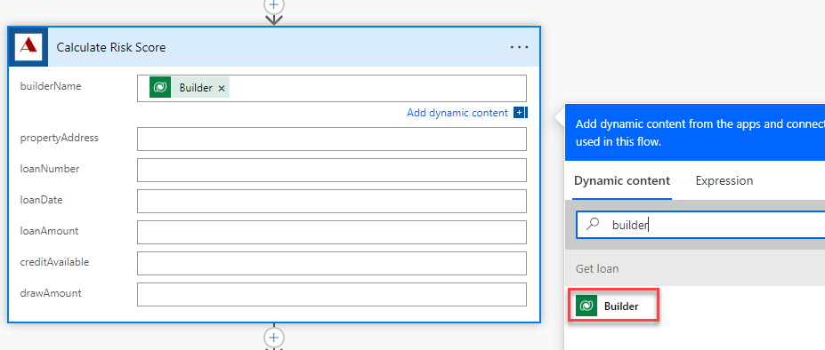 alt="enter details as described" />

13. Click on the **propertyAddress** field and select **Address** from
    the dynamic content pane.

14. Click on the **loanNumber** field and select **Loan Number** from
    the dynamic content pane.

15. Click on the **loanDate** field and select **Loan Date** from the
    dynamic content pane.

16. Click on the **loanAmount** field and select **Loan Amount** form
    the dynamic content pane.

17. Click on the **creditAvailable** field and select **Credit
    Available** from the dynamic content pane.

18. Enter **80000** for drawAmount.

19. The calculate risk score step should now look like the image below.

> 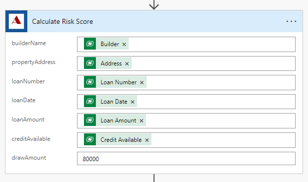 alt="review the details" />

20. Click on the **+** Insert a new step after the **Calculate Risk
    Score** step and select **Add an action**.

> 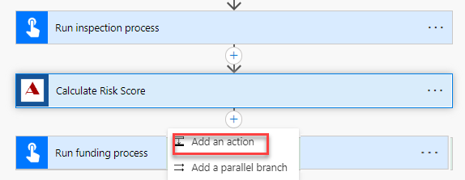 alt="add an action" />

21. Select **Update a row** Microsoft Dataverse.

22. Select **Loan Draws** for Table name, click on the **Row ID** field
    and select **Loan Draw** from the dynamic content pane.

23. Expand Show advanced options and Click on the **Risk Score** field and select **score** from the
    dynamic content pane.

24. Select **Risk Scored** for Status reason.

25. Rename the step **Update loan draw risk score**.

26. The update loan draw step should look like the image below.

> 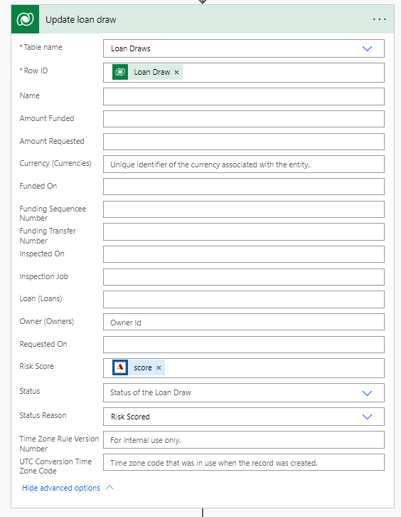 alt="review the details" />

27. Click to expand the **Run inspection process** step.

28. Remove the **PropertyAddress** value and select **Address** from the
    dynamic content pane.

>  alt="enter details as described" />

29. Expand the **Run funding process** step.

30. Remove the **RiskScore** value and select **Score** from the dynamic
    content pane.

> 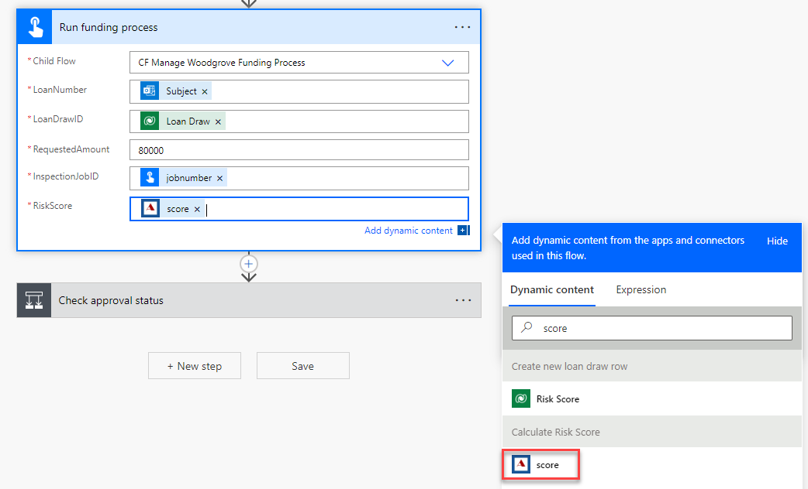 alt="enter details as described" />

31. Click **Save** and wait for the flow to be saved.

## Task \#2: Test the flow

1.  Click **Test**.

2.  Select **Manually** and click **Test**.

3.  Send an email to <Funding@yourdomain.onmicrosoft.com> with the Subject line
    as **PS7765**.

4.  The flow test should run and succeed.

5.  On the **Run History** for the flow test, all steps should show a green tick. Expand the **Calculate Risk Score** step.

6.  The output should look like the image below:

>  alt="test the flow" />

7.  You should receive an email with the subject **Draw Approved**.
