# Scenario

In this lab, you will be using AI Builder to process the construction
funding request form document that was emailed to the funding shared
mailbox to extract essential information. The extracted information will
be stored in Dataverse for use in the funding process.

# High-level lab steps

-   Use sample request forms to train an AI Builder model

-   Modify the cloud flow to use the model to process the inbound
    document

-   Store the extracted information in the Loan Draw table

# Exercise \#1: Train model for request form

In this exercise, you will create an AI Builder model that will process
the funding request form.

## Task \#1: Create AI Builder model

1.  Go to the lab resources folder and open the **Train** folder.

2.  Click to open **Jim Glynn.pdf**.

>  alt="select the pdf in file explorer" />

3.  The documents from which the model will extract the data will look
    like this document. Keep this file open, you will need it during
    model creation.

>  alt="review the document" />

4.  Navigate to <https://make.powerapps.com/> and make sure you are in
    the Dev environment.

5.  Expand **AI Builder** and select **Models**.

> 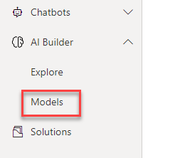 alt="select AI Builder models" />

6.  Click Start free trial.

7.  Click **+ Build a model**.

8.  Select **Extract custom information from document**.

> 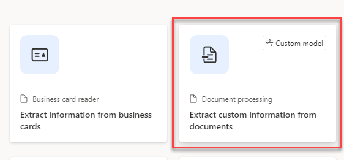 alt="Choose document processing" />

9.  Click **Get started**.

10. Select **Structured and semi-structured documents** and click
    **Next**.

> 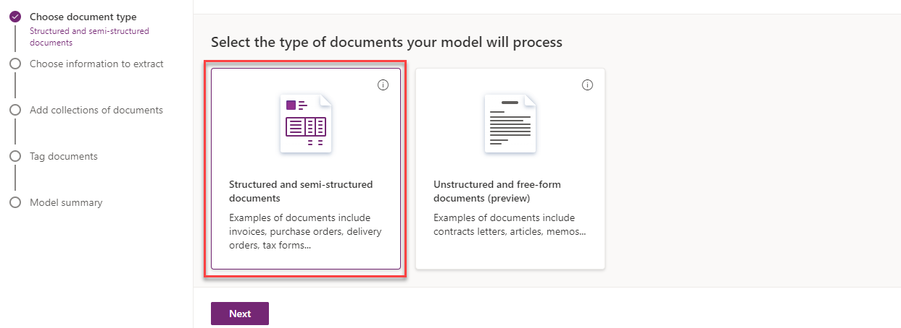 alt="select as described" />

11. Do not navigate away from this page.

12. Go to the **Jim Glynn** pdf fie, you will create fields and a table
    in the model that match the fields and the table in this document.

>  alt="select as described" />

13. Go back to the model. Click the chevron button on the **+ Add**
    button and select **Field**.

> 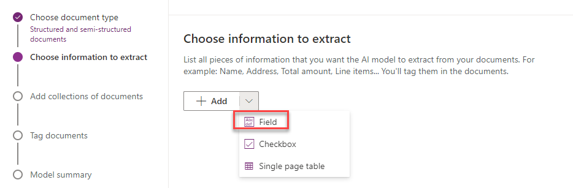 alt="select as described" />

14. Enter **Owner Name** and click **Done**.

> 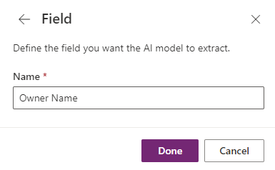 alt="enter details as described" />

15. Click the chevron button on the **+ Add** button and select
    **Field** again.

16. Enter **Property Address** and click **Done**.

17. Click the chevron button on the **+ Add** button and select
    **Field**.

18. Enter **Builder Name** and click **Done**.

19. Click the chevron button on the **+ Add** button and select
    **Field**.

20. Enter **Draw Amount** and click **Done**.

21. Click the chevron button on the **+ Add** button and select
    **Field** one more time.

22. Enter **Loan Number** and click **Done**.

23. You should now have five fields added.

> 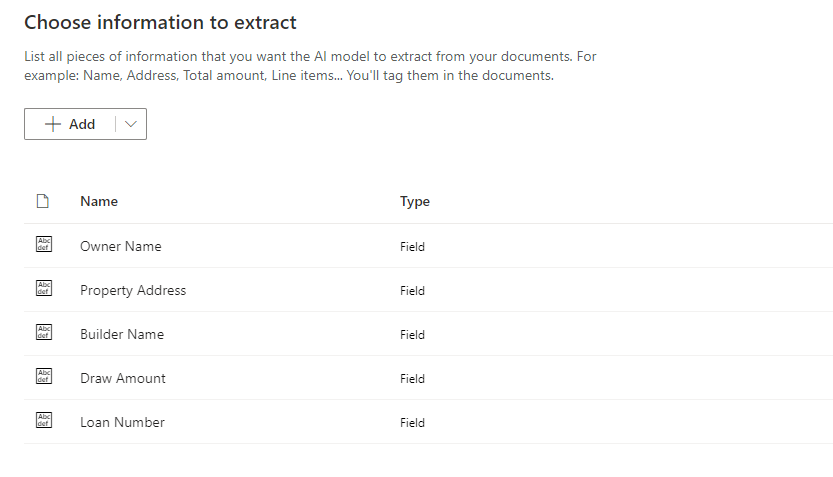 alt="review the resulting screen" />

24. You will now add the table details. Click the chevron button on the
    **+ Add** button and select **Single page table**.

> 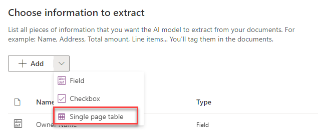 alt="select as described" />

25. Enter **Budget Items** for Table name.

26. Click on **Column 1** and select **Rename column**.

> 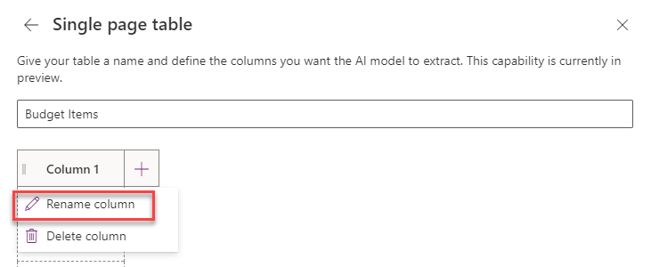 alt="select as described" />

27. Enter **Budget Category** and click **Rename**.

> 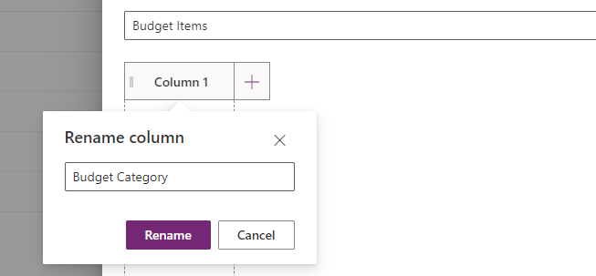 alt="enter details as described" />

28. Click **+** **New column**.

> 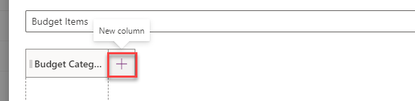 alt="select as described" />

29. Enter **Amount** and click **Add**.

30. Your table should now have 2 columns. Click **Done**.

> 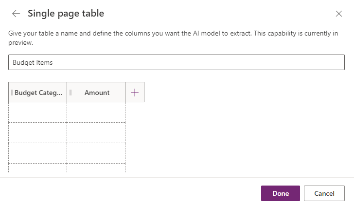 alt="review the results" />

31. Click **Next**.

32. Do not navigate away from this page.

## Task \#2: Add sample documents

1.  Click **New collection.**

> 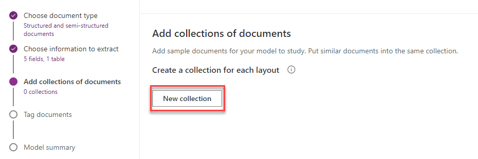 alt="select as described" />

2.  Enter **Sample documents** for collection name and click **+** add.

> 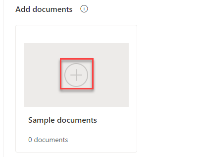 alt="select as described" />

3.  Click **Add documents**.

4.  Select **My device**.

5.  Select all **5** PDF files located in the **Train** folder and click
    **Open**.

>  alt="select the files" />

6.  Click **Upload 5 documents** and wait for the files to be loaded.

7.  Click **Close**.

> 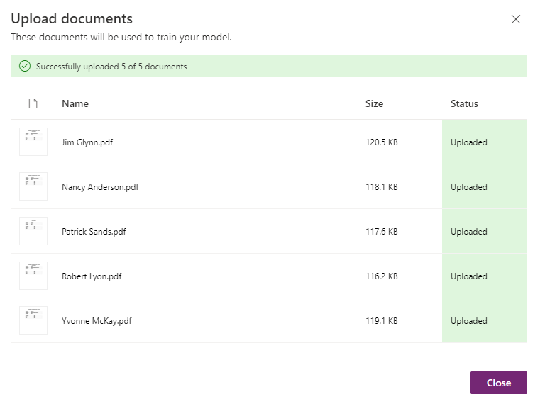 alt="confirm the selection" />

8.  Click **Next**.

9.  Do not navigate away from this page.

## Task \#3: Tag documents

1.  Click on the name of the owner and select **Owner Name** as field.

> 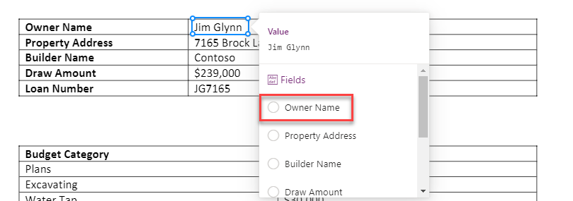 alt="select as described" />

2.  Select on the address and select **Property Address** as field.

> 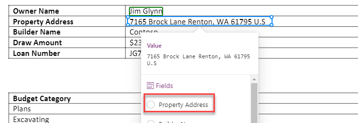 alt="select as described" />

3.  Select on the builder name and select **Builder Name** as field.

4.  Select on the draw amount and select **Draw Amount** as field.

5.  Select on the loan number and select **Loan Number** as field.

6.  All your fields should now be tagged.

> 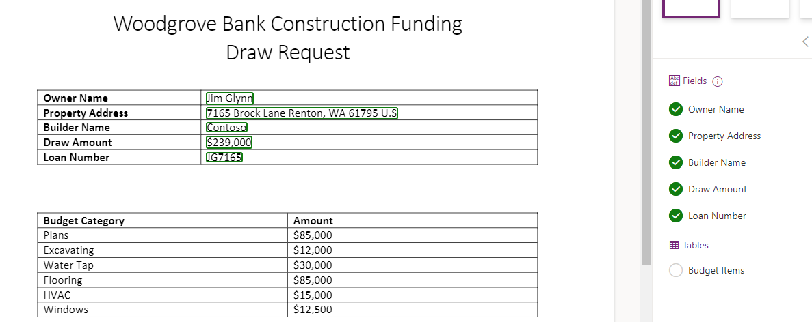 alt="review the page" />

7.  Select table area of the document and select **Budget Items** table.

> 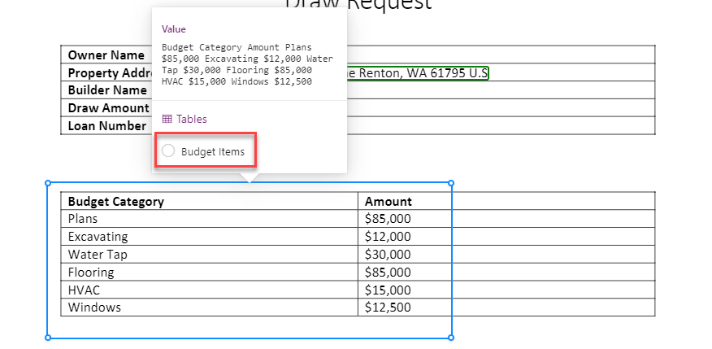 alt="select as described" />

8.  Turn on **Advanced tagging mode**.

> 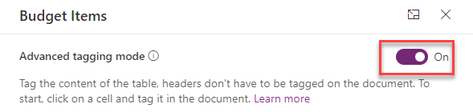 alt="select as described" />

9.  Click to select the first cell.

> 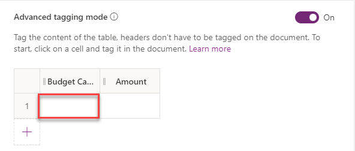 alt="select as described" />

10. Go to the document and select the first budget category item name.

>  alt="select as described" />

11. The selection should automatically advance to the second cell.
    Select first budget category item amount.

> 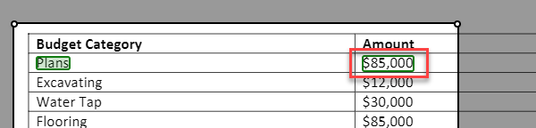 alt="select as described" />

12. The selection should automatically advance to the first cell of the
    second row. Select the second budget category item name.

> 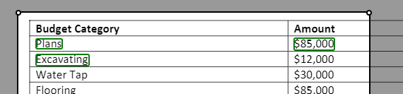 alt="select as described" />

13. Continue until all the items in the table are tagged.

14. The table should now look like the image below. Click **Done**.

> 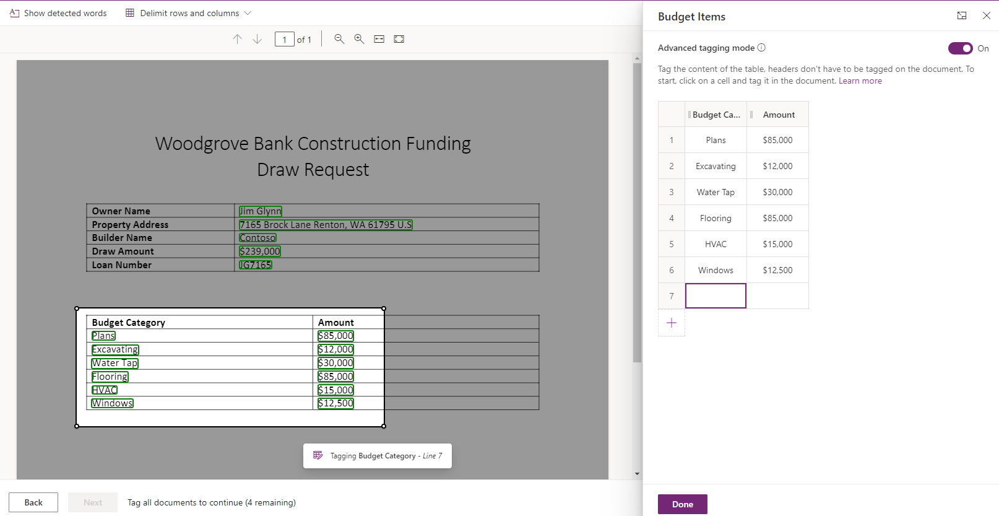 alt="review the resulting page" />

15. Select the second document.

> 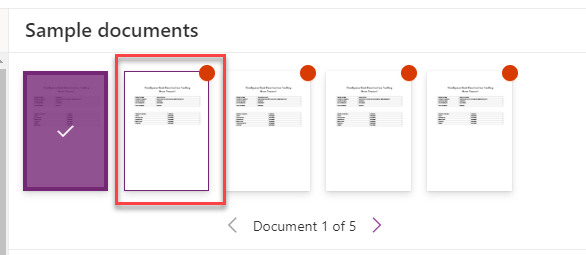 alt="select as described" />

16. Tag the fields and for the second document.

> 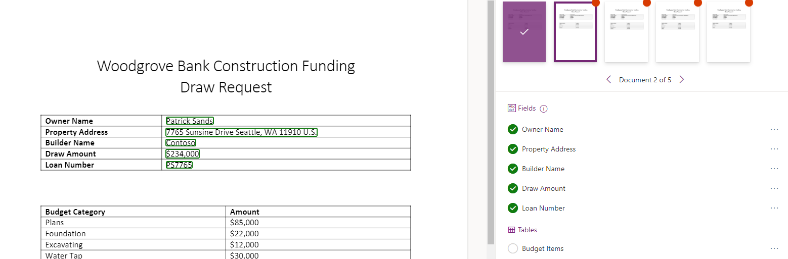 alt="select as described" />

17. Select table area of the document and select **Budget Items** table.

> 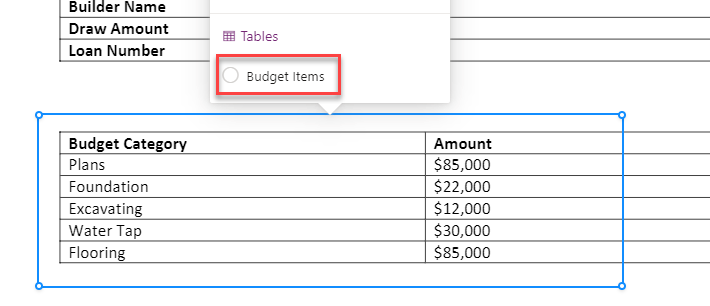 alt="select as described" />

18. Make sure **Advanced tagging mode** is turned on.

19. Tag all the items in the table.

20. You should now have two documents tagged.

> 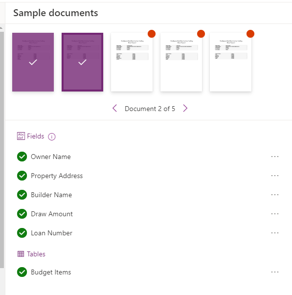 alt="select as described" />

21. Tag the rest of the documents.

22. Click **Next**. You won’t be able to advance to the next step until
    you have finished tagging all the documents.

> 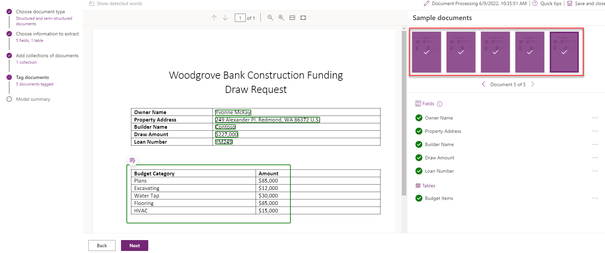 alt="select as described" />

23. Click **Train** and wait for the training to complete.

> 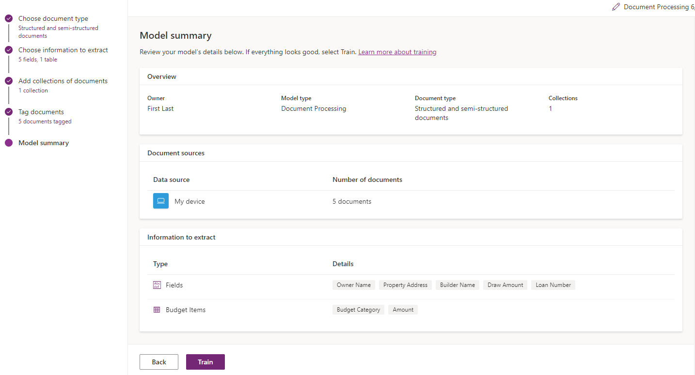 alt="select as described" />

24. Do not navigate away from this page.

## Task \#4: Test and publish the model

1.  The model should automatically open after the training completes.

2.  Click **Quick test**.

> 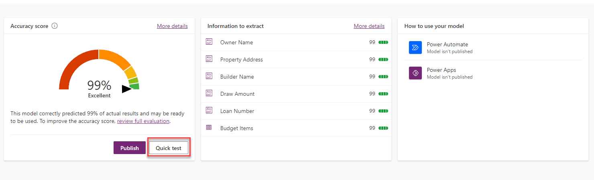 alt="review and test" />

3.  Go to the lab resources folder and open the **Test** folder.

4.  Drag the **Maria Campbell.pdf** file to the model quick test pane.

5.  The model should run and complete the document analysis.

6.  Click on the table area.

>  alt="review and test" />

7.  You should see the budget items from the test file.

>  alt="review results" />

8.  Evaluate all the values the model extracted and make sure it matches
    the test document.

9.  Click **Close**.

10. Click **Publish** and wait for the publishing to complete.

> 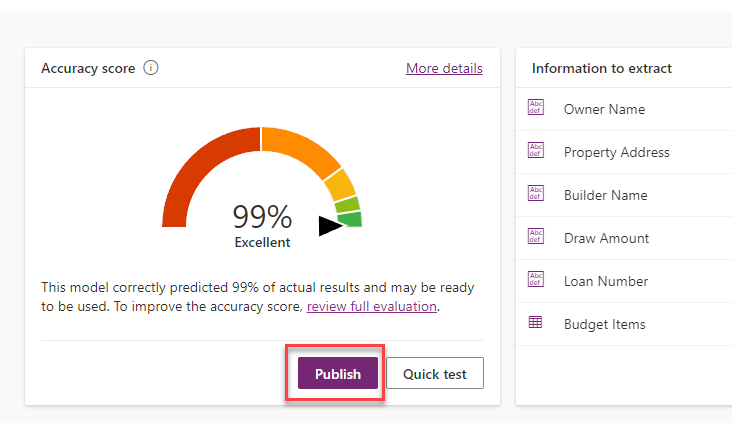 alt="publish" />

11. Your model should now be ready for use.

# Exercise \#2: Modify flow to use AI Builder model

## Task \#1: Use AI Builder

1.  Navigate to <https://make.powerapps.com/> and make sure you are in
    the Dev environment.

2.  Select **Solutions** and open the **Construction Funding** solution.

3.  Click **Add Existing | AI Model**

4.  Select your Document Processing model and click **Add**.

5.  Select **Cloud flows**, select **Process Construction Funding
    Request** flow and click **Edit**.

>  alt="select as described" />

6.  Click **+** insert new step after the **Get loan** step and select
    **Add an action**.

> 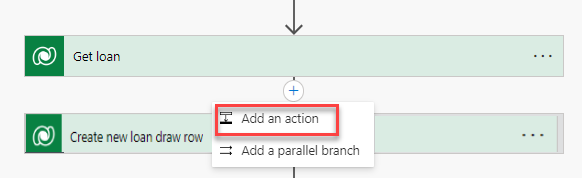 alt="add an action" />

7.  Select **Condition**.

8.  Click the first operand field and select **Has Attachment** from the
    dynamic content pane.

> 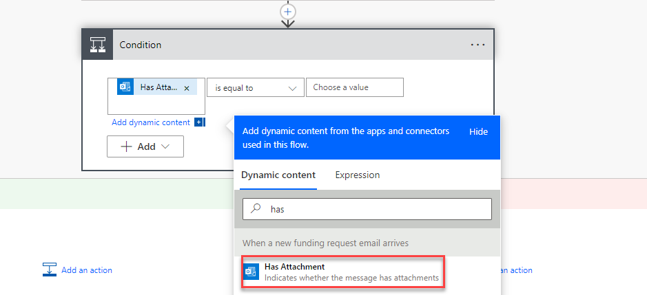 alt="select as described" />

9.  Select **is equal to** for operator.

10. Click on the second operand field, go to the dynamic content pane,
    and select the **Expression** tab.

11. Type **true** and click **OK**.

>  alt="select as described" />

12. Rename the condition **Check if email has attachment**.

13. Go to the **If no** branch and click **Add an action**.

14. Select **Send an email from a shared mailbox (V2).**

15. Click on the **Original Mailbox Address** field and select **To** in
    the dynamic content pane.

16. Click on the **To** field and select **From** in the dynamic content
    pane.

17. Enter **No attachment found** for **Subject**.

18. Enter **Email has no attachment** in the **Body**.

19. Rename the step **Send no attachment email**.

20. Click **Add an action**.

> 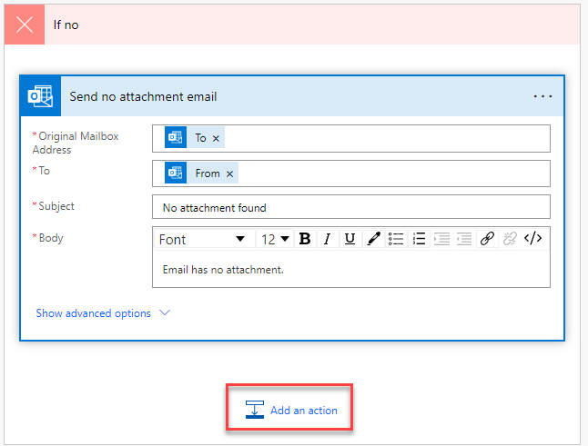 alt="add an action to the no branch" />

21. Select **Terminate**.

22. Select **Success** for Status.

23. Click **+** insert a new step and select **Add an action**.

> 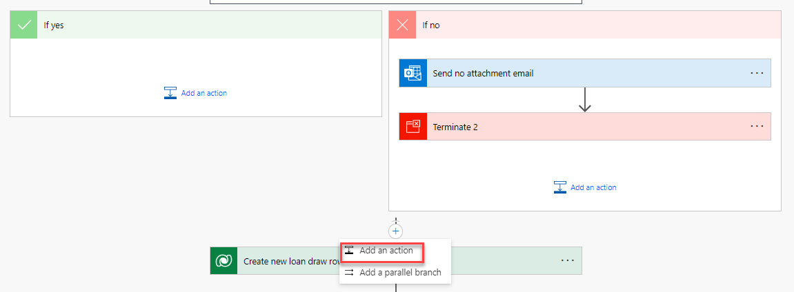 alt="add an action to the no branch" />

24. Select **Get attachment (V2).**

> 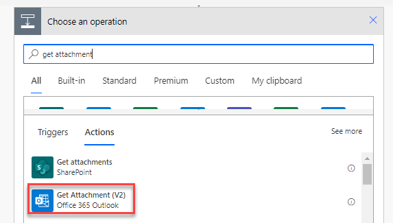 alt="select as described" />

25. Click on the **Message Id** field and select **Message Id** from the
    dynamic content pane.

26. Click on the **Attachment Id** field, go to the dynamic content pane
    and select the **Expression** tab.

27. Paste the expression below and click **OK**.

triggerOutputs()?['body/attachments']?[0]['id']

>  alt="paste the expression" />

28. Click on the **Original Mailbox Address** and select **To** from the
    dynamic content pane.

29. Rename the step **Get email attachment**.

30. Click on the **+** Insert a new step button below the **Get email
    attachment** step and select **Add an action**.

31. Select **Extract information from forms**.

> 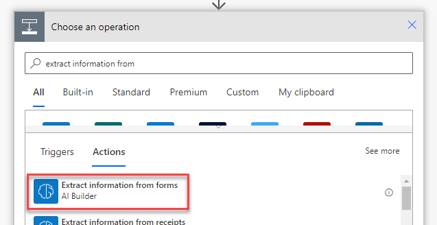 alt="select extract information from form aciton" />

32. Select the **Document Processing** you created for AI Model and
    select **PDF Document** for Form type.

33. Click on the **Form** field and select **Content Bytes** form the
    dynamic content pane.

> 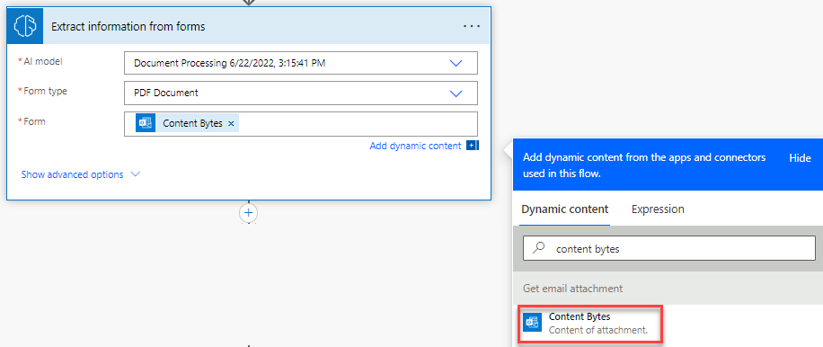 alt="select as described" />

34. Click on the **+** Insert a new step button below the **Extract
    information from forms** step and select **Add an action**.

35. Select **Initialize variable**.

>  alt="select as described" />

36. Enter **Work items** for Name and select **String** for Type.

37. Rename the step var **work items** and click **+** and select **Add an action**.

> 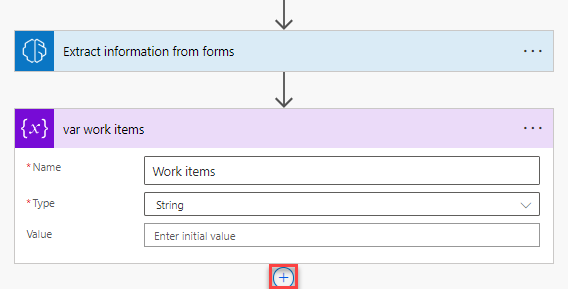 alt="select and complete as described" />

38. Select **Append to string variable**.

> 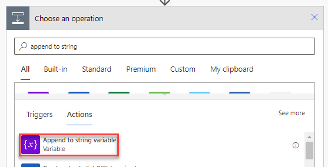 alt="select and complete as described" />

39. Select **Work Items** for Name, click on the **Value** field and
    select **Budget Items Budget Category value** from the dynamic
    content pane.

>  alt="select and complete as described" />

40. Apply to each control will be added automatically.

41. Rename the apply to each control **Apply to each work item**.

> 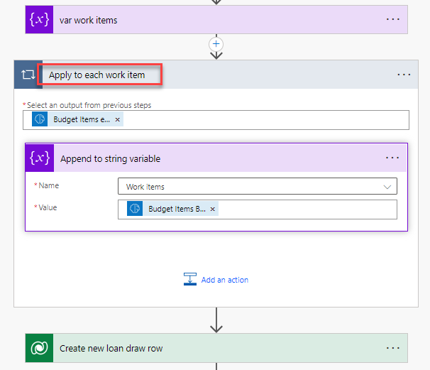 alt="select and complete as described" />

42. Add comma and space in front of the value.

>  alt="select and complete as described" />

43. Expand the **Create new loan draw** row step.

44. Click on the **Amount Requested** field, go to the dynamic content
    pane, and select the **Expression** tab.

45. Paste the expression below.

string(replace(,'$',''))

46. Place your cursor before the first comma and select the **Dynamic
    content** tab.

> 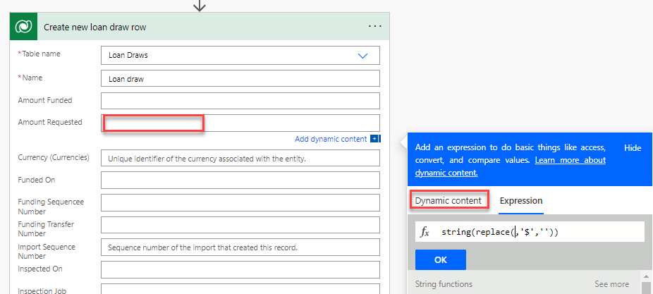 alt="select and complete as described" />

47. Select **Draw Amount value** and click **OK**.

>  alt="select and complete as described" />

48. Select **Received** for Status Reason.

49. Click on the **Requested On** field, got the dynamic content pane,
    select the **Expression** tab, type **utcNow(),** and click **OK**.

> 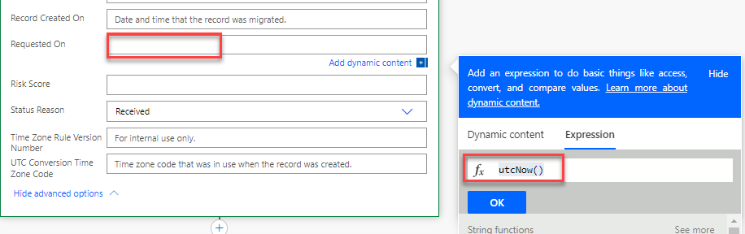 alt="select and complete as described" />

50. Click on the **Requested Amount** value and copy. Use
    **\[CONTROL\] + \[C\]** to copy.

51. Expand the **Calculate Risk Score** step.

52. Remove the **drawAmount** value and paste the value you copied.

> 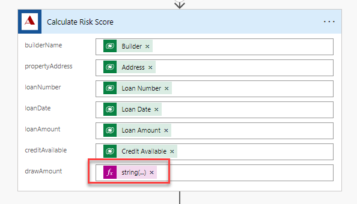 alt="select and complete as described" />

53. Expand the **Run funding process** step.

54. Remove the **RequestedAmount** value and paste the value you copied.

>  alt="select and complete as described" />

55. Expand the **Run inspection process** step.

56. Remove the **Work** value and select **Work Items** from the dynamic
    content pane.

>  alt="select and complete as described" />

57. Click **Save** and wait for the flow to be saved.

## Task \#2: Test the flow

1.  Go to the resources folder of the lab and open the Test folder.

2.  You will attach the **Attachment AI Test** file when you send the
    email.

>  alt="select the file for testing" />

3.  Go back to the flow and click **Test**.

4.  Select **Manually** and click **Test**.

5.  Send an email to <Funding@yourdomain.onmicrosoft.com> make sure the
    subject of the email is **MC3747** and you attach the **Attachment
    AI Test.pdf** file.

6.  Wait for the flow run to complete.

7.  Flow test should succeed, and you should get an email with Subject
    Funding Approved.

8.  Expand the **Extract Information from forms** step and review the
    **Outputs**.

> 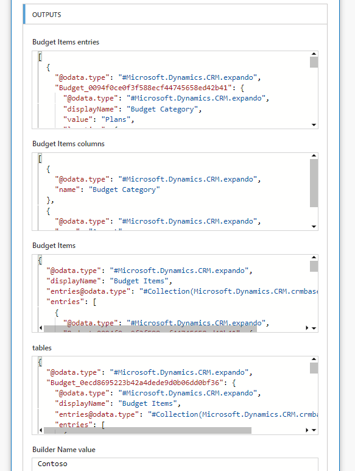 alt="review the output" />

58. Expand the **Run inspection process** and review the **Work** input.

> 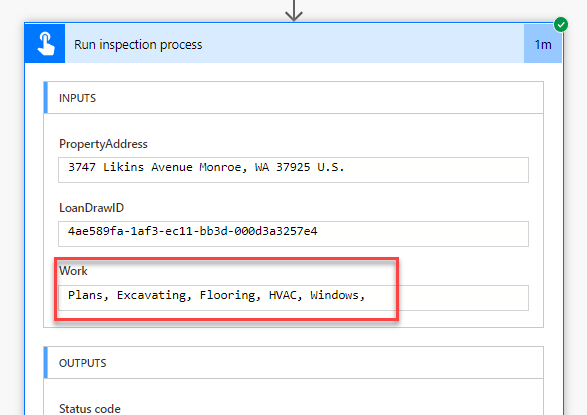 alt="review the output" />

59. Review the rest of the steps and make sure the flow produced the
    expected outcome.
