# Scenario

In this lab, you will learn how to monitor and debug desktop flows.

# High-level lab objectives

-   Monitor desktop flows

-   Debug desktop flows

-   Add retry to desktop flow

# Exercise \#1: Monitor flows

In this exercise, you will monitor desktop flows.

## Task \#1: Monitor desktop flows

1.  Navigate to <https://make.powerautomate.com/> and make sure you are
    in your dev environment.

2.  Expand **Monitor** and select **Desktop flows** **runs**.

> 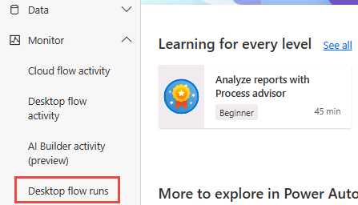 alt="select monitor-desktop flow runs" />

3.  If you don’t see anything, make sure you are in your Dev
    environment.

4.  Turn on **Auto refresh**.

> 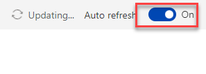 alt="enable auto-refresh" />

5.  Click on the **…** More command button of one the **Woodgrove
    Funding Manager Draw** run and select **See parent flow runs**.

>  alt="select and complete as described" />

6.  You should see the parent cloud flow run (CF Manage Woodgrove
    Funding Process).

>  alt="review the screen" />

7.  Click on the browser back button.

8.  Click to open the **Woodgrove Funding Manager Draw** run.

> 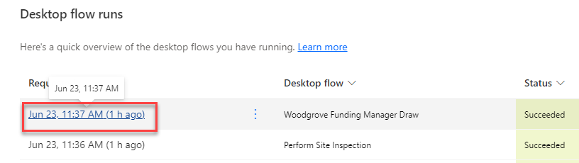 alt="select as described" />

9.  You should see all the actions in the flow run.

> 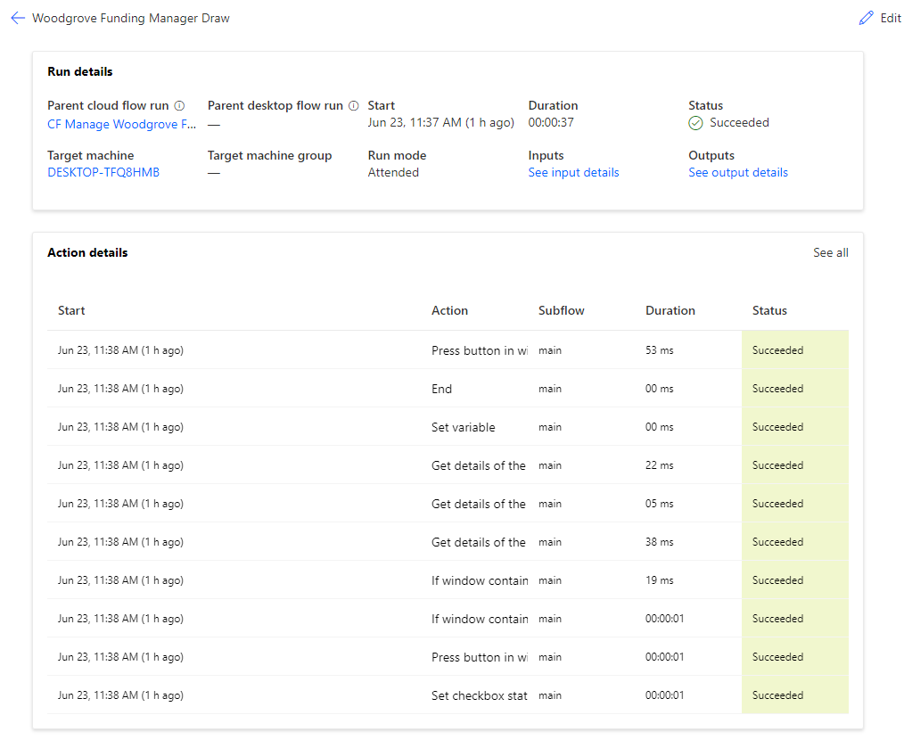 alt="review the screen" />

10. Click to open the **Set variable** action.

> 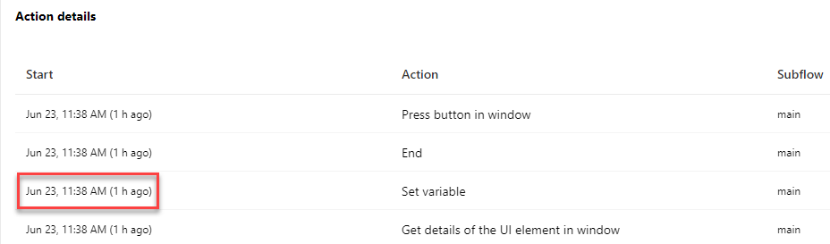 alt="select as described" />

11. Go to the **Action Details** pane and click **See output details**.

> 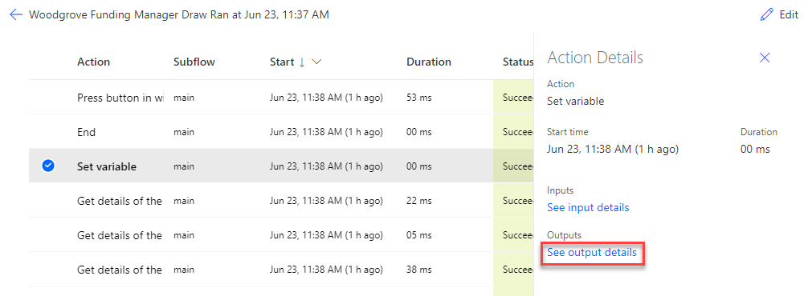 alt="select as described" />

12. You should see details of the variable.

> 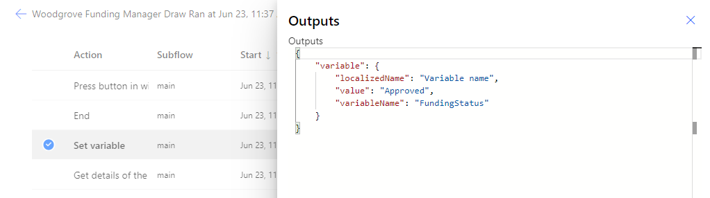 alt="review the details" />

13. Close the **Outputs** pane.

14. You may review other action.

## Task \#2: Flow monitor

1.  Launch **Power Automate for desktop**, make sure your dev
    environment is selected.

2.  Click **Settings**.

> 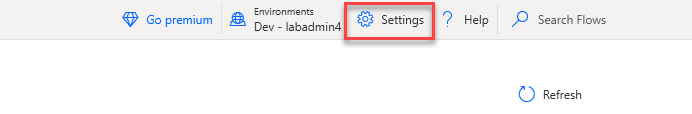 alt="select as described" />

3.  Click on the **Monitoring/Notification** dropdown, select **Flow
    monitoring window**, and click **Save**.

> 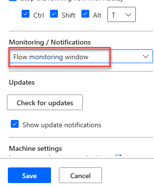 alt="select as described" />

4.  Close the **Settings** pane.

5.  Run the **Perform Site Inspection**.

>  alt="select as described" />

6.  Click **OK**.

> 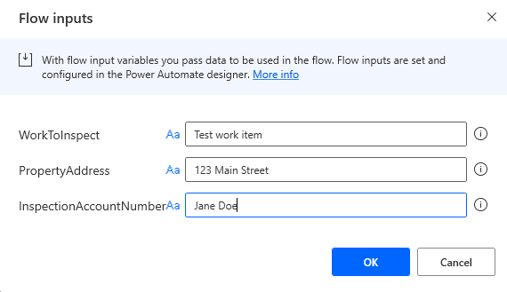 alt="select as described" />

7.  Notice the monitor. Click **Pause**.

>  alt="select as described" />

8.  The flow should pause. Click **Resume**.

>  alt="select as described" />

9.  Click **Stop**. The flow should stop, and the monitor should
    disappear.

# Exercise \#2: Debug flows

## Task \#1: Debug flow

1.  Go to Power Automate desktop flow and run the **Perform Site
    Inspection** flow again.

2.  Enter **456 Main Street** for Address and click **OK**.

>  alt="select and complete as described" />

3.  Wait for the flow to finish running.

4.  The flow should fail, and you should see an error in the
    notification.

> 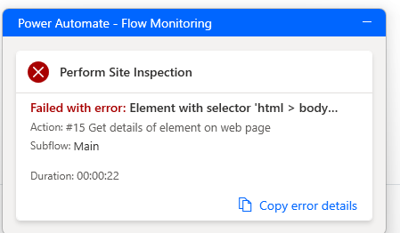 alt="review the details" />

5.  Click **Edit** flow.

>  alt="select and complete as described" />

6.  Add a breakpoint on the first press button action. Clicking to the
    left of the line number will add a breakpoint.

> 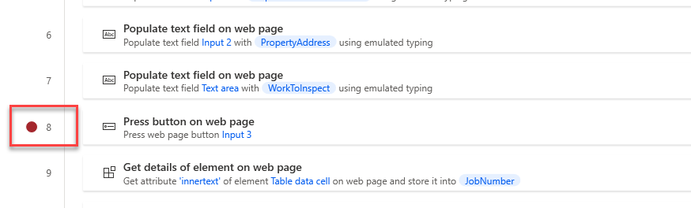 alt="add the breakpoint" />

7.  Edit the property address and change the default value to **456 Main Street**.

8.  Click **Run**.

9.  The flow will pause when the breakpoint is hit. Click **Run next
    action**.

>  alt="select run next action" />

10. The flow should advance to the next action and pause again. Click
    **Run next action** again.

11. Click **Run next action** until the flow fails.

> 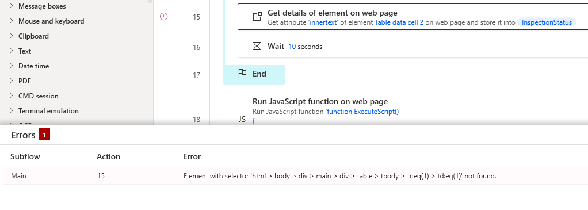 alt="select and complete as described" />

## Task \#2: Add retry

1.  Click **Subflows** and select + New subflow.

>  alt="select and complete as described" />

2.  Enter **WaitFlow** for name and click **Save**.

3.  Go to the **Actions** pane, search for **wait** and double click on
    the **Wait** action.

> 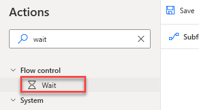 alt="select and complete as described" />

4.  Enter **60** and click **Save**.

> 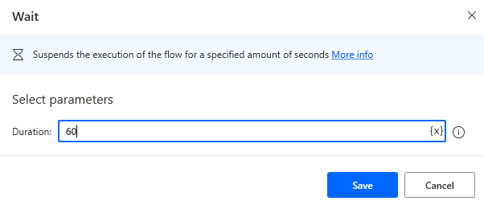 alt="select and complete as described" />

5.  The subflow should now have one wait action. Select the **Main**
    tab.

> 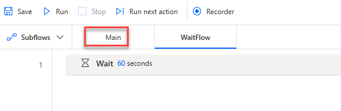 alt="select and complete as described" />

6.  Go to the **Actions** pane, search for **error**, drag **On block
    error** action, and place it after the **Get details of element on
    web page** for the **JobNumber** action.

> 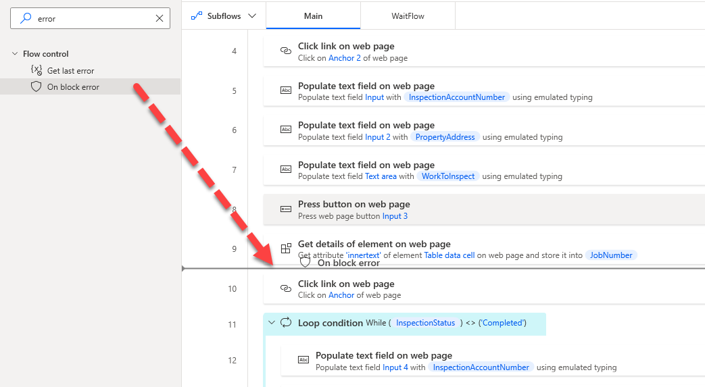 alt="select and complete as described" />

7.  Enter **RetryOnError** for Name, click **+ New rule**, and select
    **Run subflow**.

>  alt="select and complete as described" />

8.  Select the **WaitFlow** you created and click **Continue flow run**.

> 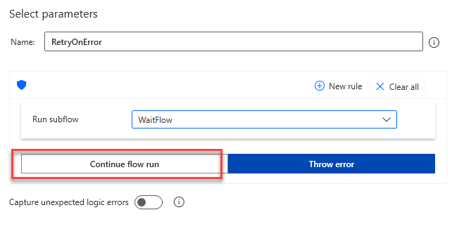 alt="select and complete as described" />

9.  Select **Go to beginning of block** for Exception handling mode and
    click **Save**.

>  alt="select and complete as described" />

10. Click to select the action below the error block.

> 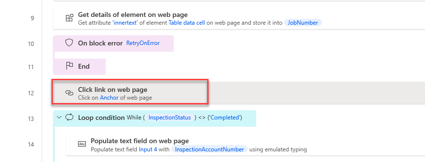 alt="select and complete as described" />

11. Hold the **\[SHIFT\]** and click to select the **End** loop action.

>  alt="select and complete as described" />

12. Drag all the selected actions and drop them inside the error block.

13. The error block should now look like the image below.

> 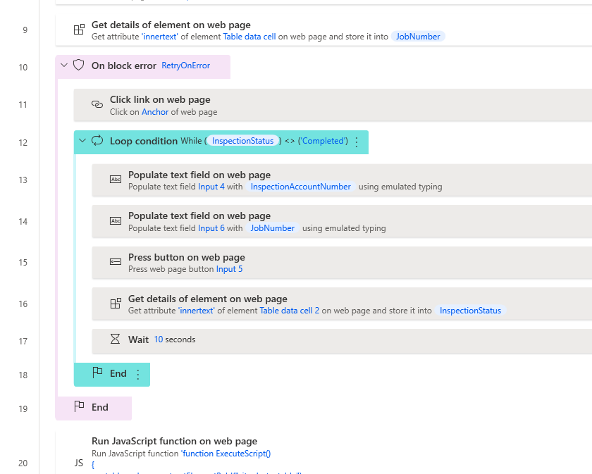 alt="review the screen" />

14. Click **Save** and wait for the flow to be saved.

## Task \#3: Test 

1.  Remove the breakpoint and Click **Run**.

2.  The flow will switch to the subflow if error occurs.

> 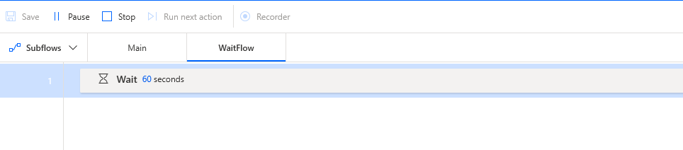 alt="watch the flow run" />

3.  The flow will go back to the main flow after **60** seconds.

4.  The process should complete successfully.

>  alt="review completed flow run" />
