# Scenario

In this lab, you will deploy the solution to run unattended in a new
test environment.

# High-level lab Objectives

-   Configure VM for unattended execution

-   Configure a machine group

-   Create and configure an Azure Key Vault

-   Use Key Vault in automations

-   Configure and use environment variables

-   Transport the solution from dev to test

# Exercise \#1: Configure VM

In this exercise, you will configure the Virtual Machine

## Task \#1: Configure VM

1.  Go to your Azure portal <https://portal.azure.com/> and open the **Funding** virtual machine
    (VM).

> 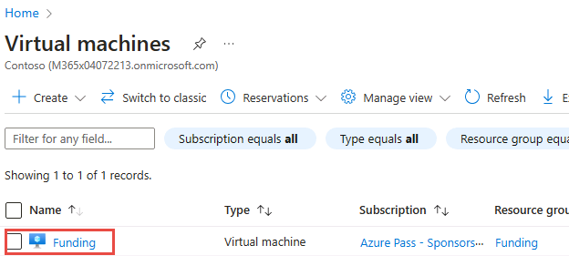 alt="select the vm described" />

2.  Copy the **Public IP address**.

> 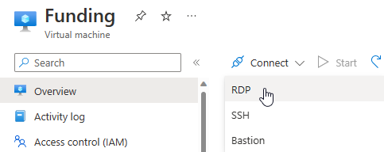 alt="copy the key" />

3.  Launch remote desktop connection.

4.  Paste the VM IP address you copied and click **Connect**.

> 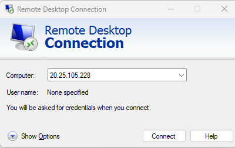 alt="connect with remote desktop" />

5.  Click **More choices** if needed. Otherwise, go to next step to enter username and password.

> 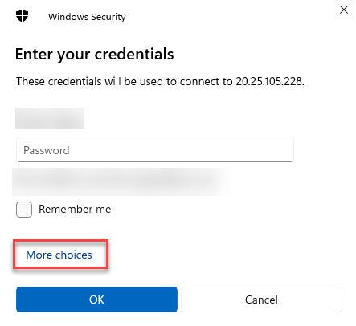 alt="select as described" />

6.  Select **Use a different account** if needed, enter **Funding** for Username,
    **relecloud@word1** for Password, and click **OK**. If prompted, click Yes to connect anyway and complete setup.

7.  Start **Edge** browser and complete setup and download the **Power Automate installer**
    <https://go.microsoft.com/fwlink/?linkid=2102613>

8.  Double click to install the Setup.Microsoft.PowerAutomate.

> 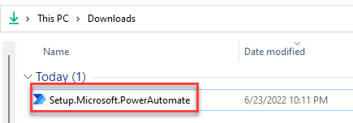 alt="select as described" />

9.  Click **Next**.

10. Read the terms of use and check By selecting 'Install', you agree to Microsoft's terms of use and click **Install**.

11. Click **Launch app**.

12. Provide your Power Platform admin login credentials and **Sign in**.

13. Click on the Machine environment dropdown and select your **Test
    environment**.

14. Click **Change**.

> 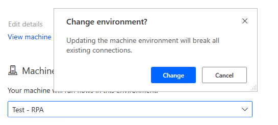 alt="select as described" />

15. Select the Machine group tab 

16. Click **+ New machine group**.

17. Enter **Funding** for Machine group name and click **Create**.

18. Click on the **Funding** machine group you created.

19. Click **Add machine**.

20. Click **Add machine** again.

21. Click **Got it**.

22. You should now see the **Joined machine group** with one machine.

> 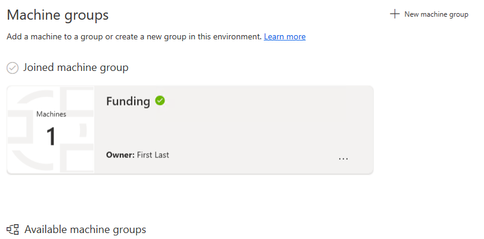 alt="review the results of the prior steps" />

23. Go to your **Local** computer and copy the **Labs** folder located
    in your C:\\ drive.

> 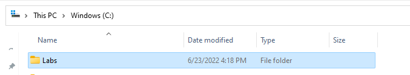 alt="image of file explorer" />

24. Go back to the **Remote desktop** and open file explorer.

25. Browse to C:\\ and paste the **Labs** folder you copied. This folder
    must be in the same location on both computers.

> 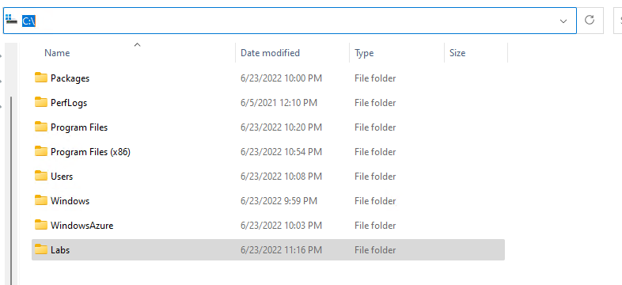 alt="image of file explorer" />

26. Browse to **C:\Labs\Resources\Funding manager app** and launch the **Woodgrove Bank Funding Manager.exe** app. If prompted, download .NET and install. Then try to launch Woodgrove Bank Funding Manager.exe again.

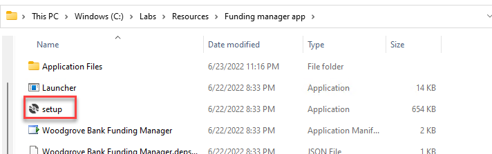

27. The app should install and launch. Close the application.

28. Launch Microsoft Edge.

29. Click **Settings** and select **Extensions**.

> 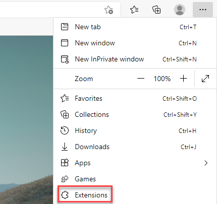 alt="menu in Microsoft Edge" />

30. Click Open Microsoft Edge Add-ons website.

>  alt="select as described" />

31. Search for Power Automate extensions and click to open **Microsoft
    Power Automate**.

> 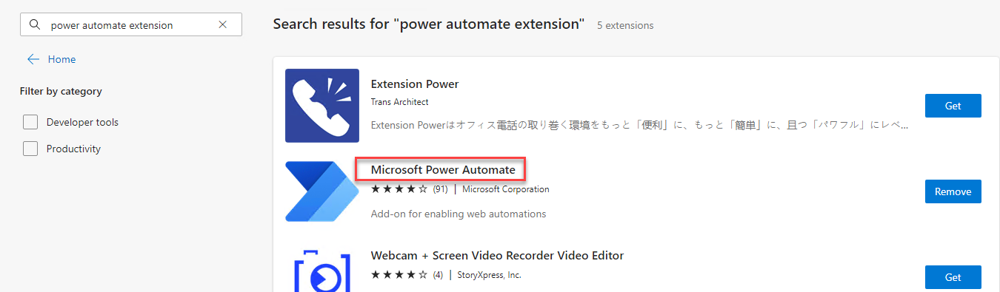 alt="select as described" />

32. Click **Get**.

33. Click **Add extension**.

# Exercise \#2: Key Vault

In this exercise, will create a Key Vault.

## Task \#1: Create Key Vault

1.  In your **Local** machine, go to your Azure portal.

2.  Click **Subscriptions**.

> 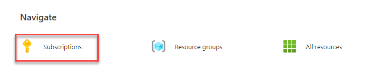 alt="select as described" />

3.  Open the subscription.

4. Select Resource providers.

4.  Search for **Microsoft.PowerPlatform** and select it.

5.  Click **Register**.

> 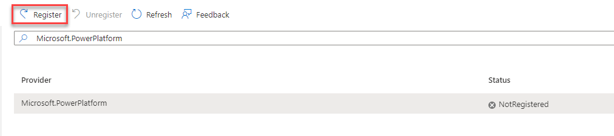 alt="select as described" />

6.  Click **Home**.

7.  Click **+ Create a resource**.

8.  Search for key vault and **Key Vault**. **DO NOT** select Azure Key
    Vault

> 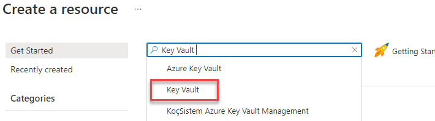 alt="select as described" />

9.  Click **Create**.

10. Select Funding for Resource group, type **FundingFL** (Replace FL
    with your initials) for Key vault name and click **Review +
    create**.

> 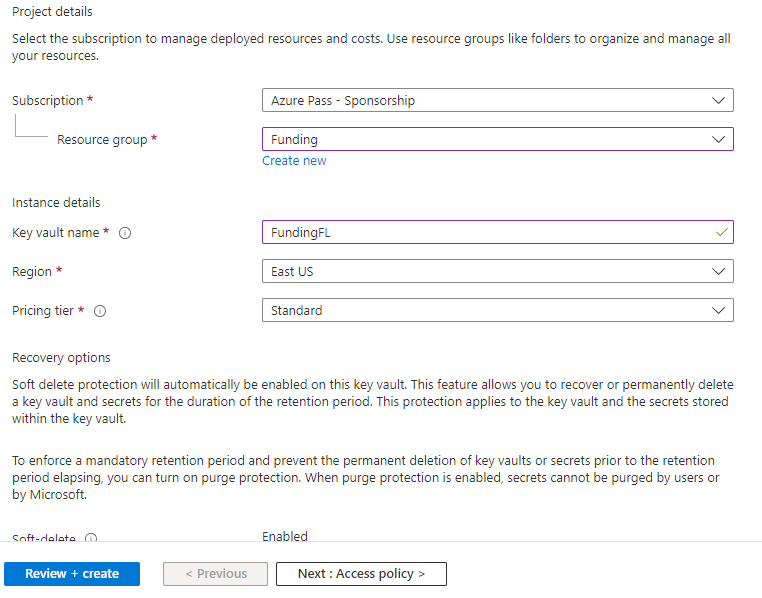 alt="review the results of the prior steps" />

11. Click **Create** again.

12. Wait for the deployment to complete.

13. Click **Go to resource**.

>  alt="select as described" />

14. Select **Secrets** and click **Generate/Import**.

> 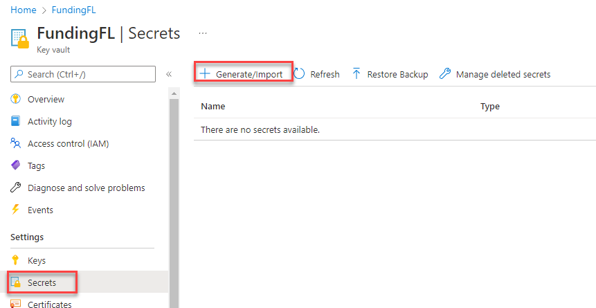 alt="select as described" />

15. Enter **FundingPassword** for Name, enter **pass@word1** for Value,
    and click **Create**.

>  alt="select and complete as described" />

16. Select **Access policies** and click **+ Add Access Policy**.

> 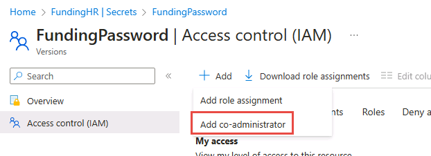 alt="select as described" />

17. Click on the Secret permission dropdown and select **Get**.

> 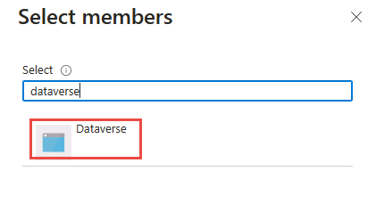 alt="select as described" />

18. Click on the **None selected** link.

> 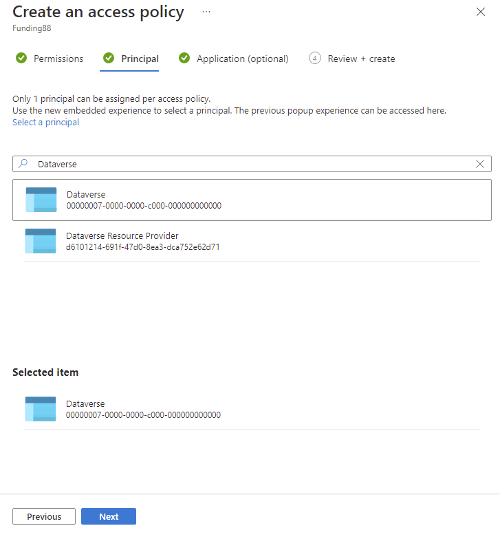 alt="select as described" />

19. Search for dataverse, select the **Dataverse** with the
    **00000007-0000-0000-c000-000000000000** identity, and click
    **Select**,

> 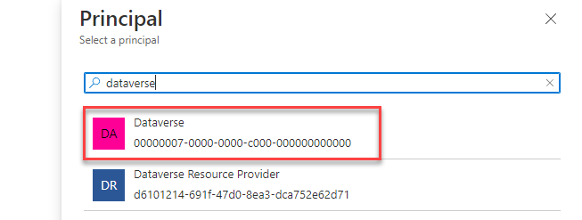 alt="select as described" />

20. Click **Add**.

21. **Access Policies** should now show one Application and one user entry.

22. Select **Access Control (IAM),** click **+ Add**, and select **Add role
    assignment**.

> 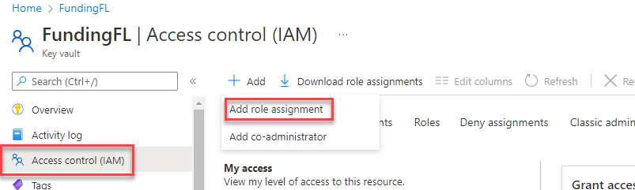 alt="select as described" />

23. Select **Reader** and click **Next**.

> 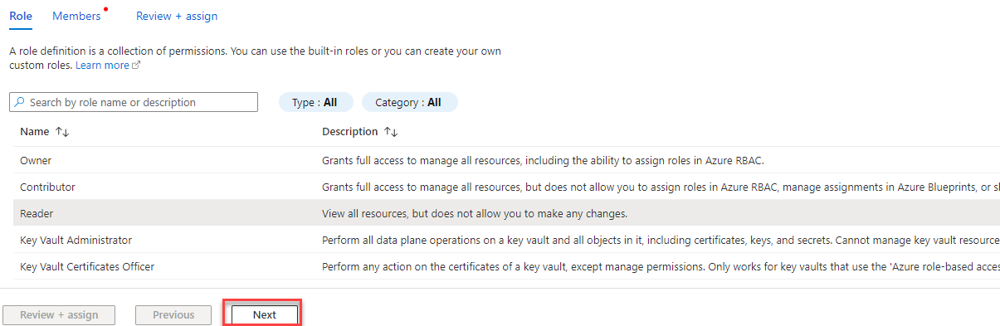 alt="select as described" />

24. Click **+ Select members**.

> 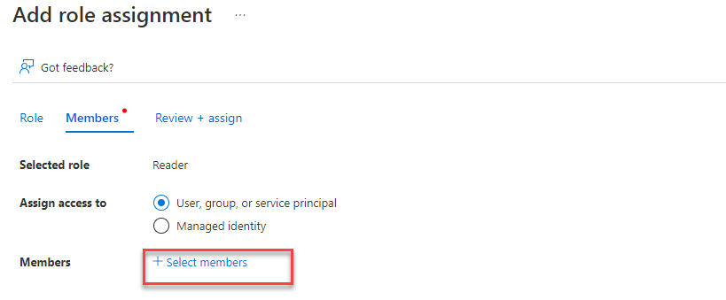 alt="select as described" />

25. Select your user and click **Select**

> 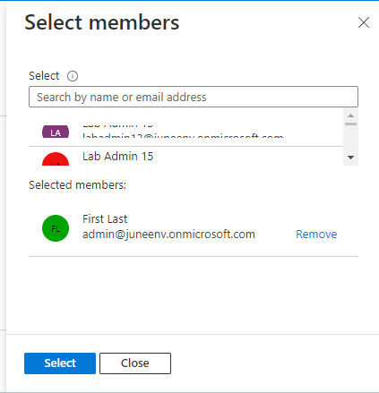 alt="select as described" />

26. Click Review + assign.

> 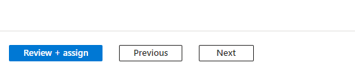 alt="select as described" />

27. Click **Review + assign** again.

# Exercise \#3: Environment Variables

In this exercise, will create environment variables and use them in the
flows.

## Task \#1: Create environment variables

1.  In your Local machine, navigate to <https://make.powerapps.com/> and
    make sure you are in your Dev environment.

2.  Select Solutions and open the **Construction Funding** solution.

3.  Click **+ New** and select **More \| Environment variable**.

> 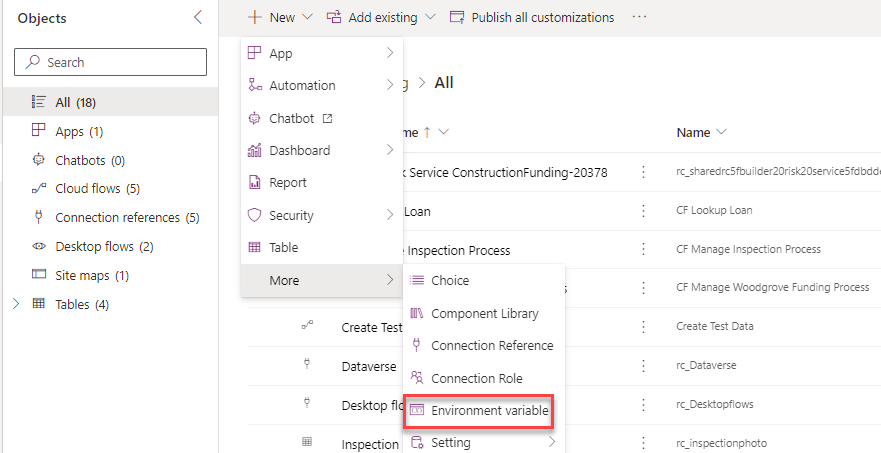 alt="select as described" />

4.  Enter **Funding Run Mode** for Display name, select **Text** for
    Data type, enter **Unattended** for Default value, go to the
    **Current value** section, and click **+ New value**.

> 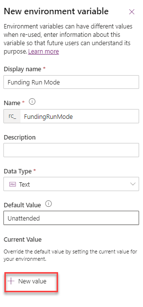 alt="select as described" />

5.  Enter **Attended** and click **Save**.

6.  Select environment variables and click to open variable you just
    created.

> 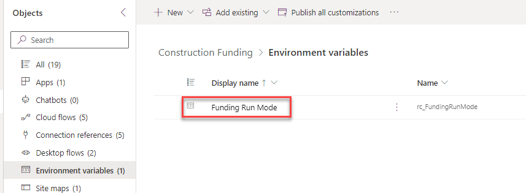 alt="select as described" />

7.  Click on the **…** button of the **Current value** and select
    **Remove from this solution**. We are removing the value from the
    solution, so it won’t move to test/production.

>  alt="select as described" />

8.  Close the edit pane.

9.  Click **+ New** and select **More \| Environment variable** again.

10. Enter **Funding Password** for Display name, select **Secret** for
    Data type, enter **secretid** for Default value, select **Azure Key
    Vault** for Secret Store, and click **+ New Azure Key Vault secret
    reference**.

>  alt="select as described" />

11. DO NOT navigate away from this page. Start a new browser window or
    tab and navigate to your **Azure** portal.

12. Click to open the **FundingFL** Key Vault you created. Remember the
    name of the Key Vault (FL will be your initials)

13. Copy the **Subscription ID**.

> 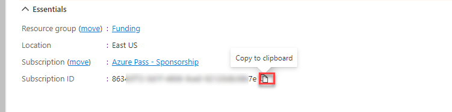 alt="select as described" />

14. Go back to the environment variable and paste it in the **Azure
    subscription Id** field.

> 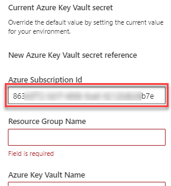 alt="paste as described" />

15. Enter **Funding** for Resource group name, **FundingFL (FL will be
    your initials)** for Azure Key Vault name, and **FundingPassword** for
    Secret name. These values must match what you
    used or you will see an error at the top of the panel.

> 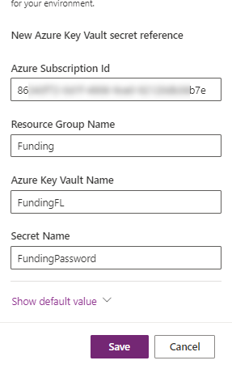 alt="select as described and review results of the prior steps" />

16. Click **Save** again.

17. Select **Environment variables** and open the **Funding Password**
    variable you just created.

18. Click on the **…** button of the current value and select **Remove
    from this solution**.

> 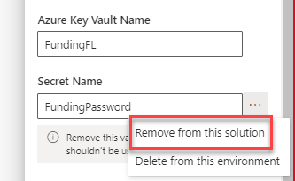 alt="select as described" />

19. Close **Edit** pane.

20. Select **Cloud flows**, select the **CF Manage Inspection Process**
    flow, and click **Edit**.

21. Expand the **Run a flow built with Power Automate for desktop**
    step.

22. Click on the **Run Mode** dropdown and select **Custom Value**.

> 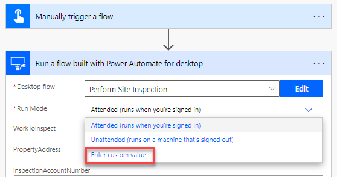 alt="select as described" />

23. Select the **Funding Run Mode** environment variable from the
    dynamic content pane. This will allow us to determine if the desktop
    flow runs attended or unattended in each environment the solution is
    imported into.

24. Click **Save** and wait for the flow to be saved.

25. Click on the back button.

26. Select **Cloud flows**, select the **CF Manage Woodgrove Funding
    Process** flow, and click **Edit**.

27. Expand the **Run a flow built with Power Automate for desktop**
    step.

28. Click on the **Run Mode** dropdown and select **Enter custom value**.

> 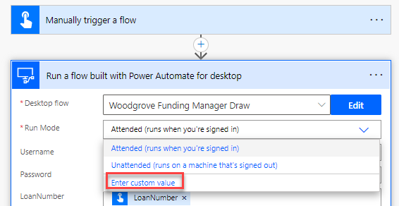 alt="select as described" />

29. Select the **Funding Run Mode** environment variable from the
    dynamic content pane.

30. Click the **+ Insert a new step** after the trigger and select **Add
    an action**.

31. Select **Perform an unbound action**.

> 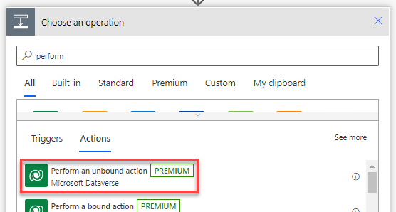 alt="select as described" />

32. Select **RetrieveEnvironmentVariableSecretValue** for Action name,
    enter **rc_FundingPassword** for EnvironmentVariableName, click on
    the **…** Menu button, and select **Settings**.

> 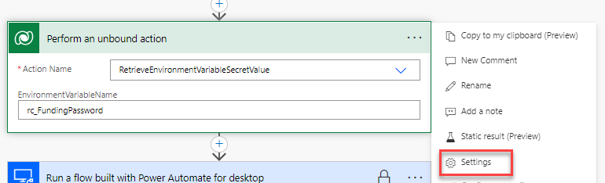 alt="select as described" />

33. Turn on **Secure Outputs** and click **Done**. This ensures the
    value is not visible when someone views the run details after
    execution.

> 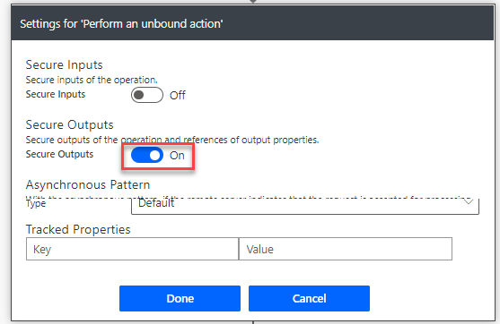 alt="select as described" />

34. Expand the **Run a flow built with Power Automate for desktop** step
    again.

35. Remove the current Password value and select
    **RetrieveEnvironmentVariableSecretValueResponse** from the dynamic
    content pane.

> 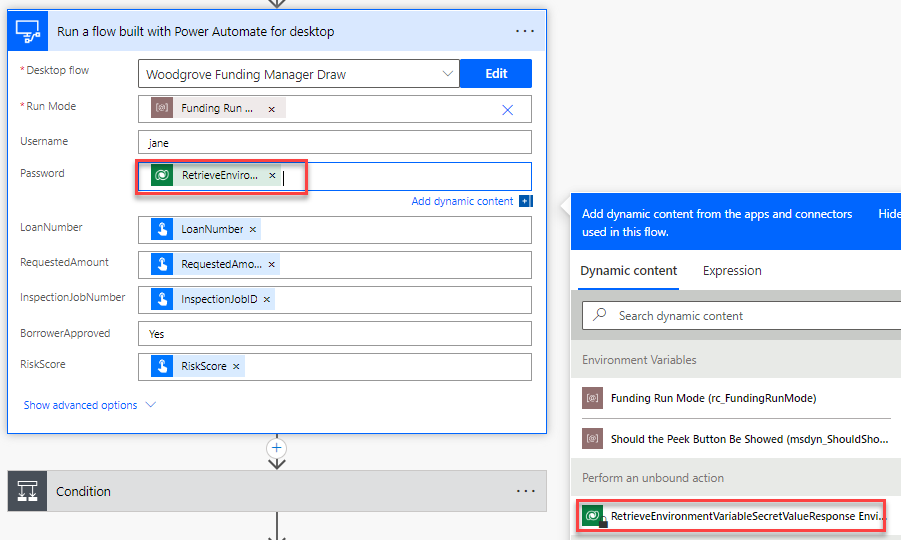 alt="select as described" />

36. Click on the **…** Menu button and select **Settings**.

37. Turn on **Secure Inputs** and click **Done**.

38. Click **Save** and wait for the flow to be saved.

# Exercise \#4: Export Solution

In this exercise, will export the Builder Risk Service and the
Construction Funding solutions.

## Task \#1: Export solution

1.  In your Local machine, navigate to <https://make.powerapps.com/> and
    make sure you are in your Dev environment.

2.  Select Solutions, select the **Builder Risk Service** solution and
    click **Export solution**.

> 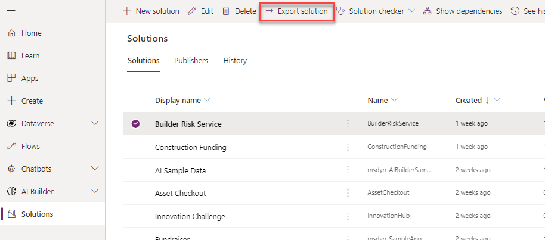 alt="select as described" />

3.  Click **Publish** and wait for the publishing to complete.

4.  Click **Next**.

5.  Select **Managed** and click **Export**.

> 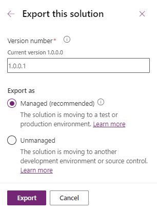 alt="select as described" />

6.  Wait for the export to complete and click **Download**.

7.  Select the **Construction Funding** solution and click **Export
    solution**.

8.  Click **Publish** and wait for the publishing to complete.

9.  Click **Next**.

10. Select **Managed** and click **Export**.

11. Wait for the solution to be exported.

12. Click **Download**.

13. Click to open the **Construction Funding** solution.

> 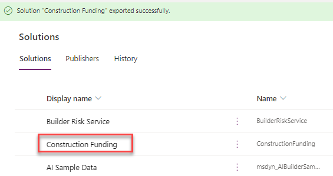 alt="select as described" />

14. Select Cloud flows, select the **Process Construction Funding
    Request** flow and click **Turn Off**. We are doing this simply so
    we can use the same shared email for testing, in a real solution you
    would use separate mailboxes for dev/test/production.

> 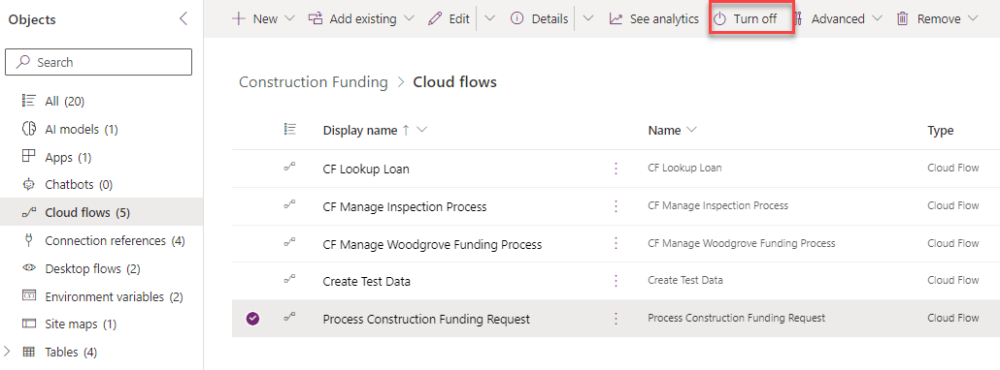 alt="select as described" />

# Exercise \#5: Import Solution

In this exercise, will import the Builder Risk Service and Construction
Funding solutions and test the flows.

## Task \#1: Import solution

1.  Select your **Test** environment.

2.  Select **Solution** and click **Import solution**.

3.  Click **Browse**.

4.  Select the **BuilderRiskService_1\_0_0\_1_managed.zip** solution you
    exported and click **Open**.

5.  Click **Next**.

6.  Click **Import** and wait for the import to complete.

7.  Click **Import solution** again.

8.  Click **Browse**.

9.  Select the **ConstructionFunding_1\_0_0\_1_managed.zip** solution
    you exported and click **Open**.

10. Click **Next**.

11. Click **Next** again.

12. Click on the drop down for the **Builder Risk Service** connection
    and select **+ New connection**.

> 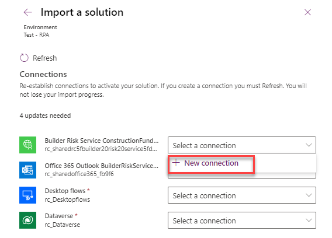 alt="select as described" />

13. DO NOT navigate away from this page. Start a new browser window or
    tab and navigate to
    <https://adatumbuilderrisktest.azurewebsites.net/>

14. Click on the **API Key** link.

15. Copy the **API Key**.

> 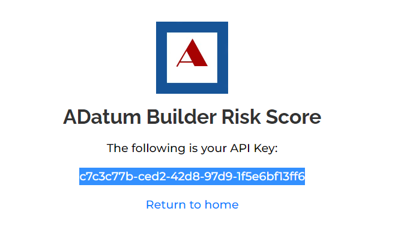 alt="select as described" />

16. Go back to the Builder Risk Service connection, paste the API Key
    you copied and click **Create**.

17. Close the connections browser tab or window.

18. Click **Refresh**.

> 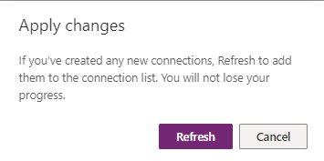 alt="select as described" />

19. Click on the **Office 365** connection dropdown and select **+ New
    connection**.

20. Click **Create**.

21. Select your credentials.

22. Close the connections browser tab or window.

23. Click **Refresh**.

24. Click on the **Desktop flows** connection dropdown and select **+
    New connection**.

25. Enter **Funding** for Domain and username, enter **relecloud@word1**
    for Password, and click **Create**.

> 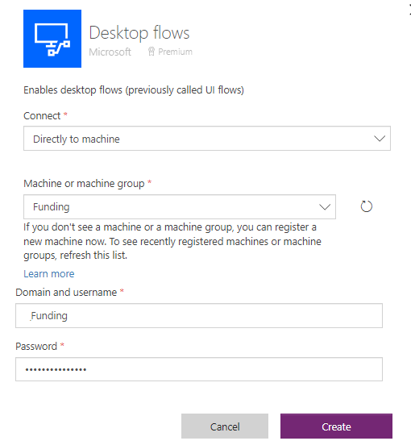 alt="select as described" />

26. Close the connections browser tab or window.

27. Click **Refresh**.

28. Click on the **Dataverse** connection dropdown and select **+ New
    connection**.

29. Click **Create**.

30. Select your credentials.

31. Close the connections browser tab or window.

32. Click **Refresh**.

33. Click Next.

> 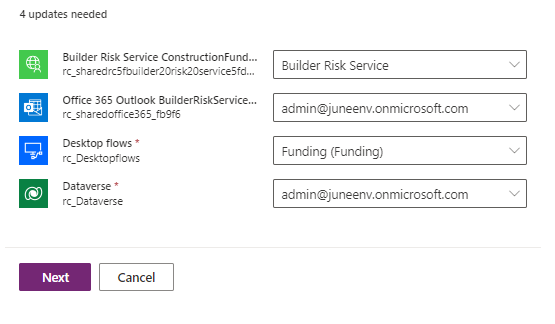 alt="select as described" />

34. DO NOT navigate away from this page. Start a new browser window or
    tab and navigate to your Azure portal.

35. Click to open the Key Vault.

> 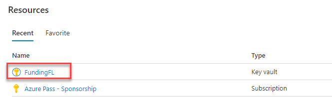 alt="select as described" />

36. Copy the **Subscription ID**. For this lab you will use the same
    subscription you used for the Dev. Usually, you would create a
    different subscription for Dev, Test, and Production.

> 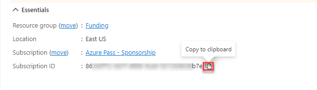 alt="select as described" />

37. Paste the text below in the Funding Password field.
    Replace **[SubscriptionID]** with subscription id you copied and
    replace **[FL]** with your initials.

> /subscriptions/**\[SubscriptionID\]**/resourceGroups/Funding/providers/Microsoft.KeyVault/vaults/Funding[FL]/secrets/FundingPassword

38. Click **Import** and wait for the import to complete.

> 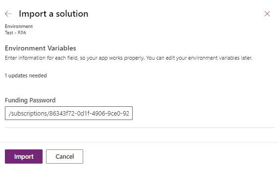 alt="select as described" />

39. Import should succeed. Note: If it takes more than five minutes to
    import, check History to see if it failed. If you didn’t have the
    correct Key Vault information this can occur.

> 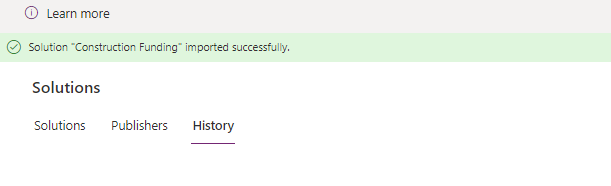 alt="select as described" />

40. Click to open the **Construction Funding** solution.

41. Select Cloud flows and open the **Create Test Data** flow.

> 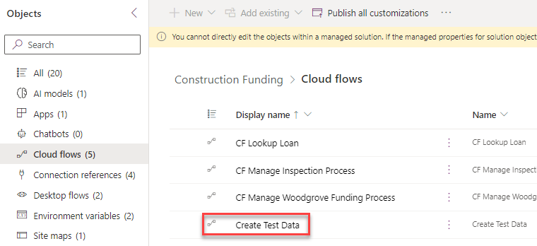 alt="select as described" />

42. Click **Run**.

43. Click **Run flow**.

44. Click **Done**.

45. Wait for the run to complete.

## Task \#2: Test

1.  Go to your remote desktop and **Sign out**. Make sure you choose
    sign out and not disconnect as unattended flows won’t run when you
    are signed in.

> 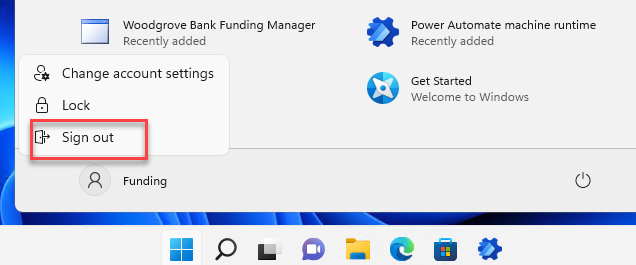 alt="select as described" />

2.  Go to the resources folder of the lab and open the Test folder.

3.  You will attach the **Attachment AI Test** file when you send the
    email.

>  alt="select the file for testing" />

4.  Send an email to <Funding@yourdomain.onmicrosoft.com> make sure the
    subject of the email is **MC3747** and you attach the **Attachment
    AI Test.pdf** file.

5.  Navigate to <https://make.powerapps.com/> and make sure you have the
    **Test** environment selected.

6.  Select **Solutions** and click to open the **Construction Funding**
    solution.

7.  Select **Cloud flows** and open the **Process Construction Funding
    Request** flow.

8.  Go to the run history.

9.  You should see a flow run with Status of Running. Click to open the
    run

10. Wait for the flow to complete.

11. Wait for the flow run to complete.

12. Flow test should succeed, and you should get an email with Subject
    Funding Approved.

> 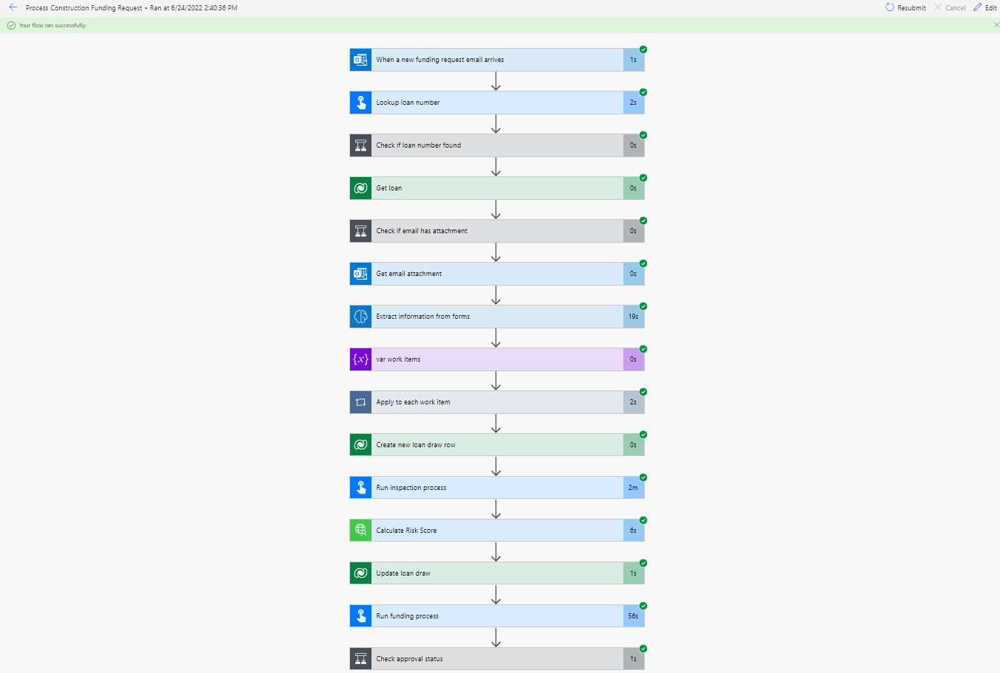 alt="review the results of the prior steps" />
