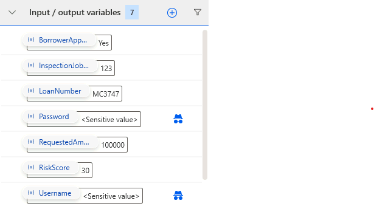
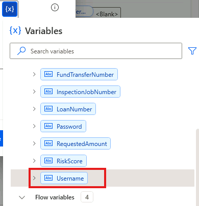

---
lab:
    title: 'Lab 2 - Build Desktop Flows'
    module: 'Module 2 - Desktop Flows'
---

# Building Desktop Flows

## Scenario

In this lab, you will be creating two desktop flows. One to automate the funding
Windows app and the other to automate the inspection website.

## High-level lab objectives

-   Use recording to capture steps to automate for both web and Windows desktop
    applications

-   Use input and output variables

-   Use flow control to handle conditional logic

-   Use loop condition and wait control

-   Use JavaScript to build JSON

## Exercise 1: Automate Desktop Funding Application

### Task 1: Practice using app

In preparation for recording practice using the app to help eliminate accidental
steps from being recorded.

1.  Browse to **C:\\Labs\\Resources\\Funding manager app** and launch the
    **Woodgrove Bank Funding Manager.exe** app.

    

1.  Enter **your username** for Username, `pass@word1` as Password, and click
    **Login**.

1.  Enter `MC3747` for Loan number and click **Lookup**.

1.  Click **Draw Funds**.

1.  Enter `100000` for Amount, `123` for Inspection Job #, `30` for Risk
    Score, check the Borrower Approved Draw checkbox, and click **Draw Funds**.

    

1.  Click **OK**.

1.  Repeat steps **3** to **6** until you feel comfortable with application.

1.  Close the application.

### Task 2: Record using the app

Create a new desktop flow in the **Construction Funding** solution and record
the steps using the **Woodgrove Funding Manager** application.

1.  Navigate to `https://make.powerapps.com/` and make sure you have the Dev
    environment selected.

1.  Select **Solutions** and open the **Construction Funding** solution.

1.  Click **+ New** and select **Automation \| Desktop flow**.

    

1.  Enter `Woodgrove Funding Manager Draw` for Flow name and click **Launch
    app**.

1.  Power Automate Desktop should launch.

1.  Go to the **Actions** pane, expand the **System** group, and double click on
    the **Run application** action.

    

1.  Click on the **Select file** button of the Application path.

    

1.  Select the **Woodgrove Bank Funding Manager.exe** file located in the lab
    folder **C:\\Labs Resources\\Funding manager app** and click **Open**.

    

1.  Click **Save**.

1.  Click **Run**.

    

1.  The application should start, and the flow should complete.

1.  Do not close the application.

1.  Go to the desktop flow and click **Recorder**.

1.  Do not start recording yet. Close or minimize all but the funding manager
    application. You will be recording steps and modifying steps. Make sure to
    follow the directions here, and only click Finish when we tell you to.

1.  Remember, you will provide the values below once you start recording.

    > Username: **your username**.
    >
    > Password: `pass@word1`
    >
    > Loan number: `MC3747`
    >
    > Amount: `100000`
    >
    > Inspection job #: `123`
    >    
    > Risk score: `30`

    
    **DO NOT** click the **OK** button on the Draw Confirmation screen.

1.  Click **Record** and select **Next**. On Recorder Pane, click on **Record**.

    

1.  The recording should start.

1.  Capture steps, same as you practiced.

1.  **DO NOT** click on the OK button.

1.  On the confirmation screen of the Windows app right click on the **Amount**
    value and select **Get text(“”).**

    

1.  Right click on the **Funds transfer number** value and select **Get
    text(“”).**

1.  Right click on the **Funds sequence number** value and select **Get
    text(“”).**

1.  Click **OK**.

1.  Go to the recorder and click **Done**.

1.  The steps you recorded should look like the image below.

    

1.  Close the **Woodgrove Funding Manager** application.

1.  If Run Application is no longer your first step, Drag the **Run
    application** action from the bottom to the top of the steps.

    

1.  Click **Run**. Do not interact with your computer until the run completes.

1.  Your flow variables should now look like the image below but might have
    different values.

    

1.  Click **Save** and wait for the flow to be saved.

1.  Do not close the desktop flow.

### Task 3: Add Input and output variables

In this task, you will define the input and output variables that you'll use to
replace the hard coded values recorded. The input variables will be used to pass
data from the calling cloud flow. The output variables will be used to return
data to that flow.

1.  On the **Variables** pane, click the plus button **(+)** and select
    **Input** to add a new input variable.

    

1.  Configure the variable as follows:

    > Variable name: `Username`
    >
    > Data  type: Text
    >
    > Default value: **Your Username**
    >
    > External name: `Username`
    >
    > Description: `Username`

    Mark the variable as sensitive, and click **Save**.

    

1.  Click **(+)** and select **Input** again.

    

1.  Enter `Password` for Variable name, select **Text** for Data type,
    `pass@word1` for Default value, `Password` for External name,
    `Password` for Description, mark the variable as sensitive, and click
    **Save**.

1.  Click **(+)** and select **Input** again.

1.  Enter `LoanNumber` for Variable name, select **Text** for Data type, `MC3747` for Default value, `LoanNumber` for External name, `Loan number` for Description, and click **Save**.

1.  Click **(+)** and select **Input** again.

1.  Enter `RequestedAmount` for Variable name, select **Text** for Data type,
    `100000` for Default value, `RequestedAmount` for External name,
    `Requested amount` for Description, and click **Save**.

1.  Click **(+)** and select **Input** again.

1.  Enter `InspectionJobNumber` for Variable name, select **Text** for Data
    type, `123` for Default value, `InspectionJobNumber` for External name,
    `Inspection job number` for Description, and click **Save**.

1.  Click **(+)** and select **Input** again.

1.  Enter `BorrowerApproved` for Variable name, select **Text** for Data type, `Yes` for Default value, `BorrowerApproved` for External name,
    `Borrower approved` for Description, and click **Save**.

1.  Click **(+)** and select **Input** again.

1.  Enter `RiskScore` for Variable name, select **Text** for Data type, `30` for Default value, `RiskScore` for External name, `Risk score` for
    Description, and click **Save**.

1.  You should now have 7 input arguments. They're displayed in alphabetical order.

    

1.  Select **(+)** and select **Output**.

    

1.  Enter `FundedAmount` for Variable name, select **Text** for Data type,
    `FundedAmount` for External name, `Funded amount` for Description, and
    click **Save**.

    

1.  Click **(+)** and select **Output** again.

1.  Enter `FundTransferNumber` for Variable name, select **Text** for Data
    type, `FundTransferNumber` for External name, `Fund transfer number` for Description, and click **Save**.

1.  Click **(+)** and select **Output** again.

1.  Enter `FundSequenceNumber` for Variable name, select **Text** for Data
    type, `FundSequenceNumber` for External name, `Fund sequence number` for Description, and click **Save**.

1.  Click **(+)** and select **Output** again.

1.  Enter `FundingStatus` for Variable name, select **Text** for Data type, `FundingStatus` for External name, `Funding status` for Description, and click **Save**.

1.  You should now have **11** total variables 7 inputs and 4 outputs.

1.  Click **Save** and wait for the flow to be saved.

### Task 4: Change flow to use input variables

In this task, you will modify hard coded values in the steps to use the input
variables you just defined.

1.  Go to the populate username action and double click on it.

    

1.  Remove the current value and click on the **{x}** select variable button.

    

1.  Select **Username** for variable and click **Select**.

    

1.  Click **Save**.

1.  Go to the populate password action and double click on it.

    

1.  Click on then encryption button and select **Input as text,** **variable or
    expression**.

    

1.  Click on the **{x}** select variable button.

1.  Select **Password** for variable and click **Select**.

1.  Click **Save**.

1.  Go to the populate loan number action and double click on it.

1.  Remove the current value and click on the **{x}** select variable button.

1.  Select **LoanNumber** for variable and click **Select**.

1.  Click **Save**.

1.  Go to the populate amount action and double click on it.

1.  Remove the current value and click on the **{x}** select variable button.

1. Select **RequestedAmount** for variable and click **Select**.

1. Click **Save**.

1. Go to the populate inspection job # action and double click on it.

1. Remove the current value and click on the **{x}** select variable button.

1. Select **InspectionJobNumber** for variable and click **Select**.

1. Click **Save**.

1. Go to the populate risk score action and double click on it.

1. Remove the current value and click on the **{x}** select variable button.

1. Select **RiskScore** for variable and click **Select**.

1. Click **Save**.

1. The actions you changed should now look like the image below.

    

1.  Click **Save** and wait for the flow to be saved.

### Task 5: Change to populate output variables

In this task, you will modify hard coded values in the steps to use the output
variables you just defined.

1.  In your steps, locate the **Get details of a UI element in window** action
    for the amount and double click on it.

    

1.  Expand the **Variables produced section** and click on the **{x}** select
    variable button.

    

1.  Select **FundedAmount**.

    

1.  Click **Save**.

1.  Locate the **Get details of a UI element in window** action for the transfer
    number and double click on it.

    

1.  Expand the **Variables produced section** and click on the **{x}** select
    variable button.

1.  Select **FundTransferNumber**.

1.  Click **Save**.

1.  Locate the **Get details of a UI element in window** action for the sequence
    number and double click on it.

    

1.  Expand the **Variables produced section** and click on the **{x}** select
    variable button.

1.  Select **FundSequenceNumber**.

1.  Click **Save**.

1.  You should now have three output variables populated.

    

1.  Click Save and wait for the flow to be saved.

### Task 6: Handle denied draws

In this task, you will handle if the funding is denied by adding conditional
logic to the flow. This will ensure the flow does not have an error when certain
controls are not available, and you will return an output variable indicating
that the funding was denied.

1.  Open the Woodgrove Bank Funding Manager application and go through the steps
    with the following parameters to get the denied message.

    > Username: **your username**.
    >
    > Password: `pass@word1`
    >
    > Loan number: `MC3747`
    >
    > Amount: `100000`
    >
    > Inspection job #: `123`
    >
    > Risk score: `90`

1.  Leave the denied message and don’t click OK.

1.  In Power Automate Desktop, go to the **Actions** pane and expand the **UI
    automation** group.

1.  Drag the **If window contains** action and drop it above the **Get details
    of the UI element in window** of the amount.

    

1.  Click the UI element dropdown and then click **Add UI element**.

1.  Hold the Ctrl key and Click on the text **Draw denied contact bank**.

1.  Click **Save**.

    

1.  Click on the **…** More actions button of the Get details of a UI element in
    window action for the amount.

    

1.  Select **Copy**.

1.  Right click on the Get details of a UI element in window action for the
    amount and select **Paste**.

    

1.  You should now have two the Get details of a UI element in window action for
    amount.

    

1.  Drag the first Get details of a UI element in window action for amount and
    drop it inside the **If window** contains.

    

1.  Double click on the Get details of a UI element in window action for amount
    inside the If.

    

1.  Click on the **UI element** dropdown and select **Draw denied contact bank**
    and click **Select**.

    

1.  Expand the **Variables produced** and click on the **{x}** select variable
    button.

1.  Select **FundingStatus**.

1.  Click **Save**.

1.  Drag another If window contains action and drop it below the **End** if.

    

1.  Click on the **Check if window** dropdown and select **Doesn’t contain UI
    element**.

1.  Click on the **UI element** dropdown select **Draw denied contact bank** and
    click **Select**.

1.  Click **Save**.

1.  Move all three Get details of a UI element in window actions outside of the
    If and drag them to the inside of the second if condition.

    

1.  Expand the **Variables** action group and drag **Set variable** action to
    the second If window contains.

    

1.  Click **{x}** select variable select **FundingStatus**.

    

1.  Type `Approved` for Value and click **Save**.

### Task 7: Add Close of app and Test Run

1.  In the **Actions** pane, search for **close**. Drag **Close window** and
    drop it after the last action.

1.  Select **Windows 'Request Funds Draw'** for Window and then click
    **Select**.

1.  Click **Save** on the Close window step.

1.  Click **Save** and wait for the flow to be saved.

1.  **Close** the funding manager app if it is still running.

1.  Click **Run**. Do not interact with the VM until the run completes.

    

1.  The flow should run successfully. Review the output variables and make sure
    the **FundingStatus** is set to **Approved**.

    

1.  Locate the **RiskScore** variable and double click on it.

    

1.  Change the **Default value** to **85** and click **Save**.

    

1.  Click **Run** again. Do not interact with the VM until the run completes.

1.  The flow should run successfully. Review the output variables and make sure
    the **FundingStatus** is set to **Draw denied contact bank**.

    

1.  Locate the **RiskScore** variable and double click on it.

1.  Change the **Default value** to **30** and click **Save**.

1.  Click **Save** and wait for the flow to be saved.

1.  You may close the desktop flow.

## Exercise 2: Automate Inspection web site

### Task 1: Practice using site

In preparation for recording practice using the app to help eliminate accidental
steps from being recorded.
    
 **Note**: Before running this desktop flow from Power Automate Desktop, please ensure to enable **Power Automate Extension** in your Web browser.

1.  Navigate to `https://fabrikaminspectionstest.azurewebsites.net/`

1.  Navigate to the **Request Inspection** page.

1.  Enter your name for Inspection Account\#, enter `123 Main Street` for Property Address, enter `Test work item` for Work to Inspect, and then
    click **Request Inspection**.

    

1.  Copy the **Job Number** and keep it in your clipboard.

    

1.  Go to the **Inspection Results** page.

1.  Enter your name for Inspection Account \#, paste the Job number you copied,
    and click **Check Inspection**.

    

1.  The Job Status should show **In progress**.

    

1.  Go to the **Request** **Inspection** page and repeat the steps until you are
    comfortable with the inspection request process.

### Task 2: Record using app

Create a new desktop flow in the **Construction Funding** solution and record
the steps using the **Inspection** web app.

1.  Navigate to `https://make.powerapps.com/` and make sure you have the Dev
    environment selected.

1.  Select **Solutions** and open the **Construction Funding** solution.

1.  Click + New and select Automation - Desktop flow.

    

1.  Enter `Perform Site Inspection` for Flow name and click **Launch app**.

1.  Power Automate Desktop flow designer should launch. You may need to click
    **Open** on the browser to permit the action.

1.  Expand the **Browser automation** group and double click on the **Launch new
    Microsoft Edge** action.

1.  Provide [https://fabrikaminspectionstest.azurewebsites.net](https://fabrikaminspectionstest.azurewebsites.net/) for Initial URL and click **Save**.

    

1.  DO NOT start recording yet.

1.  Minimize or close all but desktop flow application.

1.  Click **Run**.

    

1.  Microsoft Edge should load and navigate to the URL you provided.

1.  DO NOT close this Browser session.

1.  Go back to the desktop flow and click **Recorder**.

1.  The recorder pane should come to view.

1.  DO NOT start recording. Once you’ve reviewed the steps below, start
    recording. When you start recording you will repeat the steps you went
    through during the practice as outlined below.

    i. Go to the **Request Inspection** page.

    ii. Enter your name for **Inspection Account**

    iii. Enter `123 Main Street` for Property Address.

    iv. Enter `Test work item` for Work to Inspect.

    v. Click on the **Request Inspection** button.

    vi. Right click on the **Job Number** and select **Extract element value \|
    Text: ('your job number here')**. Remember the Job number.

    vii. Navigate to the Inspection Results page.

    viii. Provide your name again.

    ix. Enter the **Job number**.

    x. Click on the **Check Inspection** button.

    xi. Right click on the **Job status** and select **Extract element value \|
    Text: ('In progress')**.

    

    **Note**: Depending on your speed, the Job Status may already be **Completed**. In
    this case select corresponding option **Extract element value \| Text: ('In
    progress')**.

    xii. Go back to the recorder and click **Done**.

1.  Click **Record** and perform the steps.

1.  After you finish recording, your recorder actions should look like the image
    below.

1.  Click **Save** and wait for the flow to be saved.

    

### Task 3: Add input and output variables

In this task, you will define the input and output variables that you'll use to
replace the hard coded values recorded. The input variables will be used to pass
data from the calling cloud flow. The output variables will be used to return
data to that flow.

1.  Open the **Variables** pane, click the plus button **(+)** and select
    **Input**.

2.  Enter `InspectionAccountNumber` for Variable name, select **Text** for
    Data type, `Jane Doe` for Default value, `InspectionAccountNumber` for
    External name, `Inspection account number` for Description, and click
    **Save**.

3.  Click **(+)** and select **Input** again.

4.  Enter `PropertyAddress` for Variable name, select **Text** for Data type,
    `123 Main Street` for Default value, `PropertyAddress` for External
    name, `Property address` for Description, and click **Save**.

5.  Click **(+)** and select **Input** one more time.

6.  Enter `WorkToInspect` for Variable name, select **Text** for Data type,
    `Test work item` for Default value, `WorkToInspect` for External name,
    `Work to inspect` for Description, and click **Save**.

7.  Click **(+)** and select **Output**.

8.  Enter `InspectionStatus` for Variable name, select **Text** for Data type,
    `InspectionStatus` for External name, `Inspection status` for
    Description, and click **Save**.

9.  Click **(+)** and select **Output** again.

10. Enter `SitePhotos` for Variable name, select **Text** for Data type,
    `SitePhotos` for External name, `Site photos` for Description, and click
    **Save**.

11. Click **(+)** and select **Output** one more time.

12. Enter `JobNumber` for Variable name, select **Text** for Data type,
    `JobNumber` for External name, `Job number` for Description, and click
    **Save**.

13. You should now have three input and three output variables.

### Task 4: Change to use variables

In this task, you will modify hard coded values in the steps to use the
variables you just defined.

1.  Go to the Populate text field on web page for the account number and double
    click on it.

    

1.  Clear the Text value and click on the **{x}** select variable button.

    

1.  Select **InspectionAccountNumber** and click **Select**.

1.  Click **Save**.

1.  Go to the Populate text field on web page for the property address and
    double click on it.

1.  Clear the Text value and click on the **{x}** select variable button.

1.  Select **PropertyAddress** and click **Select**.

1.  Click **Save**.

1.  Go to the Populate text field on web page for the work to inspect and double
    click on it.

    

1.  Clear the Text value and click on the **{x}** select variable button.

1.  Select **WorkToInspect** and click **Select**.

1.  Click **Save**.

1.  Go to the first Get details of element on web page and double click on it.

    

1.  Click on the variable name, change it to **JobNumber**, and click
    **Save**. You are typing in this field.

    

1.  Go to the Populate text field on web page for the second account number and
    double click on it.

    

1.  Clear the Text value and click on the **{x}** select variable button.

1.  Select **InspectionAccountNumber** and click **Select**.

1.  Click **Save**.

1.  Go to the last Populate text field on web page and double click on it.

    

1.  Clear the Text value and click on the **{x}** select variable button.

1.  Select **JobNumber** and click **Select**.

1.  Click **Save**.

1.  Go to the last Get details of element on web page and double click on it.

    

1.  Click on variable and then click on the **{x}** select variable button.

1.  Select **InspectionStatus**.

1.  Click **Save** and close the Fabrikam Inspection website.

1.  If your Launch new Microsoft Edge is not the first action in the flow, then
    drag the Launch new Microsoft Edge action and drop it before all the
    recorded actions.

    

1.  Click **Run** and wait for the run to complete.

1.  You should get an error similar to the one below. You see this error because
    the job number will be different for each run, but the flow is trying to
    match it with job number generated during the recording.

    

1.  Go the **UI elements** tab and double click on the **Table data cell
    'xxxxx'** UI.

    

1.  Select the last element form the **Elements** list **Table data cell
    'xxxxx'**, uncheck the **Text** attribute, check the **Ordinal** attribute,
    change the value or the Ordinal from 0 to **1**, and click **Save**. We are
    telling the flow to use the value in the second cell of the table, the table
    cells are zero based where 0 is the first cell and 1 is the second cell.

    

1.  We will do the same thing for the inspection status. Double click on the
    **Table data cell 'In progress'** UI.

    Note: Depending on the recording previously, this might be **Table data cell
    'Completed'**.

    

1.  Select the **Table row 'Job Status: In progress** element, check the
    **Ordinal** attribute checkbox, enter 1 for the Ordinal value, and then
    select **Table data cell 'In progress'**. You are selectecting the row first
    and then moving to edit the cell.

    

1.  Uncheck the **Text** attribute, check the **Ordinal** attribute, change the
    value or the Ordinal from 0 to **1**, and click **Save**.

1.  Run the flow again.

1.  The flow run should now succeed, and the variables should look like the
    image below.

    

1.  Click **Save** and wait for the flow to be saved.

### Task 5: Add loop condition and wait control

In this task, you will be adding a loop to recheck if the inspection is done.
You will add a delay to give the inspection time to be completed before checking
again.

1.  Expand the **Loops** group, drag **Loop condition** and drop it before
    Populate text field on a web page for the second InspectionAccountNumber
    action.

    

1.  Click on the **{x}** select variable button of the First operand.

    

1.  Select **InspectionStatus** and click **Select**.

1.  Select **Not equal to (<\>)** for Operation, enter **Completed** for the
    Second operand, and click **Save**.

    

1.  Select the four actions after the loop and move them inside the loop by drag
    and drop.

    

1.  Expand the **Flow control** group, drag **Wait** action and drop it before
    the **End** loop.

    

1.  Enter **10** seconds and click **Save**.

1.  Click **Run** and wait for the flow to complete. The flow should go through
    the loop until the inspection status changes to **Completed**.

    

1.  Do not close the browser.

1.  Click **Save** and wait for the flow to be saved.

### Task 6: Use JavaScript to build JSON

In this task, you will use JavaScript to extract the work site inspection photos
and format the data into a JSON array that can be used to populate the output
variable.

1.  Go to the **Actions** pane and expand the **Browser automation** group.

2.  Expand the **Web data extraction** subgroup and double click on the
    **Extract data from web page** action.

    

1.  Go back to the web page, right click on the image, and select **Extract
    entire HTML table**.

    

1.  Notice you only get Value \#1, currently, extract is not able to extract
    both columns of the table because column 2 is an img tag.

    

1.  Click **Cancel**.

1.  Click **Cancel** again.

    

1.  Go to the web page and open the DevTools via the **F12** key. We are going
    to use Dev Tools to test our JavaScript.

1.  Select the **Console** tab and click **Clear console**.

    

1.  Paste the script below and press enter.


    ```js
    var table = document.getElementById("sitephotostable");
    
    var sitephotolist = { images:[] }
    
    for (var i = 0; i < table.rows.length; i++) {
    
    row = table.rows[i];
    
    namecol = row.cells[0];
    
    imgcol = row.cells[1];
    
    var imgtags = imgcol.getElementsByTagName('img');
    
    var imgsource = imgtags[0]['src'];
    
    console.log(imgsource)
    
    sitephotolist.images.push({"name":namecol.innerText, "url":imgsource})
    
    }
    
    console.log(JSON.stringify(sitephotolist))
    ```


1.  Review the information you are trying to extract.

    

1.  Close the DevTools.

1.  Go back to the desktop flow.

1.  Expand the **Browser automation** group, drag **Run JavaScript function on a
    web page and get the returned result** action and drop it after the **End**
    loop.

    

1.  Select **%Browser%** for Web browser instance, paste the script below in the
    JavaScript function field, expand the **Variables produced** section, click
    on the **{x}** select variable button.

    ```js
    function ExecuteScript()

    {

    var table = document.getElementById("sitephotostable");

    var sitephotolist = { images:[] }

    for (var i = 0; i < table.rows.length; i++) {

    row = table.rows[i];

    namecol = row.cells[0];

    imgcol = row.cells[1];

    var imgtags = imgcol.getElementsByTagName('img');

    var imgsource = imgtags[0]['src'];

    console.log(imgsource)

    sitephotolist.images.push({"name":namecol.innerText, "url":imgsource})

    }

    console.log(JSON.stringify(sitephotolist))

    return JSON.stringify(sitephotolist);

    }
    ```    
    

15.  Select **SitePhotos**.

16.  Click **Save**.

17.  Expand the **Browser automation** group, drag **Close web browser** action,
    and drop it to the bottom of the recorded actions.

        

18.  Select **%Browser%** for web browser instance and click **Save**.

19.  Click **Save** and wait for the flow to be saved.

### Task 7: Close browser and test

1.  Close the Fabrikam Inspection website.

1.  Click **Run** and wait for the run to complete. The flow will loop through
    the loop condition multiple times, until the status changes to completed.

1.  Go to the Variables pane and make sure the **SitePhotos** variable has the
    expected value.

    

1.  Click **Save** and wait for the flow to be saved.
