---
lab:
    title: 'Lab 3 - Use Desktop Flow from Cloud Flow'
    module: 'Module 3 - Use Desktop Flow from Cloud Flow'
---

# Using Desktop Flows from Cloud Flows

## Scenario

In this lab, you will build cloud flows which integrate with the desktop flows.

## High-level lab objectives

-   Use child flows to create a more maintainable cloud flow

-   Use desktop flows from cloud flow

## Exercise 1: Lookup Loan Child flow

### Task 1: Create child flow

1.  Navigate to `https://make.powerapps.com/` and make sure you are in the Dev
    environment.

1.  Select **Solutions** and open the **Construction Funding** solution.

1.  Click **+ New** and select **Automation \| Cloud flow \| Instant**.

    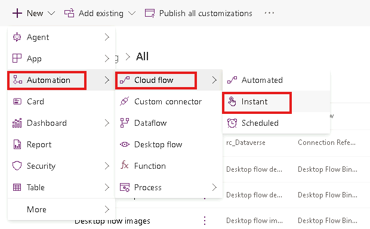

1.  Enter `CF Lookup Loan` for Flow name, select **Manually trigger a flow**,
    and click **Create**.

    

1.  Expand the trigger by clicking on **Manually trigger a flow**.

1.  Select **+ Add an input**.

    

1.  Select **Text**.

1.  Enter `LoanNumber` and click **+ New step**.

    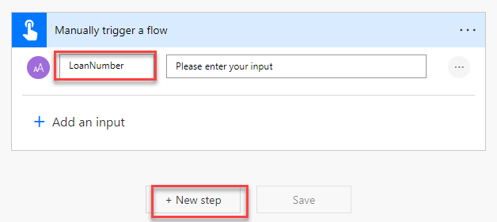

1.  Search for list rows and select **List rows Microsoft Dataverse**.

    

1.  Select **Loans** for Table name and click **Show advanced options**.

    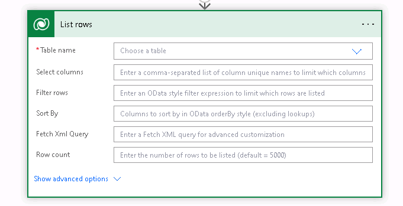

1.  Enter `rc_loannumber eq` for Filter rows and select **LoanNumber** from
    the dynamic content pane.

    

     If you do not see the **Dynamic Content & Expression** pop-up, increase
your browser width or zoom out slightly to reveal it (Keyboard shortcut: Ctrl +
\-).

1.  Add single quotes (') before and after LoanNumber

1.  Click **+ New step**.

1.  Select **Condition**.

    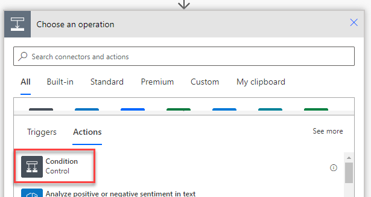

1.  Click to select the first operand field, go to the dynamic content pane, and
    select the expression tab.

1.  Paste the expression below and click **OK**. This checks if any rows were
    returned.
    ```
    empty(outputs('List_rows')?['body/value'])
    ```
    

1.  Select **is equal to** for condition.

1.  Click to select the second operand field, go to the dynamic content pane,
    and select the expression tab.

1.  Type **true** and click **OK**.

    

1.  Go to the **If yes** branch and click **Add an action**.

    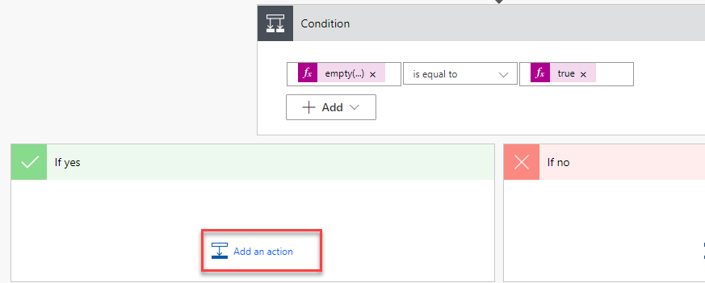

1.  Select **Respond to a PowerApp or flow**.

    

1.  Click **+ Add an output**.

    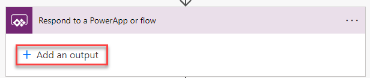

1.  Select **Yes/No**.

1.  Enter `LoanFound` for title and click to select the value field.

1.  Go to the Dynamic content pane and select the **Expression tab**.

1.  Type **false** and click **OK**.

    

1.  Click **+ Add an output** again.

1.  Select **Text**.

1.  Enter `LoanID` for title.

1.  Click on the value field, add an empty space.

    

1.  Click on the **…** more actions button and select **Rename**.

    

1.  Rename the step `Not found response`.

1.  Go to the **If no** branch and click **Add an action**.

    

1.  Select **Respond to a PowerApp or flow**.

    

1.  Click **+ Add an output**.

1.  Select **Yes/No**.

1.  Enter `LoanFound` for title and click to select the value field.

1.  Go to the dynamic content pane and select the **Expression tab**.

1.  Type **true** and click **OK**.

    

1.  Click **+ Add an output** again.

1.  Select **Text**.

1.  Enter `LoanID` for title.

1.  Click to select the value field, go to the dynamic content pane, and select
    the **Expression** tab.

1.  Paste the expression below and click *OK*. This gets the ID from the first
    row.
    ```
    first(outputs('List_rows')?['body/value'])?['rc_loanid']
    ```
    

1.  Click on the … more actions button and select **Rename**.

1.  Rename the step `Found response`.

1.  Click **Save** to save the flow.

    

1.  Click **Test**.

    

1.  Select **Manually** and click **Test**.

1.  Enter `MC3747` for LoanNumber and click **Run flow**.

    

1.  Click **Done**.

1.  Click to expand the response step.

1.  Make sure the output body matches your expectation.

    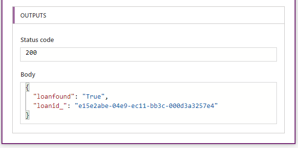

1.  You may close the flow

## Exercise 2: Inspection Child flow

### Task 1: Setup Machine connection

1.  Navigate to `https://make.powerapps.com/` and make sure you are in the Dev
    environment.

1.  Select **Solutions** and open the **Construction Funding** solution.

1.  Click **+ New** and select **More \| Connection Reference**.

    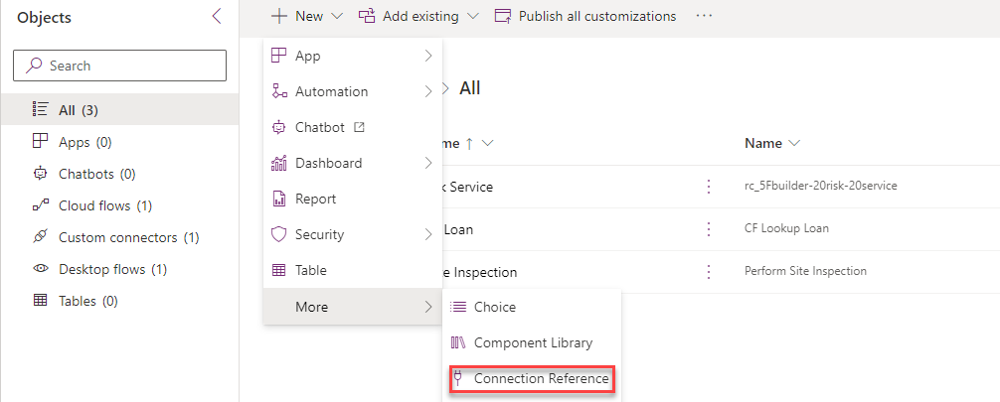

1.  Enter `Desktop Flows` for Display name, select **Desktop flows** for Connector,
    click on the Connection dropdown and select **+ New connection**.

    

1.  Select **Connect with username and password** for Connect and select your
    desktop. If you don’t see your desktop here, go to desktop flow machine
    settings and make sure you have the Dev environment selected.

    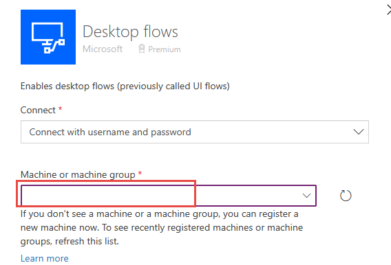

1.  Provide your Machine/VM admin username and password, and click **Create**.

    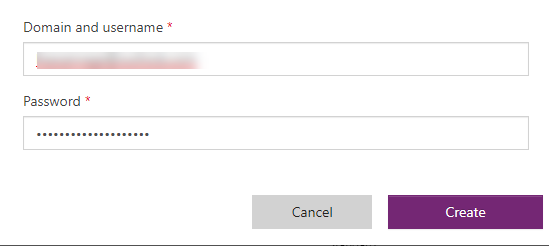

1.  Close the connection browser tab or window.

1.  Click on the **Refresh** connection button.

    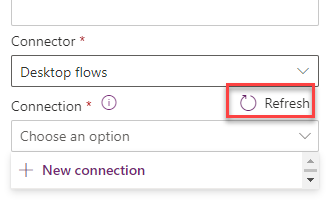

1.  Select the connection you created and click **Create**.

    

### Task 2: Create child flow

1.  Navigate to `https://make.powerapps.com/` and make sure you are in the Dev
    environment.

1.  Select **Solutions** and open the **Construction Funding** solution.

1.  Click **+ New** and select **Automation \| Cloud flow \| Instant**.

    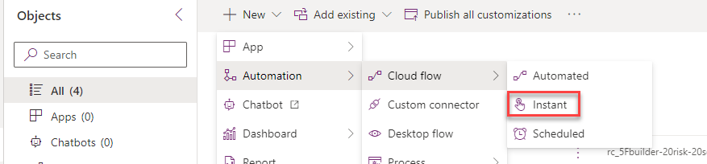

1.  Enter `CF Manage Inspection Process` for Flow name, select **Manually
    trigger a flow**, and click **Create**.

1.  Expand the trigger and click **+ Add an input**.

1.  Select **Text**.

1.  Enter `PropertyAddress` and click **+ Add an input** again.

    

1.  Select **Text**.

1.  Enter `LoanDrawID` and click **+ Add an input** one more time.

1.  Select **Text**.

1.  Enter `Work`. You should now have three input parameters. Click + New
    step.

    

1.  Select **Run a flow built with Power Automate for desktop**.

    

1.  Select **Perform Site Inspection** for Desktop flow and select **Attended**
    for Run Mode.

1.  Click on the **WorkToInspect** field and select **Work** from the dynamic
    content pane.

    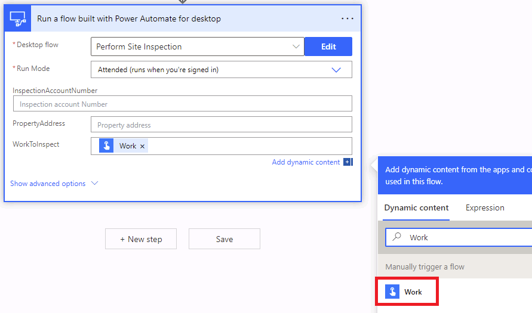

1.  Click on the **PropertyAddress** and select **PropertyAddress** from the
    dynamic content pane.

1.  Enter your name for Inspection account number.

    

1.  Click **+ New step**.

1.  Search the connectors and actions for **Parse JSON**. Select the **Parse
    JSON** action which is part of the **Data Operation** connector.

    

1.  Click on the **Content** field and select **SitePhotos** from dynamic
    content pane.

    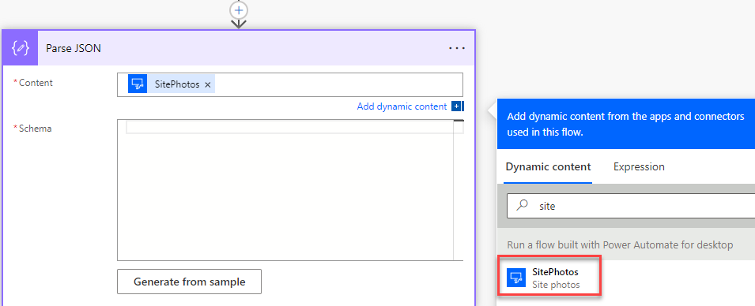

1.  Paste the JSON schema below in the **Schema** field and click **+ New
    step**. Typically, you would generate this from a sample of the data
    expected.

    ```json
    {
       "type":"object",
       "properties":{
          "images":{
             "type":"array",
             "items":{
                "type":"object",
                "properties":{
                   "name":{
                      "type":"string"
                   },
                   "url":{
                      "type":"string"
                   }
                },
                "required":[
                   "name",
                   "url"
                ]
             }
          }
       }
    }
    ```


    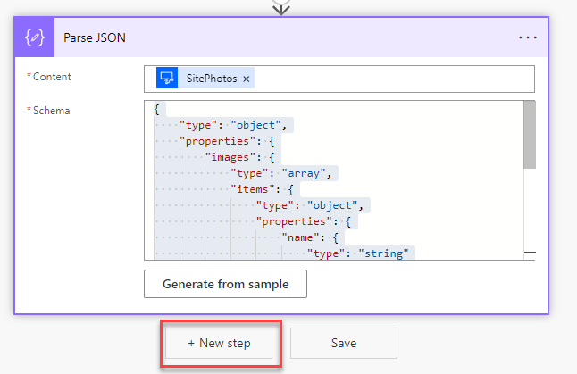

1.  Select the **HTTP** action.

    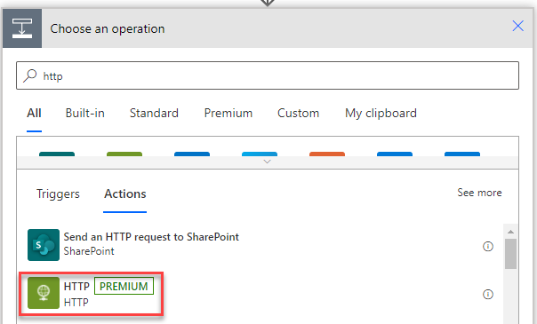

1.  Select **GET** for Method, click on the **URI** field, and select **url**
    from the dynamic content pane.

    

1.  Apply to each will be added automatically for you. Rename the Apply to each
    step **Apply to each image**.

1.  Click **Add an action**.

    

1.  Select the **Add a new row** action from the **Microsoft Dataverse**
    connector.

    

1.  Select **Inspection Photos** for Table name, click on the **Name** field,
    and select **name** from the dynamic content pane.

    

1.  Rename the Add a new row step to **Add inspection photo** and click **Show
    advanced options**.

    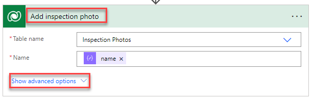

1.  Enter `rc_loandraws()` for Loan Draw, place your cursor inside the
    parentheses, and select **LoanDrawID** from the dynamic content pane.

    

1.  Click on the **Photo** field, go to the dynamic content pane, and select the
    **Expression** tab.

1.  Paste the expression below and click **OK**.

    `base64(body('HTTP'))`

    

1.  Click **+ New step**.

    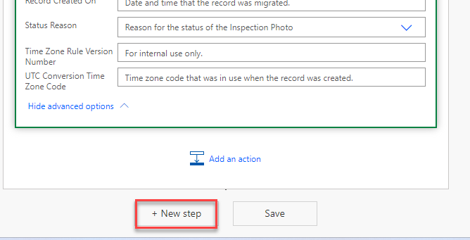

1.  Select the **Update a row** action from the **Microsoft Dataverse**
    connector.

    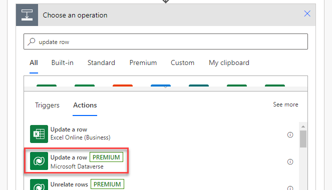

1.  Select **Loan Draws** for Table name, click on the **Row ID** field and
    select **LoanDrawID** from the dynamic content pane.

1.  Click **Show advanced options**.

    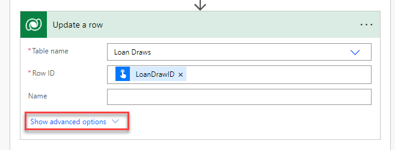

1.  Click on the **Inspected On** field, go to the dynamic content pane, select
    the **Expression** tab, type **utcNow()** and click **OK**.

    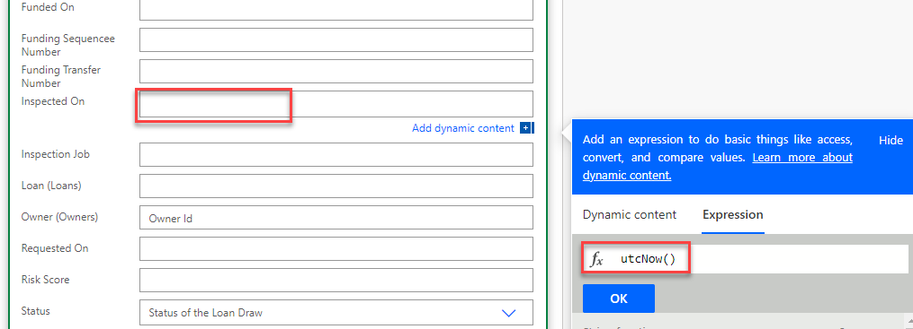

1.  Click on the **Inspection Job** field and select **JobNumber** from the
    dynamic content pane.

    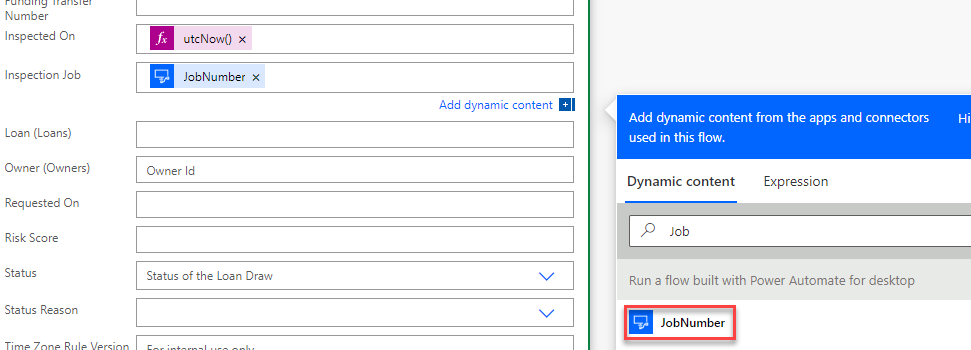

1.  Select **Inspection Completed** for Status Reason and click **Hide advanced
    options**.

    

1.  Rename the step **Update loan draw** and click **+ New step**.

1.  Select the **Respond to PowerApp or flow** action from the **PowerApps**
    connector.

    

1.  Click **+ Add an output**.

1.  Select **Text**.

1.  Enter `InspectionStatus`, click on the value field and select
    **InspectionStatus** from the dynamic content pane.

    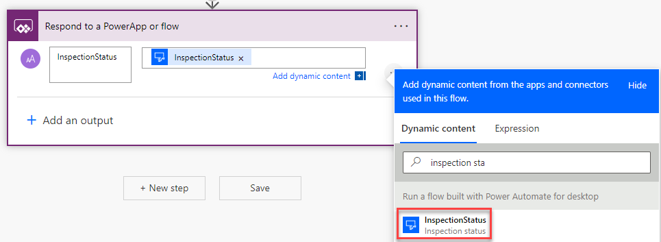

1.  Click **+ Add an output** again.

1.  Select **Text**.

1.  Enter `JobNumber`, click on the value field and select **JobNumber** from
    the dynamic content pane.

    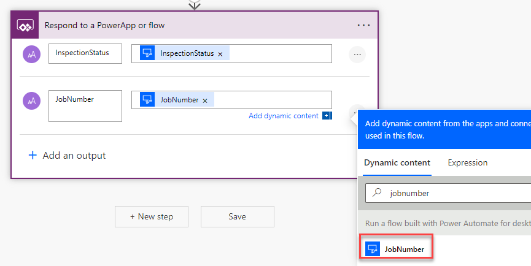

1.  Click **Save** to save the flow.

1.  Click on the **back** arrow.

    

1.  Open the flow details.

    

1.  Click **Run**.

1.  If prompted, select **Manually** and click **Test** again.

1.  Click **Continue**.

    

1.  **DO NOT** navigate away from this page.

1.  Start a new browser instance and navigate to <https://make.powerapps.com/>
    and make sure you are in the Dev environment.

1.  Select **Apps** and launch the **Loan Manager** application.

    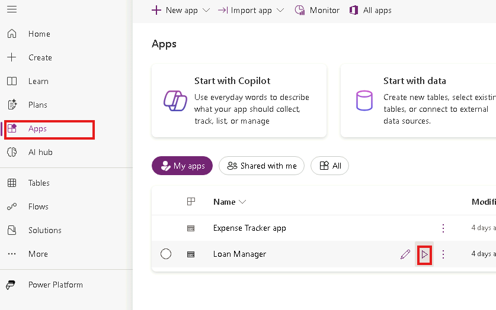

1.  Open the first loan record.

1.  Click **Related** and select **Loan Draws**.

    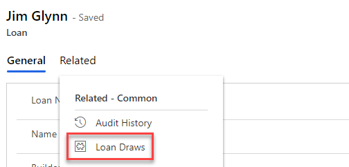

1.  Click **+ New Loan Draw**.

    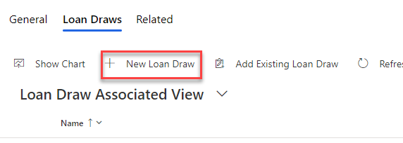

1.  Enter `Test Draw` for Name and click **Save**.

1.  Go to the URL and copy the **id** GUID. Paste this id into Notepad, you will
    need it in future steps.

    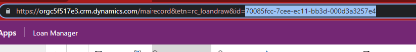

1.  Go back to the Cloud Flow and enter `123 Main Street` for PropertyAddress,
    paste the id you copied in the LoanDrawID field, type `Test work item` for
    Work, and click **Run flow**.

    

1.  **Wait** for the flow run to complete.

1.  **Close** the run flow pane.

1.  Go to the **28-day run history** and click **refresh** until the flow run
    shows as **Succeeded**.

    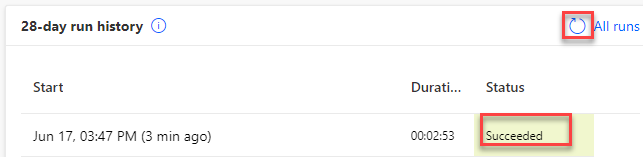

1.  Go back to the **Loan Manager** application, click **Related** and select
    **Inspection Photos**.

    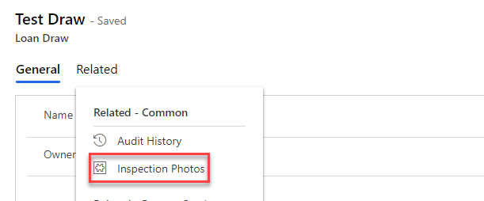

1.  You should see the inspection photos created by the flow.

    

## Exercise 3: Funding Child flow

### Task 1: Create child flow

1.  Navigate to `https://make.powerapps.com/` and make sure you are in the Dev
    environment.

1.  Select **Solutions** and open the **Construction Funding** solution.

1.  Click **+ New** and select **Automation \| Cloud flow \| Instant**.

1.  Enter `CF Manage Woodgrove Funding Process` for Flow name, select
    **Manually trigger a flow**, and click **Create**.

    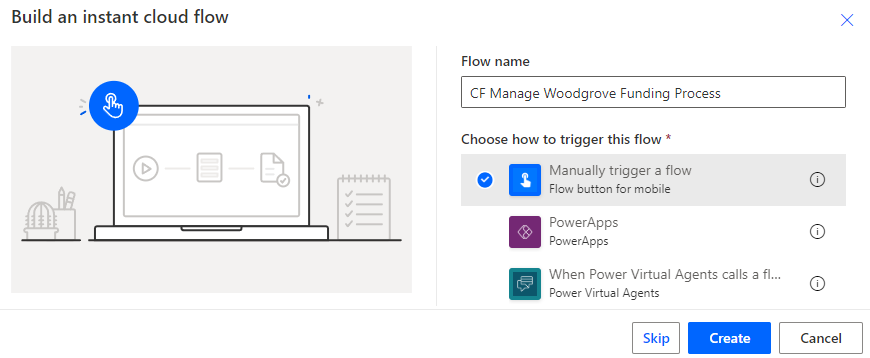

1.  Expand the trigger and click **+ Add an input**.

    

1.  Select **Text**.

1.  Enter `LoanNumber` and click **+ Add an input** again.

1.  Select **Text**.

1.  Enter `LoanDrawID` and click **+ Add an input** again.

1.  Select **Text**.

1.  Enter `RequestedAmount` and click **+ Add an input** again.

1.  Select **Text**.

1.  Enter `InspectionJobID` and click **+ Add an input** again.

1.  Select **Number**.

1. Enter `RiskScore`.

1. You should now have five inputs. Click **+ New step**.

    

1.  Select the **Run a flow built with Power Automate for desktop** action.

    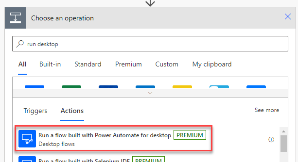

1.  Select **Woodgrove Funding Manager Draw** for Desktop flow and select
    **Attended** for Run Mode.

1.  Click on the **LoanNumber** field and select **LoanNumber** from the dynamic
    content pane.

    

1.  Click on the **RequestedAmount** field and select **RequestedAmount** from
    the dynamic content pane.

1.  Click on the **InspectionJobNumber** field and select **InspectionJobID**
    from the dynamic content pane.

1.  Type **Yes** for BorrowerApproved.

1.  Click on the **RiskScore** field and select **RiskScore** from the dynamic
    content pane.

1.  Enter your name for Username, `pass@word1` for Password.

1.  The run desktop flow should now look like the image below. Click **+ New
    step**.

    

1.  Select the **Condition** action from the **Control** connector.

1.  Click on the first operand and select **FundingStatus** from the dynamic
    content pane.

    

1.  Select **is equal to** for operator and enter `Approved` for the second
    operand.

1.  Go to the **If yes** branch and click **Add an action**.

    

1.  Select the **Update a row** action from the **Microsoft Dataverse**
    connector.

    

1.  Select **Loan Draws** for Table name, click on the Row ID field and select
    **LoanDrawID** from the dynamic content pane.

    

1.  Click **Show advanced options**.

1.  Click on the **Amount Funded** field and go to the dynamic content pane and
    select the **Expression** tab.

1.  Paste the expression below and click **OK**.
    ```
    replace(outputs('Run_a_flow_built_with_Power_Automate_for_desktop')?['body/FundedAmount'],'$','')
    ```
    

1.  Click on the **Funded On** field, go to the dynamic content pane, and select
    the **Expression** tab.

1.  Type **utcNow()** and click **OK**.

    

1.  Click on the **Funding Sequence Number** field and select
    **FundSequenceNumber** from the dynamic content pane.

1.  Click on the **Funding Transfer Number** field and select
    **FundTransferNumber** form the dynamic content pane.

1.  Click on the **RiskScore** field and select **RiskScore** form the dynamic
    content pane.

1.  Select **Funding Approved** for Status Reason and click **Hide advanced
    options**.

    

1.  Rename the step **Update for approved**.

1.  Go to the **If no** branch and click **Add an action**.

    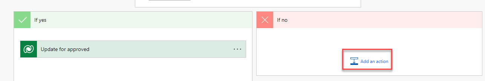

1.  Select the **Update a row** action from the **Microsoft Dataverse**
    connector.

    

1.  Select **Loan Draws** for Table name, click on the Row ID field and select
    **LoanDrawID** from the dynamic content pane.

    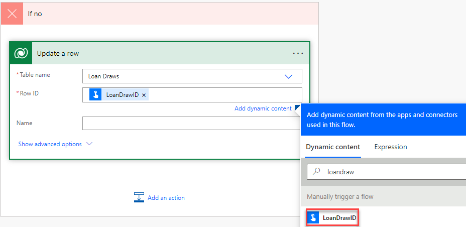

1.  Click **Show advanced options**.

1.  Select **Funding Denied** for Status Reason and click **+ New step**.

    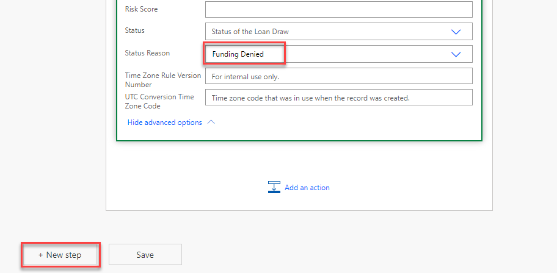

1.  Select the **Respond to PowerApps or flow** action from the **PowerApps**
    connector.

    

1.  Click **+ Add an output**.

1.  Select **Text**.

1.  Enter `FundingStatus`, click on the value field and select
    **FundingStatus** from the dynamic content pane.

    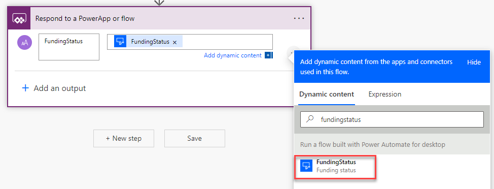

1.  Click **Save** and wait for the flow to be saved.

1.  Click **Test**.

1.  Select **Manually** and click **Test** again.

1.  Click **Continue**.

1.  Enter `JG7165` for LoanNumber, paste the id you copied in the previous
    exercise for LoanDrawID, enter `80000` for RequestedAmount, enter `123`
    for InspectionJobID, enter `50` for RiskScrore, and click **Run flow**.

    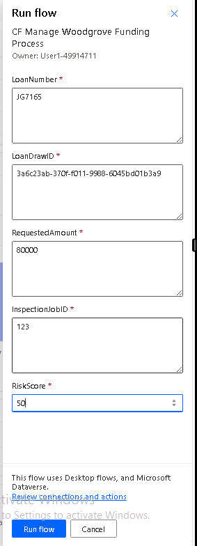

1.  **Wait** for the flow run to complete, the flow run should succeed. Click
    **Done** to review the flow run history.

## Exercise 4: Build Overall Process Flow

### Task 1: Create a shared mailbox

1.  Navigate to `https://admin.microsoft.com/` and click **Show all**.

    

1.  Go to the **Admin centers** area and select **Exchange**.

    

1.  In the left side menu under **Recipients** select **Mailboxes**.

1.  Click **+ Add a shared mailbox**.

    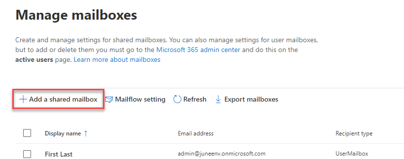

1.  Enter `Funding` for Display name, **Funding** for Email address, select
    your domain, and click **Create**.

    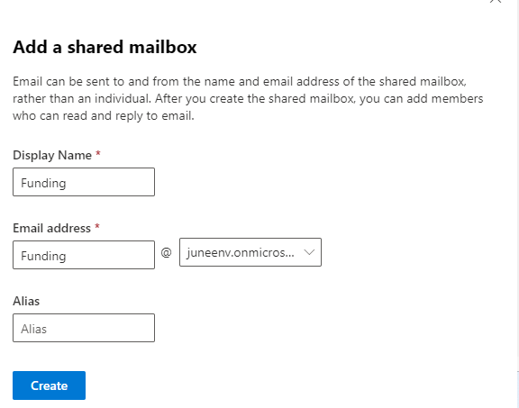

1.  Click **Add users to this mailbox**.

    

1.  Click **+ Add members**.

1.  Select your user and click **Save**. You may add other users to the shared
    mailbox.

    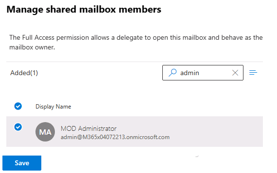

1.  Click **Confirm**.

1.  Close the shared mailbox pane.

## Task 2: Create flow

1.  Navigate to `https://make.powerapps.com/` and make sure you are in the Dev
    environment.

1.  Select **Solutions** and open the **Construction Funding** solution.

1.  Locate and open the **CF Manage Inspection Process** child flow.

    

1.  Go to the **Run only users** section and click **Edit**.

    

1.  Select the desktop connection you created and click **OK** on the popup.

1.  Click **Save**.

    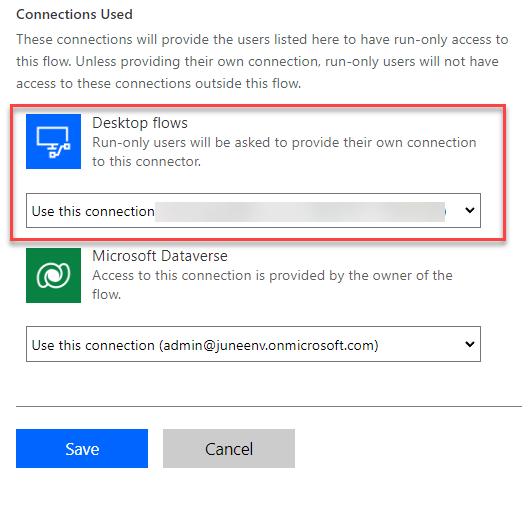

1.  Click on the browser back button.

1.  Locate and open the **CF Manage Woodgrove Funding Process** child flow.

    

1.  Go to the **Run only users** section and click **Edit**.

1.  Select the desktop connection you created and click **OK** on the popup.

1.  Click **Save**.

1.  Click on the browser back button.

1.  Click **+ New** and select **Automation \| Cloud flow \| Automated**.

    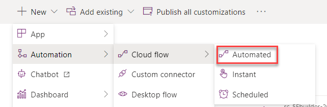

1.  Enter `Process Construction Funding Request` for Flow name, select the
    **When a new email arrives in a shared mailbox** trigger, and click
    **Create**.

    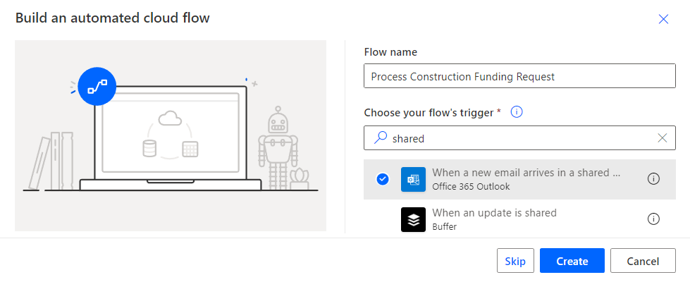

1.  Select the **Funding** shared email you created for **Original Mailbox
    Address**, select **Inbox** for Folder, and click **Show advanced options**.

1.  Select **Yes** for Include attachments and click on the **…** button of the
    trigger.

    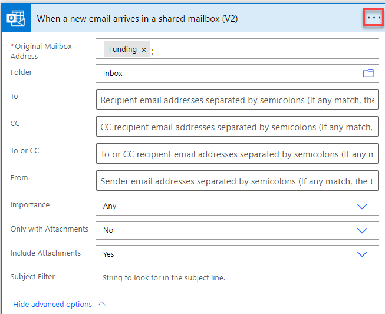

1.  Select **Rename**.

1.  Rename the trigger to **When a new funding request email arrives**.

1.  Click **+ New step**.

1.  Select the **Run a Child Flow** action from the **Flows** connector.

    

1.  Select **CF Lookup Loan** for Child flow.

1.  Click on the **LoanNumber** field, go to the dynamic content pane, and
    select **Subject**.

    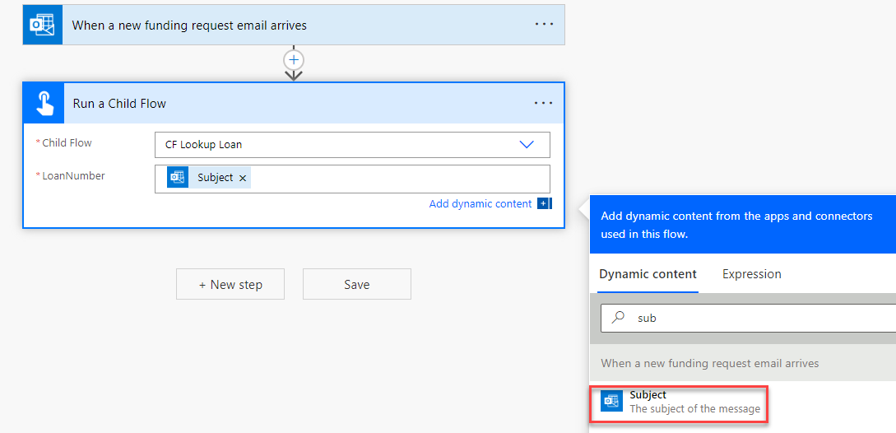

1.  Rename the step **Lookup loan number**.

1.  Click **+ New step**.

1.  Select the **Condition** action from the **Control** connector.

1.  Click to select the first operand field, go to the dynamic content pane, and
    select **LoanFound**.

    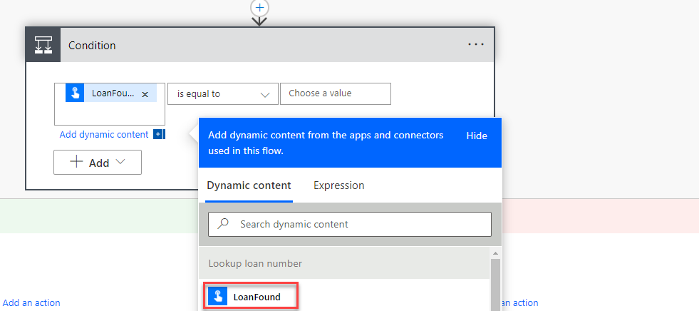

1.  Select **is equal to** for the operator and type True for the second operand
    field.

1.  Rename the condition **Check if loan number found**.

1.  Go to the **If no** branch and click **Add an action**.

1.  Select the **Send an email from a shared mailbox (V2)** action from the
    **Office 365 Outlook** connector.

    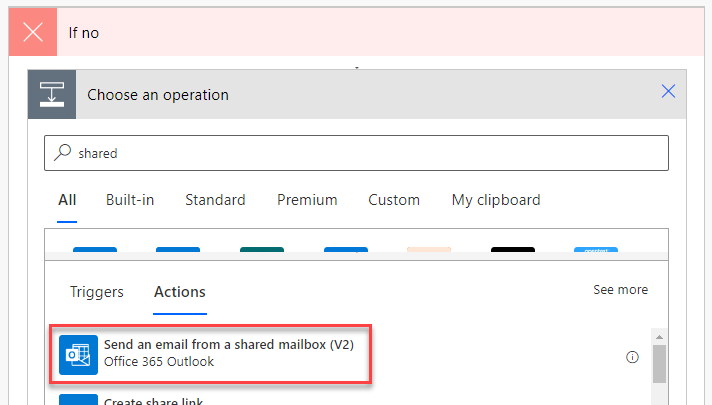

1.  Click on the **Original mailbox Address**, click **Add dynamic content** and
    select **To** from the dynamic content pane.

    

1.  Click on the **To** field, click **Add dynamics content** and select
    **From** from the dynamic content pane.

1.  Type `Loan number not found` for Subject.

1.  Type `Loan \#` Body and select **Subject** from the dynamic content pane.

    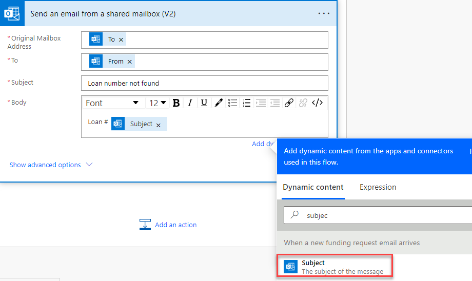

1.  Add `not found, contact your bank.` to the body.

1.  Rename the reply **Send loan not found email** and click **Add an action**.

    

1.  Select the **Terminate** action from the **Control** connector.

    

1.  Select **Succeeded** for Status.

1.  Click **+ New step**.

    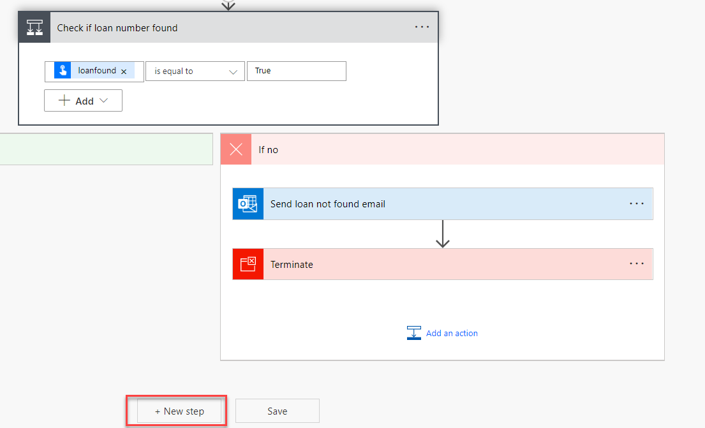

1.  Select the **Add a new row** action from the **Microsoft Dataverse**
    connector.

    

1.  Select **Loan Draws** for Table name.

1.  Enter **Loan draw** for Name and click **Show advanced options**.

    

1.  Enter `80000` for Amount Requested.

1.  Type **rc_loans()** for Loan (Loans), place your cursor inside the
    parentheses, and select **LoanID** from the dynamic content pane.

    

1.  Rename the step **Create new loan draw row**.

1.  Click **+ New step.**

1.  Select the **Run a Child Flow** action from the **Flows** connector.

1.  Select **CF Manage Inspection Process** for Child flow.

1.  Enter `123 Main Street` for PropertyAddress.

1.  Click on the **LoanDrawID** field and select **Loan Draw** from the dynamic
    content pane.

    

1.  Enter `Test work item` for Work.

1.  Rename the child flow **Run inspection process** and click **+ New step**.

    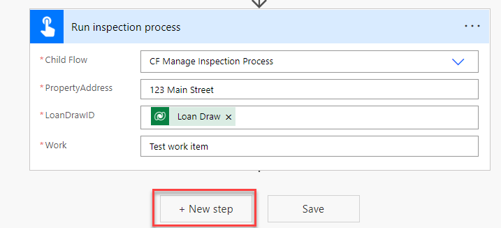

1.  Select the **Run a Child Flow** action from the **Flows** connector.

1.  Select **CF Manage Woodgrove Funding Process** for Child flow.

1.  Click on the **LoanNumber** field and select **Subject** from the dynamic
    content pane.

1.  Click on the **LoanDrawID** field and select **Loan Draw** from the dynamic
    content pane.

1.  Enter `80000` for RequestedAmount.

1.  Click on the **InspectionJobID** field and select **JobNumber** from the
    dynamic content pane.

1.  Enter `55` for **RiskScore**.

1.  Rename the child flow **Run funding process**. Click **Save**.

1.  Click **+ New step**.

    

1.  Select the **Condition** action from the **Control** connector.

1.  Click on the first operand and select **FundingStatus** from the dynamic
    content pane.

    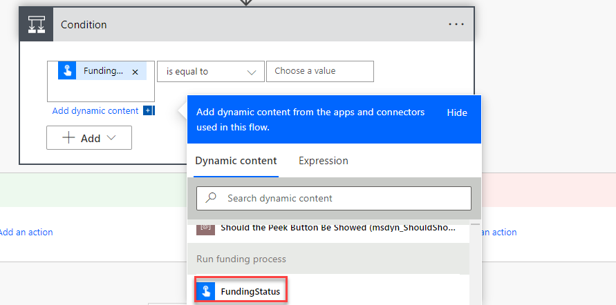

1.  Select **is equals to** for operator and enter **Approved** for the second
    operand.

1.  Rename the condition **Check approval status**.

1.  Go to the **If yes** branch and click **Add an action**.

    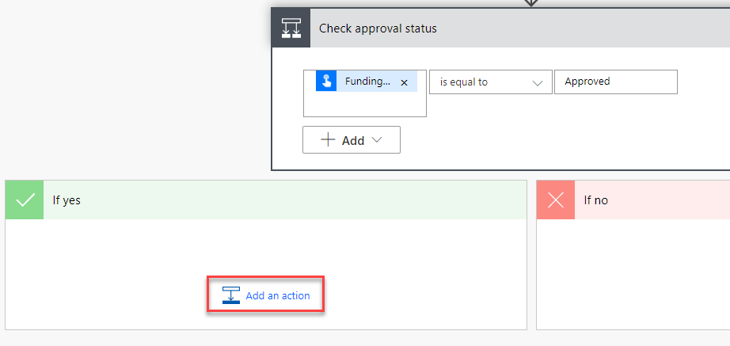

1.  Select the **Send an email from a shared mailbox (V2)** action from the
    **Office 365 Outlook** connector.

1.  Click on the **Original Mailbox Address** field, click **Add dynamic
    content** and select **To** from the dynamic content pane.

1.  Click on the **To** field, click **Add dynamics content** and select
    **From** from the dynamic content pane.

1.  Enter `Draw Approved` for Subject.

1.  Type `Your draw for` in the Body and select **Amount Funded** from the
    dynamic content pane.

    

1.  Add `was approved` to the body.

1.  Rename the step **Send approved draw email**.

1.  Go to the **If no** branch and click **Add an action**.

    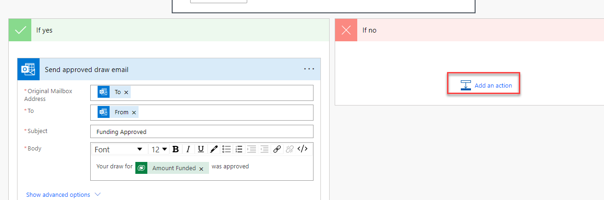

1.  Select the **Send an email from a shared mailbox (V2)** action from the
    **Office 365 Outlook** connector.

1.  Click on the **Original Mailbox Address** field, click **Add dynamic
    content** and select **To** from the dynamic content pane.

1.  Click on the **To** field, click **Add dynamic content** and select **From**
    from the dynamic content pane.

1.  Enter `Draw was not approved` for Subject.

1.  Type `Your draw for` in the Body and select **Amount Funded** from the
    dynamic content pane.

1.  Add `was not approved, please contact bank.` to the body.

1.  Rename the step **Send draw not approved email**.

1.  Click **Save** and wait for the flow to be saved.

    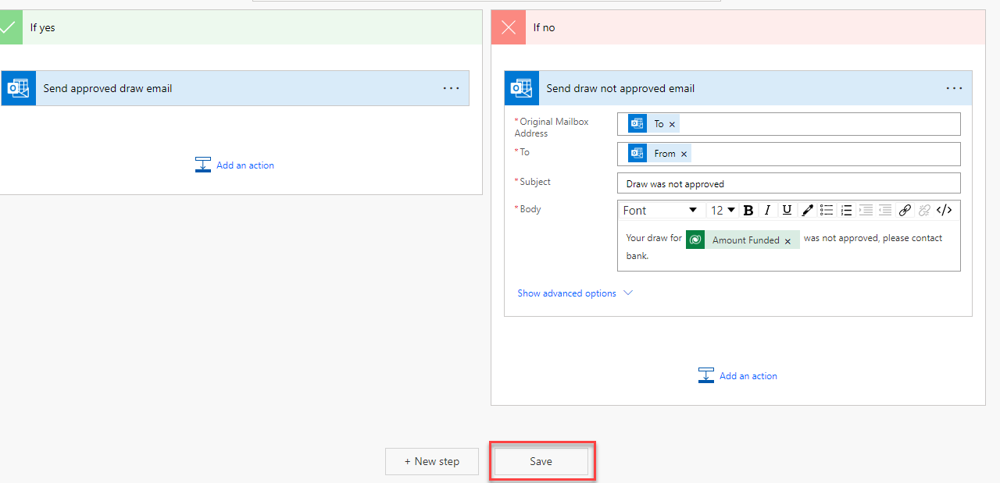

### Task 3: Test flow

1.  Click **Test**.

1.  Select **Manually** and click **Test** again.

1.  Send an email with the subject **MC3747** from your email to the Funding
    shared email you created
    ([Funding@yourdomain.onmicrosoft.com](mailto:Funding@yourdomain.onmicrosoft.com)).

1.  Wait for the flow to get triggered. Do not interact your computer while the
    flow is running.

1.  The flow should run successfully.

    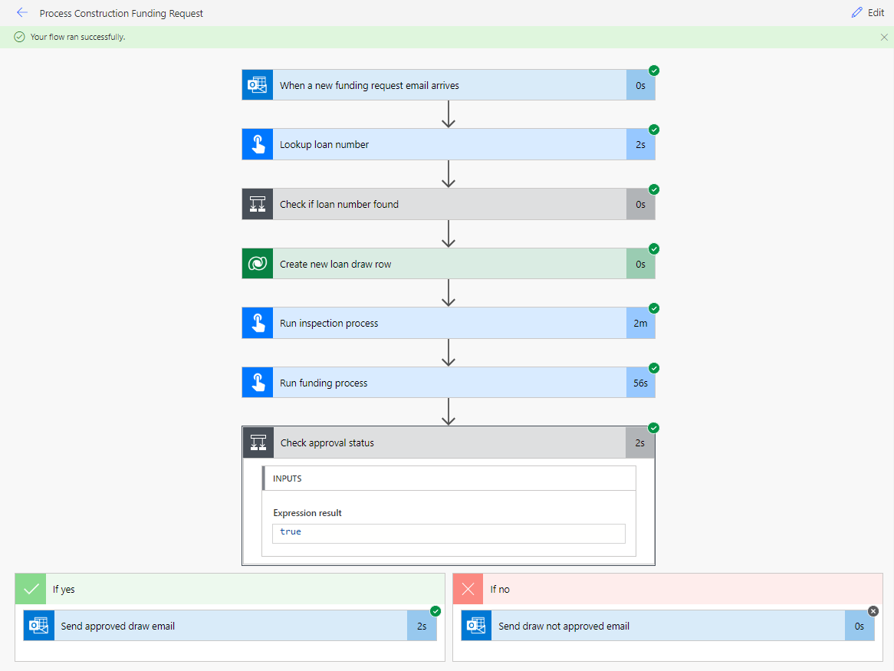

1.  You should receive an email with the subject **Draw Approved**.
