---
lab:
    title: 'Lab 4 - Custom Connectors'
    module: 'Module 4 - Custom Connectors'
---

# Custom Connectors

## Scenario

In this lab, you will build a custom connector for A Datum’s Risk Score API.

## High-level lab objectives

-   Build a custom connector

-   Modify the cloud flow to use the connector

## Exercise 1: Create a custom connector

### Task 1: Create a new solution

1.  Navigate to `https://make.powerapps.com/` and make sure you are in the Dev
    environment.

2.  Select **Solutions** and click **+ New solution**. We are creating a new
    solution to keep the custom connector separate from the flow that uses it
    which is the current requirement of using a custom connector.

3.  Enter `Builder Risk Service` for Display name, select **Relecloud** for
    Publisher, and click **Create**.

    

### Task 2: Create custom connector

1.  Click **+ New** and select **Automation \| Custom connector**.

    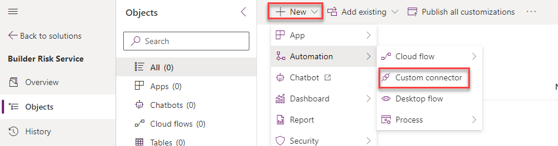

1.  Enter `Builder Risk Service` for Connector Name.

    

1.  Enter `Service for evaluating builder risk` for Description, enter
    `adatumbuilderrisktest.azurewebsites.net` for Host, and click **Create
    connector**.

    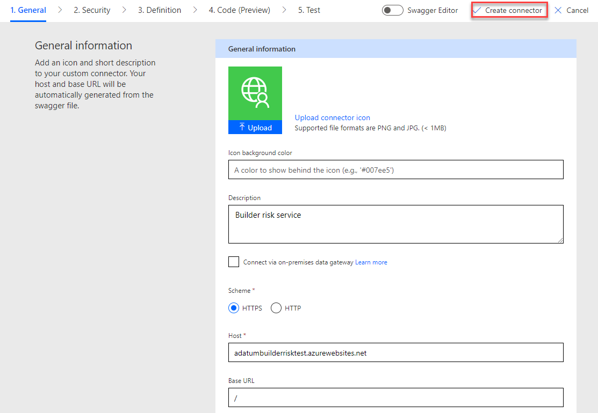

### Task 3: Import Open API

1.  Navigate to `https://adatumbuilderrisktest.azurewebsites.net/`

1.  Click **Download Logo** and save the logo on your machine.

1.  Click on the **API Key** link.

    

1.  Copy the **API Key** and save it on a notepad.

1.  Click **Return to home**.

1.  Click on the **API documentation** link.

1.  Review the documentation.

1.  Close the documentation browser tab or window, after you finish reviewing.

1.  Click on the **Open API definition file** link.

    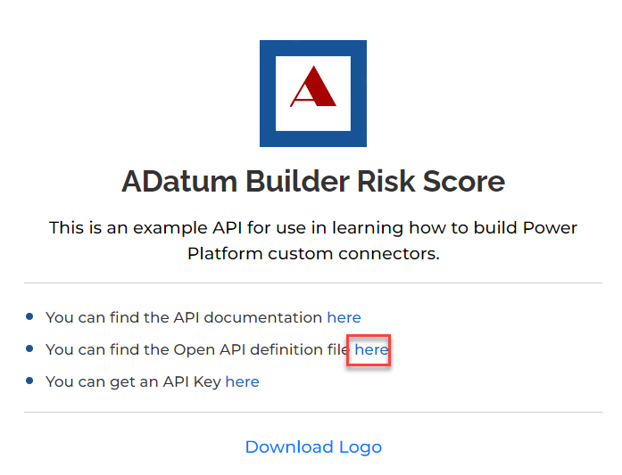

1.  On your keyboard press **CTRL + S** and select **Save**. Now the file is
    saved on your machine.

1.  Navigate to `https://make.powerautomate.com/` and make sure you are in the
    Dev environment.

1.  Click **More** and select **Discover all**.

    

1.  Scroll down and select **Custom connectors** under data.

    

1.  Click on the **…** more actions button of the **Builder Risk Service**
    custom connector and select **Update from OpenAPI file**.

    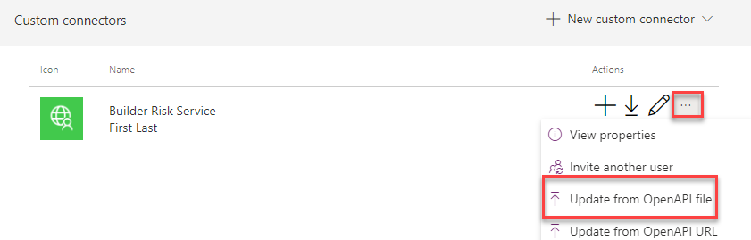

1.  Click **Import**.

1.  Select the **swagger.json** file you saved to your machine and click
    **Open**.

1.  Click **Continue**.

    

1.  Click **Upload** under the logo.

1.  Select the logo you downloaded and click **Open**.

1.  Enter `Service for evaluating builder risk` for Description, enter

    `adatumbuilderrisktest.azurewebsites.net` for Host, and select **Security**
    from the breadcrumb navigation bar at the top of the screen.

    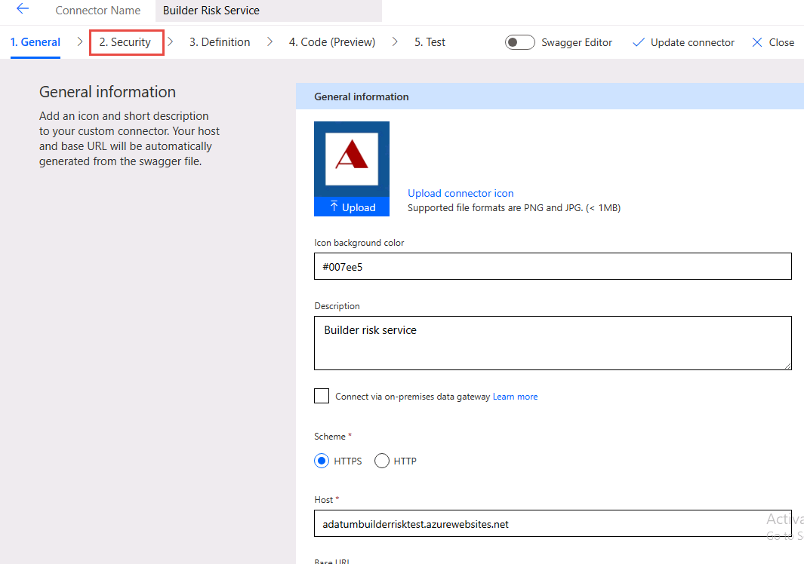

1.  Select **Definition** from the breadcrumb navigation bar at the top of the
    screen and see the operation imported.

1.  Turn on **Swagger Editor**.

    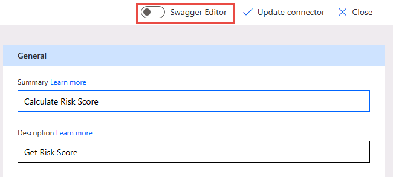

1.  Have a look at the Swagger Editor and then turn off the **Swagger Editor**.

1.  Select **Update connector** and wait for the connector to be updated.

1.  Do not navigate away from this page.

### Task 4: Test connector

1.  Select **Test** from the breadcrumb navigation bar at the top of the screen
    and click **+ New connection**.

    

1.  Paste your **API Key** and click **Create connection**.

1.  Click the **Refresh connections** button, on the right. The connection you
    just created should be the **Selected connection**.

1.  Under CalcRiskScore, enter `Contoso` for builderName, `7165 Brock Lane
    Renton, WA 61795 U.S.` for propertyAddress, `JG7165` for loanNumber,
    `645000` for loanAmount, `500000` for creditAvailable, `100000` for
    drawAmount, and click **Test operation**.

    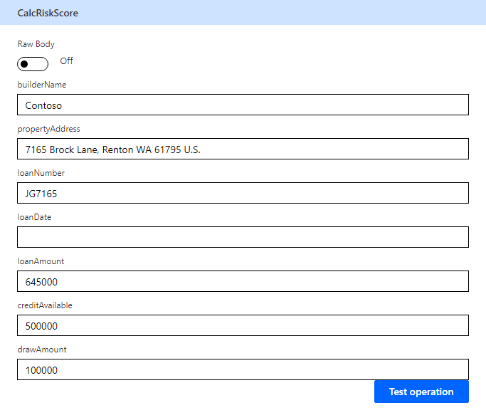

1.  The test should run successfully, and you should receive a score and a
    reason.

    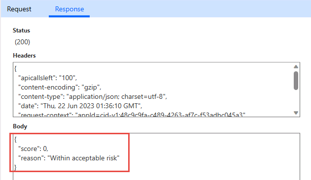

1.  Click **Close** to return to the list of Custom connectors.

## Exercise 2: Modify cloud flow to use connector

### Task 1: Use custom connector in flow

1.  Navigate to `https://make.powerapps.com/` and make sure you are in the Dev
    environment.

1.  Select **Solutions** and open the **Construction Funding** solution.

1.  Select **Cloud flows**, select **Process Construction Funding Request** flow
    and click **Edit**.

    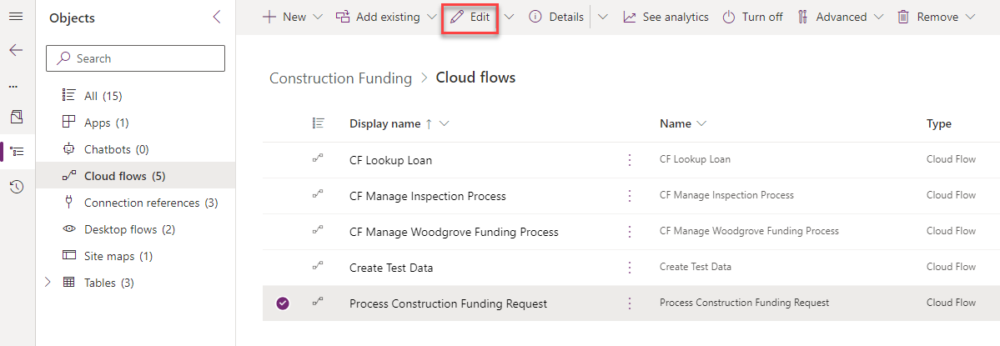

1.  Click **+** insert new step after the **Check if loan number found**
    condition and select **Add an action.**

    

1.  Select **Get a row by ID** Microsoft Dataverse.

    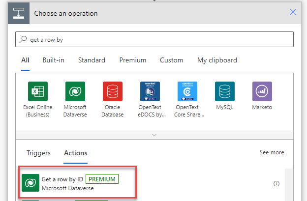

1.  Select **Loans** for Table name, click on the **Row ID** field and select
    **LoanID** from the dynamic content pane.

    

1.  Rename the step **Get loan**.

1.  Go to the **+** Insert a new step button after the **Run inspection
    process** and select **Add an action**.

    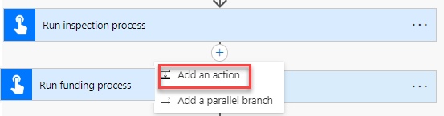

1.  Go to the **Custom** tab and select **Builder Risk Service**.

    

1.  Select the **Calculate Risk Score** action.

1.  Enter `Risk Service` for Connection name, paste the API Key you copied
    earlier, and click **Create**.

    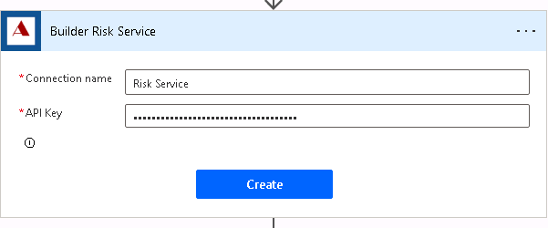

1.  Click on the **builderName** field and select **Builder** from the dynamic
    content pane.

    

1.  Click on the **propertyAddress** field and select **Address** from the
    dynamic content pane.

1.  Click on the **loanNumber** field and select **Loan Number** from the
    dynamic content pane.

1.  Click on the **loanDate** field and select **Loan Date** from the dynamic
    content pane.

1.  Click on the **loanAmount** field and select **Loan Amount** form the
    dynamic content pane.

1.  Click on the **creditAvailable** field and select **Credit Available** from
    the dynamic content pane.

1.  Enter `80000` for drawAmount.

1.  The calculate risk score step should now look like the image below.

    

1.  Click on the **+** Insert a new step after the **Calculate Risk Score** step
    and select **Add an action**.

    

1.  Select **Update a row** Microsoft Dataverse.

1.  Select **Loan Draws** for Table name, click on the **Row ID** field and
    select **Loan Draw** from the dynamic content pane.

1.  Expand Show advanced options and Click on the **Risk Score** field and
    select **score** from the dynamic content pane.

1.  Select **Risk Scored** for Status reason.

1.  Rename the step **Update loan draw risk score**.

1.  The update loan draw step should look like the image below.

    

1.  Click to expand the **Run inspection process** step.

1.  Remove the **PropertyAddress** value and select **Address** from the dynamic
    content pane.

    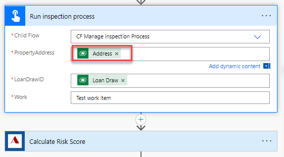

1.  Expand the **Run funding process** step.

1.  Remove the **RiskScore** value and select **Score** from the dynamic content
    pane.

    

1.  Click **Save** and wait for the flow to be saved.

### Task 2: Test the flow

1.  Click **Test**.

1.  Select **Manually** and click **Test**.

1.  Send an email to
    [Funding@yourdomain.onmicrosoft.com](mailto:Funding@yourdomain.onmicrosoft.com)
    with the Subject line as **PS7765**.

1.  The flow test should run and succeed.

1.  On the **Run History** for the flow test, all steps should show a green
    tick. Expand the **Calculate Risk Score** step.

1.  The output should look like the image below:

    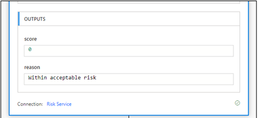

1.  You should receive an email with the subject **Draw Approved**.
