**Integrate AI**

**Scenario**

In this lab, you will be using the AI Builder to process the construction
funding request form document that was emailed to the funding shared mailbox to
extract essential information. The extracted information will be stored in
Dataverse for use in the funding process.

**High-level lab steps**

-   Use sample request forms to train an AI Builder model

-   Modify the cloud flow to use the model to process the inbound document

-   Store the extracted information in the Loan Draw table

**Exercise \#1: Train model for request form**

In this exercise, you will create an AI Builder model that will process the
funding request form.

**Task \#1: Create AI Builder model**

1.  Go to the lab resources folder and open the **Train** folder.

2.  Click to open **Jim Glynn.pdf**.

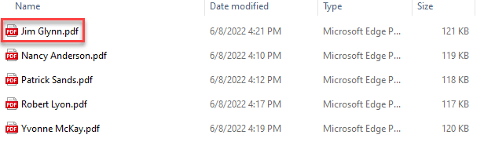

1.  The documents from which the model will extract the data will look like this
    document. Keep this file open, you will need it during model creation.

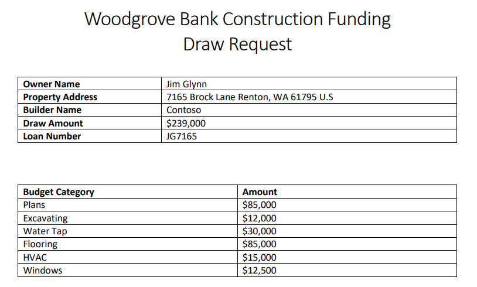

1.  Navigate to <https://make.powerapps.com/> and make sure you are in the Dev
    environment.

2.  Click **... More** and select **Discover all**.

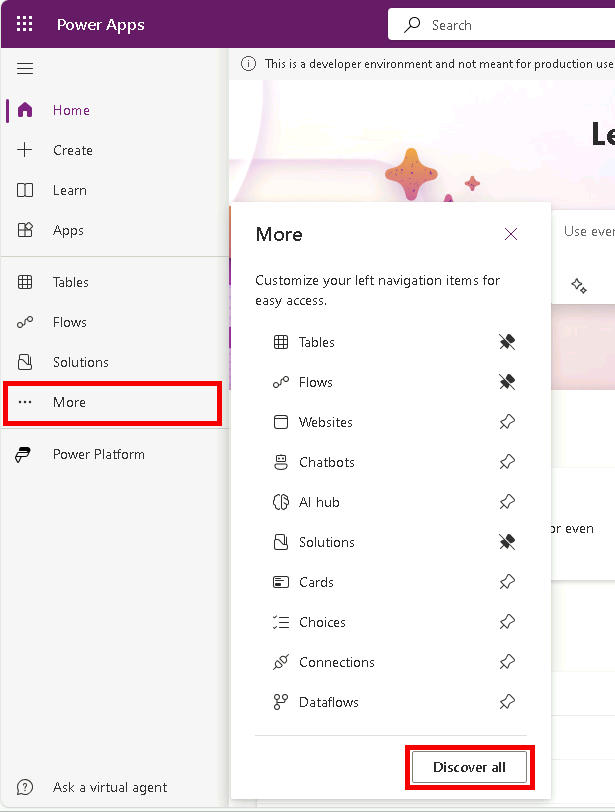

1.  Under AI select **Ai models**.

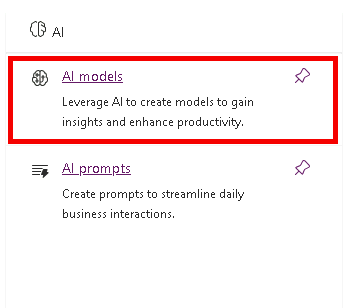

1.  Select **Extract custom information from documents**.

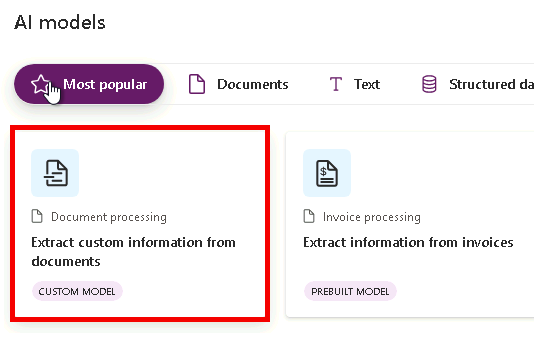

1.  Click **Create custom model**.

2.  Select **Structured documents** and click **Next**.

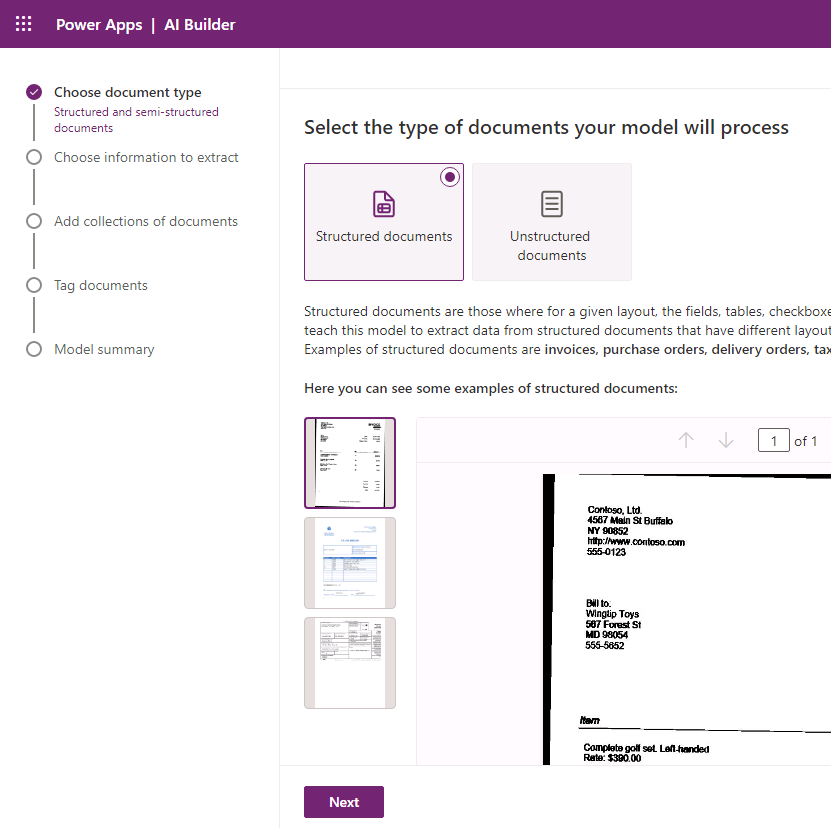

1.  Do not navigate away from this page.

2.  Go to the **Jim Glynn** pdf fie, you will create fields and a table in the
    model that match the fields and the table in this document.

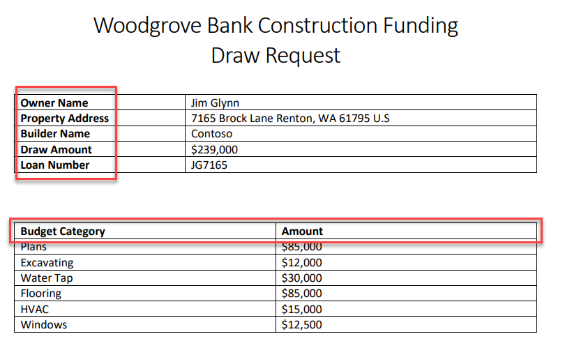

1.  Go back to the model. Click the chevron button on the **+ Add** button and
    select **Text field**.

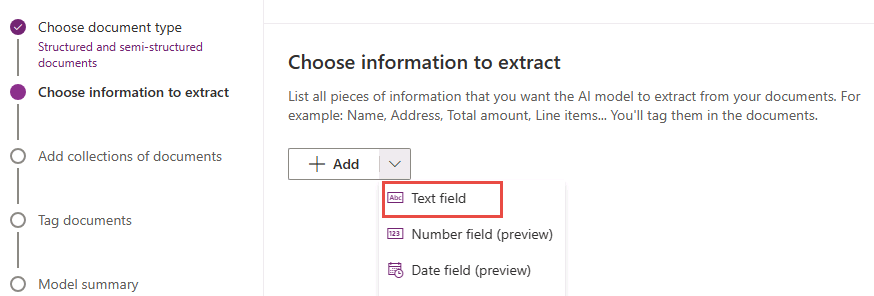

1.  Enter **Owner Name** and click **Done**.

1.  Select the **+ Add** button and select **Text field** again.

2.  Enter **Property Address** and click **Done**.

3.  Select the **+ Add** button and select **Text field**.

4.  Enter **Builder Name** and click **Done**.

5.  Select the **+ Add** button and select **Text field**.

6.  Enter **Draw Amount** and click **Done**.

7.  Select the **+ Add** button and select **Text field** one more time.

8.  Enter **Loan Number** and click **Done**.

9.  You should now have five text fields added.

1.  You will now add the table details. Click the chevron button on the **+
    Add** button and select **Table**.

1.  Enter **Budget Items** for Table name.

2.  Click on **Column 1** and select **Edit column**.

1.  Enter **Budget Category** and click **Comfirm**.

1.  Click **+ New column**.

1.  Enter **Amount** for Name and click **Add**.

2.  Your table should now have 2 columns. Click **Done**.

1.  Click **Next**.

2.  Do not navigate away from this page.

**Task \#2: Add sample documents**

1.  Click **New collection.**

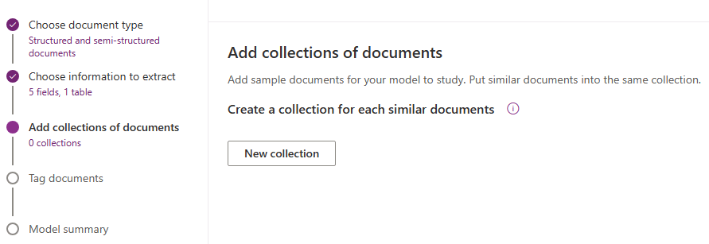

1.  Enter **Sample documents** for collection name and click **+** add.

1.  Click **Add documents**.

2.  Select **My device**.

3.  Select all **5** PDF files located in the **Train** folder and click
    **Open**.

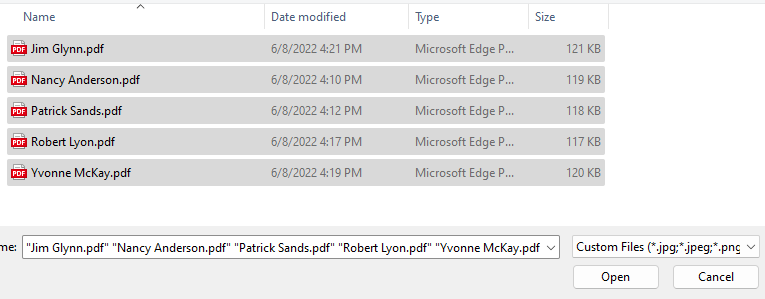

1.  Click **Upload 5 documents** and wait for the files to be loaded.

2.  Click **Done**.

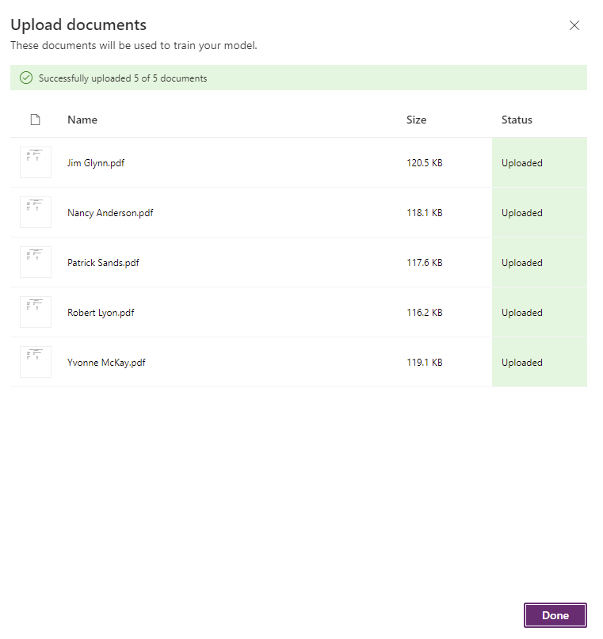

1.  Click **Next**.

2.  Do not navigate away from this page.

**Task \#3: Tag documents**

1.  Click on the name of the owner and select **Owner Name** as text field.

1.  Select on the address and select **Property Address** as text field.

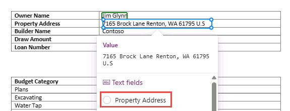

1.  Select on the builder name and select **Builder Name** as text field.

2.  Select on the draw amount and select **Draw Amount** as text field.

3.  Select on the loan number and select **Loan Number** as text field.

4.  All your fields should now be tagged.

1.  Select table area of the document and select **Budget Items** table.

1.  Turn on **Advanced tagging mode**.

1.  Click to and select the first cell.

1.  Go to the document and select the first budget category item name.

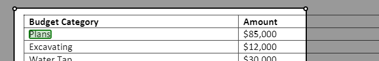

1.  The selection should automatically advance to the second cell. Select first
    budget category item amount.

1.  The selection should automatically advance to the first cell of the second
    row. Select the second budget category item name.

1.  Continue until all the items in the table are tagged.

2.  The table should now look like the image below. Click **Done**.

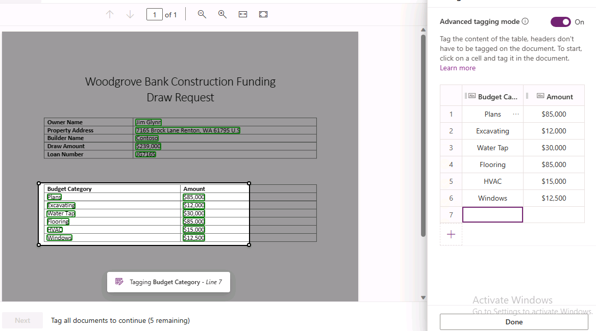

1.  Select the second document.

1.  Tag the fields and for the second document.

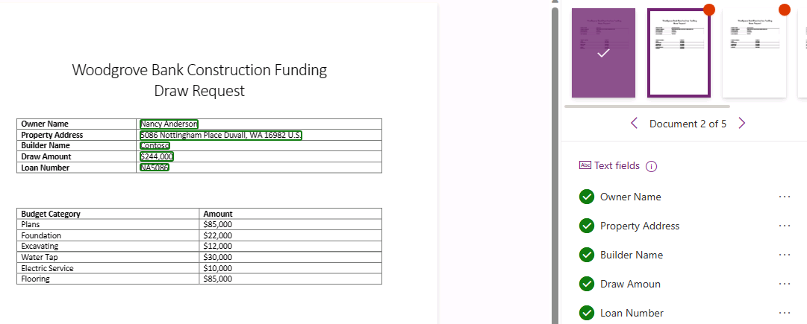

1.  Select table area of the document and select **Budget Items** table.

1.  Make sure **Advanced tagging mode** is turned on.

2.  Tag all the items in the table.

3.  You should now have two documents tagged.

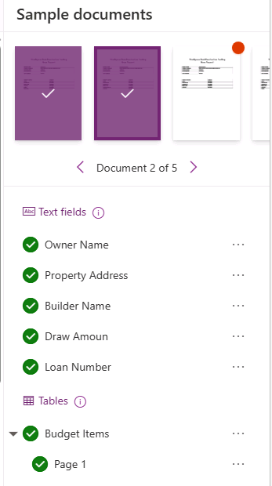

1.  Tag the rest of the documents.

2.  Click **Next**. You won’t be able to advance to the next step until you have
    finished tagging all the documents.

1.  Click **Train** and wait for the training to complete.

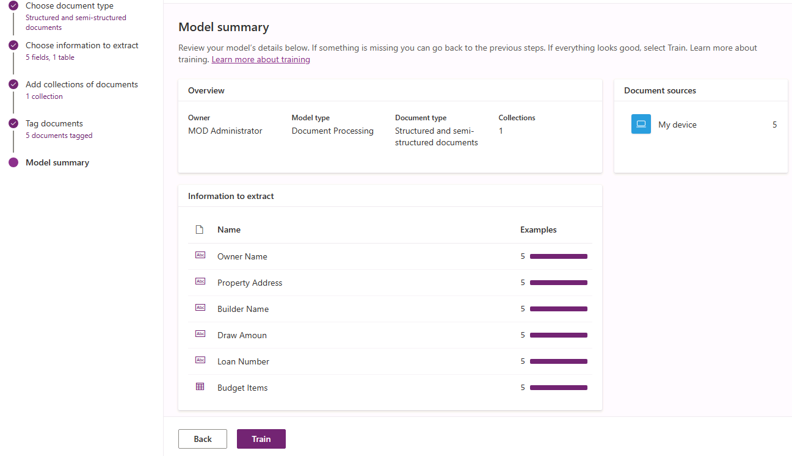

1.  Do not navigate away from this page.

**Task \#4: Test and publish the model**

1.  The model should automatically open after the training completes or click
    **Go to models**.

2.  Click **Quick test**.

1.  Go to the lab resources folder and open the **Test** folder.

2.  Drag the **Maria Campbell.pdf** file to the model quick test pane.

3.  The model should run and complete the document analysis.

4.  Click on the table area.

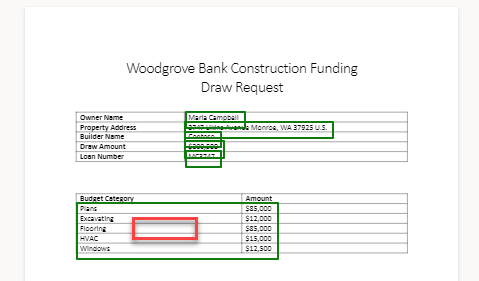

1.  You should see the budget items from the test file.

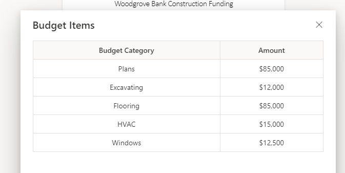

1.  Evaluate all the values the model extracted and make sure it matches the
    test document.

2.  Click **Close**.

3.  Click **Publish** and wait for the publishing to complete.

1.  Your model should now be ready for use.

**Exercise \#2: Modify flow to use AI Builder model**

**Task \#1: Use AI Builder**

1.  Navigate to <https://make.powerapps.com/> and make sure you are in the Dev
    environment.

2.  Select **Solutions** and open the **Construction Funding** solution.

3.  Click **Add Existing \| AI Model**.

4.  Select your Document Processing model and click **Add**.

5.  Select **Cloud flows**, select **Process Construction Funding Request** flow
    and click **Edit**.

1.  Click **+** insert new step after the **Get loan** step and select **Add an
    action**.

1.  Select the **Condition** action from the **Control** connector.

2.  Click the first operand field and select **Has Attachment** from the dynamic
    content pane.

1.  Select **is equal to** for operator.

2.  Click on the second operand field, go to the dynamic content pane, and
    select the **Expression** tab.

3.  Type **true** and click **OK**.

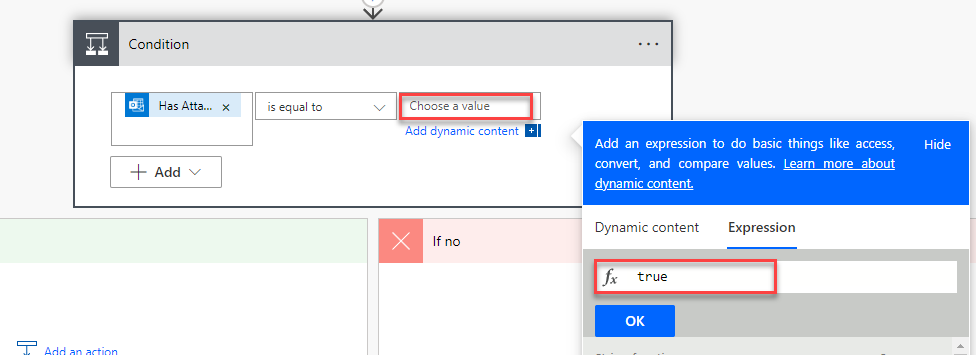

1.  Rename the condition **Check if email has attachment**.

2.  Go to the **If no** branch and click **Add an action**.

3.  Select the **Send an email from a shared mailbox (V2)** action from the
    **Office 365 Outlook** connector.

4.  Click on the **Original Mailbox Address** field and select **To** in the
    dynamic content pane.

5.  Click on the **To** field and select **From** in the dynamic content pane.

6.  Enter **No attachment found** for **Subject**.

7.  Enter **Email has no attachment** in the **Body**.

8.  Rename the step **Send no attachment email**.

9.  Click **Add an action**.

1.  Select **Terminate**.

2.  Select **Succeeded** for Status.

3.  Click **+** insert a new step and select **Add an action**.

1.  Select the **Get attachment (V2)** action from the **Office 365 Outlook**
    connector.

1.  Click on the **Message Id** field and select **Message Id** from the dynamic
    content pane.

2.  Click on the **Attachment Id** field, go to the dynamic content pane and
    select the **Expression** tab.

3.  Paste the expression below and click **OK**.

triggerOutputs()?['body/attachments']?[0]['id']

1.  Click on the **Original Mailbox Address** and select **To** from the dynamic
    content pane.

2.  Rename the step **Get email attachment**.

3.  Click on the **+** Insert a new step button below the **Get email
    attachment** step and select **Add an action**.

4.  Select the **Extract information from documents** action from the **AI
    Builder** connector.

1.  Select the **Document Processing** you created for AI Model and select **PDF
    Document** for Form type.

2.  Click on the **Form** field and select **Content Bytes** form the dynamic
    content pane.

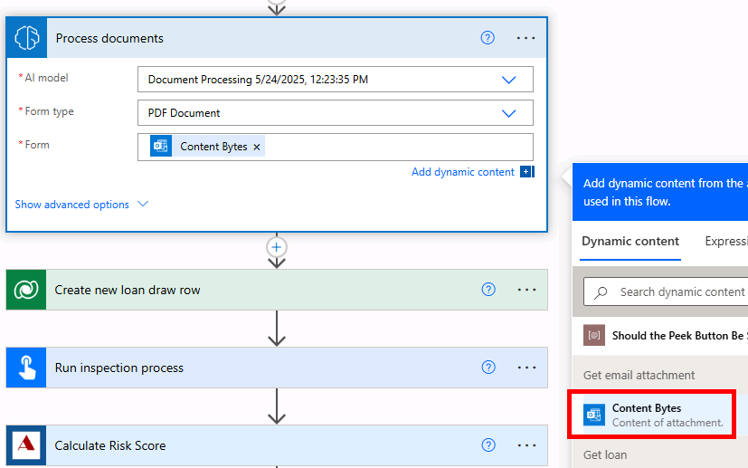

1.  Click on the **+** Insert a new step button below the **Extract information
    from documents** step and select **Add an action**.

2.  Select the **Initialize variable** action from the **Variable** connector.

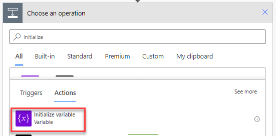

1.  Enter **Work items** for Name and select **String** for Type.

2.  Rename the step **var work items** and click **+** and select **Add an
    action**.

1.  Select the **Append to string variable** action from the **Variable**
    connector.

1.  Select **Work items** for Name, click on the **Value** field and select
    **Budget Items Budget Category value** from the dynamic content pane.

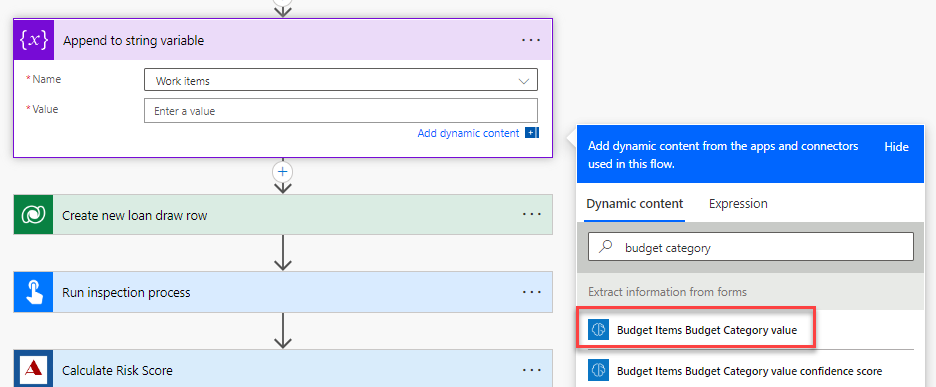

1.  Notice the **Apply to each** control will be added automatically.

2.  Rename the apply to each control **Apply to each work item**.

1.  Add a **comma and space** after the value in the **Append to string
    variable** action.

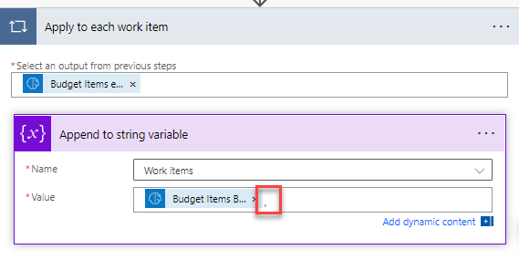

1.  Expand the **Create new loan draw** row step.

2.  Click on the **Amount Requested** field (remove current value if populated),
    go to the dynamic content pane, and select the **Expression** tab.

3.  Paste the expression below.

string(replace(,'\$',''))

1.  Place your cursor before the first comma and select the **Dynamic content**
    tab.

1.  Select **Draw Amount value** and click **OK**.

1.  Select **Received** for Status Reason.

2.  Click on the **Requested On** field, got the dynamic content pane, select
    the **Expression** tab, type **utcNow(),** and click **OK**.

1.  Click on the **Amount Requested** value and copy. Use **[CONTROL] + [C]** to
    copy.

2.  Expand the **Calculate Risk Score** step.

3.  Remove the **drawAmount** value and paste the value you copied.

1.  Expand the **Run funding process** step.

2.  Remove the **RequestedAmount** value and paste the value you copied.

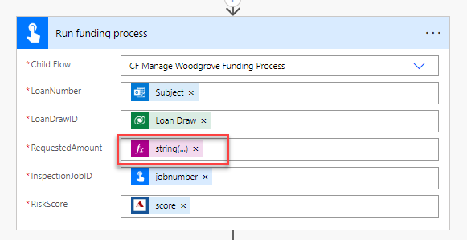

1.  Expand the **Run inspection process** step.

2.  Remove the **Work** value and select **Work Items** from the dynamic content
    pane.

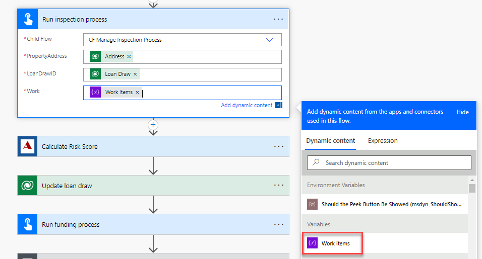

1.  Click **Save** and wait for the flow to be saved.

**Task \#2: Test the flow**

1.  Go to the resources folder of the lab and open the Test folder.

2.  You will attach the **Attachment AI Test** file when you send the email.

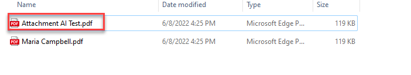

1.  Go back to the flow and click **Test**.

2.  Select **Manually** and click **Test**.

3.  Send an email to
    [Funding@yourdomain.onmicrosoft.com](mailto:Funding@yourdomain.onmicrosoft.com)
    make sure the subject of the email is **MC3747** and you attach the
    **Attachment AI Test.pdf** file.

4.  Wait for the flow run to complete.

5.  The flow test should succeed, and you should get an email with subject line
    **Draw Approved**.

6.  Expand the **Extract Information from documents** step and review the
    **Outputs**.

1.  Expand the **Run inspection process** and review the **Work** input.

1.  Review the rest of the steps and make sure the flow produced the expected
    outcome.
